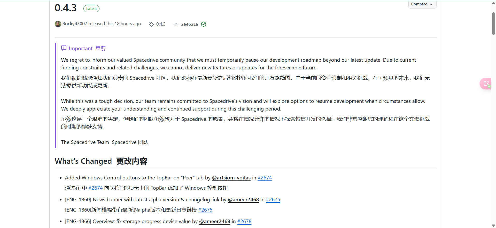
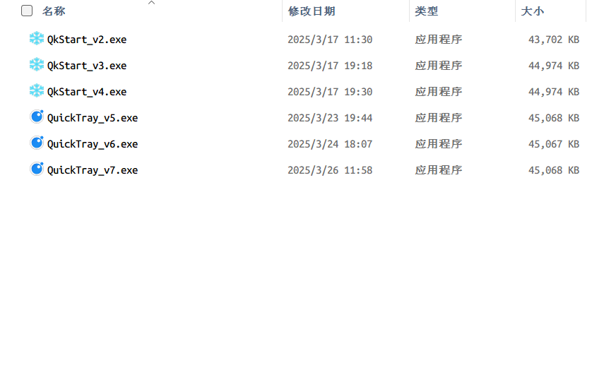
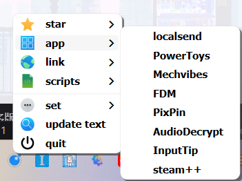
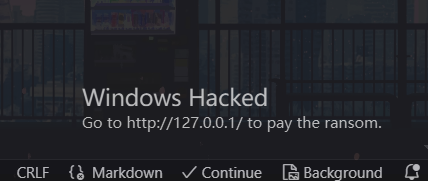
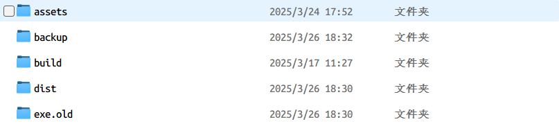
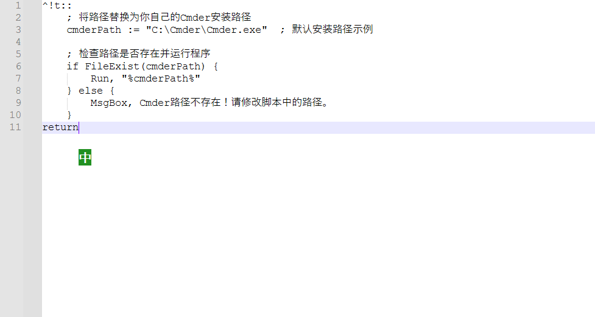
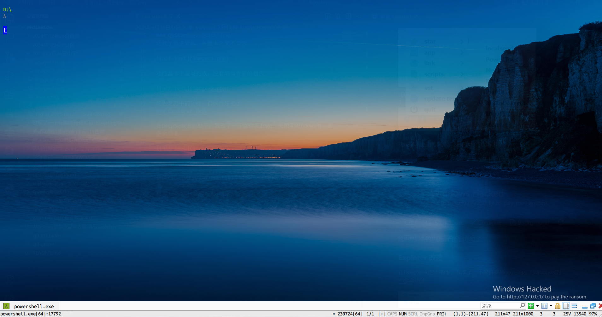
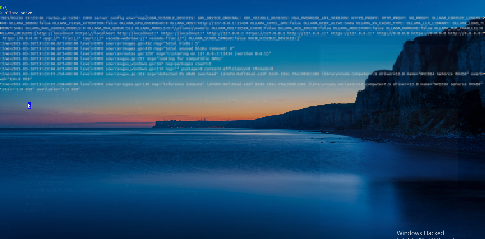
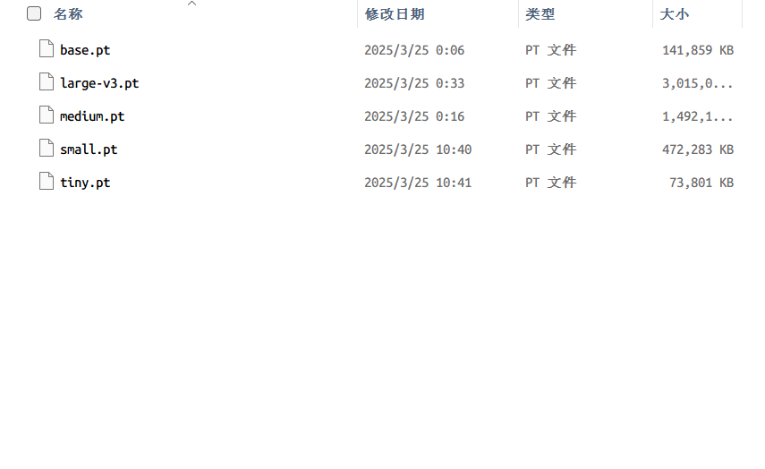

### Spacedrive 暂停开发
3月25日，我在逛社区的时候浏览到以下消息，表示遗憾

### QkStart -> Quick Tray
更改[QkStart](https://github.com/Pfolg/QkStart)为Quick Tray，目前还没有开源的想法（主要是没人用），还没有设计UI的想法

迭代了很多版本，各版本之间不兼容

功能基本上重写完成，没有编写界面的想法

这也是其中的功能，自娱自乐罢了，以后可能会 _焊接_ 更多东西上去。
### Explorer 改造

在DeepSeek的协助下，我改了一下文件夹logo。关闭了Windows的一些多余功能

### AutoHotKey + Cmder

借助AutoHotKey实现Ubuntu的终端热键——Ctrl+Alt+T

脚本

Cmder

主要是用Cmder比美化Cmd来得快一点

### ollama
又安装了ollama

由于电脑配置太烂，不敢下太大的模型，DeepSeek本地部署就算了，那是玩具，还是的搞点合适的。

### whisper

https://github.com/openai/whisper

有想实现实时字幕的想法，但是没时间做，AI给的我也不太满意，没时间去理解消化然后更改代码。