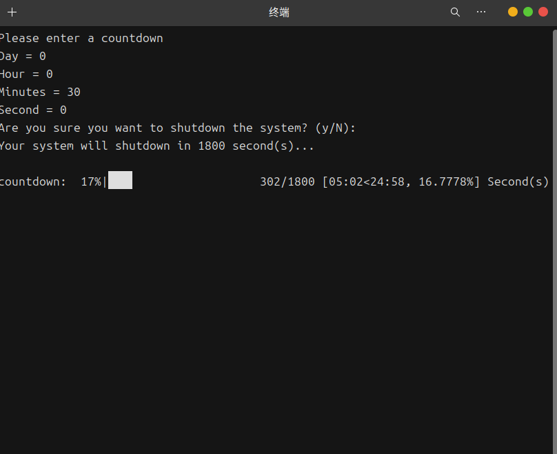

# 动机

以前用windows的时候，就写了一个定时关机程序，效果还不错，这回又觉得不太舒服，于是在ubuntu上写了出来

# Python Code

~~~Python
# -*- coding: UTF-8 -*-
"""
@Project ：Python_projects 
@File    ：AutoShutdownLinux
@IDE     ：PyCharm 
@Author  ：pfolg
@Date    ：2/5/25 11:09 AM 
"""
import time
import tqdm
import os

class ShutdownLinux:
    def __init__(self, total_time: int):
        self.total_time = total_time
        self.last_time()

    def last_time(self):
        confirm = input("Are you sure you want to shutdown the system? (y/N): ")
        if confirm in ["y", "Y"]:
            print("Shutdown canceled.")
            exit()
        print(f"Your system will shutdown in {self.total_time} second(s)...\n")

        # 自定义进度条格式
        bar_format = '{l_bar}{bar} {n_fmt}/{total_fmt} [{elapsed}<{remaining}, {percentage:.4f}%] Second(s)'
        #'{l_bar}{bar} {n_fmt}/{total_fmt} Second(s)'

        for _ in tqdm.tqdm(range(self.total_time), desc="countdown", bar_format=bar_format, unit_scale=False):
            time.sleep(1)
        # for _ in tqdm.tqdm(range(self.total_time), desc="countdown",colour="blue"):
        #     time.sleep(1)
        print("\nThe countdown ended!")
        os.system("poweroff")
        # Linux：sudo poweroff
        # windows：shutdown /s /t 0
        # macos：sudo shutdown -h now
        # 其他自己查

if __name__ == '__main__':
    while True:
        print("Please enter a countdown")
        try:
            day = int(input("Day = "))
            hour = int(input("Hour = "))
            mins = int(input("Minutes = "))
            sec = int(input("Second = "))
            total = day * 24 * 60 ** 2 + hour * 60 ** 2 + mins * 60 + sec
            break
        except ValueError:
            print('\033[31m' + 'ValueError, please check!' + '\033[0m')
    example = ShutdownLinux(total)
~~~
使用了两个内置库，一个第三方库（进度条，其实没有必要），然后打包又费了我一番脑筋，结果还是pyinstaller上大分。

以下命令是将脚本打包成一个带终端的linux可执行程序
~~~shell
pyinstaller -F main.py
~~~

打包又让我配了一下镜像源和虚拟环境，最终还是花了9MB，其实没必要打包的吧。不过这毕竟是Linux第一次——爽！

那么运行呢？双击运行不了！！！

# 双击运行

没错，就是快捷方式！

~~~txt
[Desktop Entry]
Version=1.0
Type=Application
# use terminal
Terminal=true
# This file is for use in appimages, which rewrite the path.
# Other uses would have to replace these with the correct path.
Exec="/home/pfolg/Linux_Scripts/shutdownLinux/AutoShutdownLinux"
Name=AutoShutdownLinux
Icon=None
# "Shell" would be the proper category, but it's reserved so we can't use it.
Categories=ConsoleOnly;System;
~~~

我把fish的.desktop搬过来，改了一下，然后赋予可执行权限，最终实现了“呆”的双击执行！

将它放到桌面就成为了桌面快捷方式，放到menu文件夹就成了主菜单程序了。

效果还不错吧！

最后呢，咱们的电脑也是成功的关上了……

一波三折，学到了很多，又真是自我感动的一天呐！