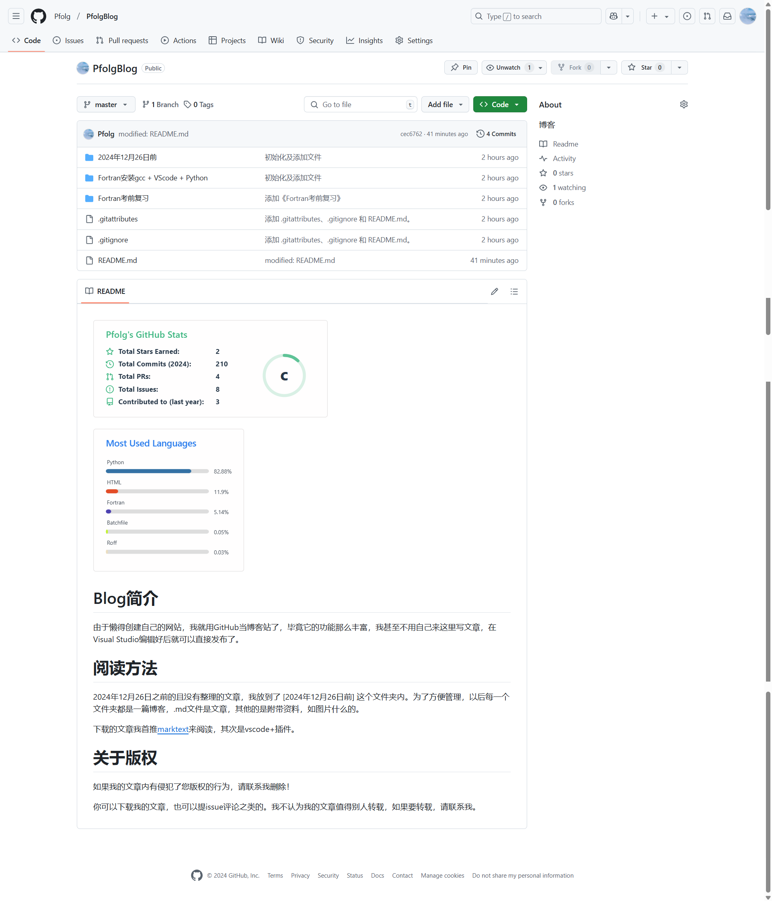
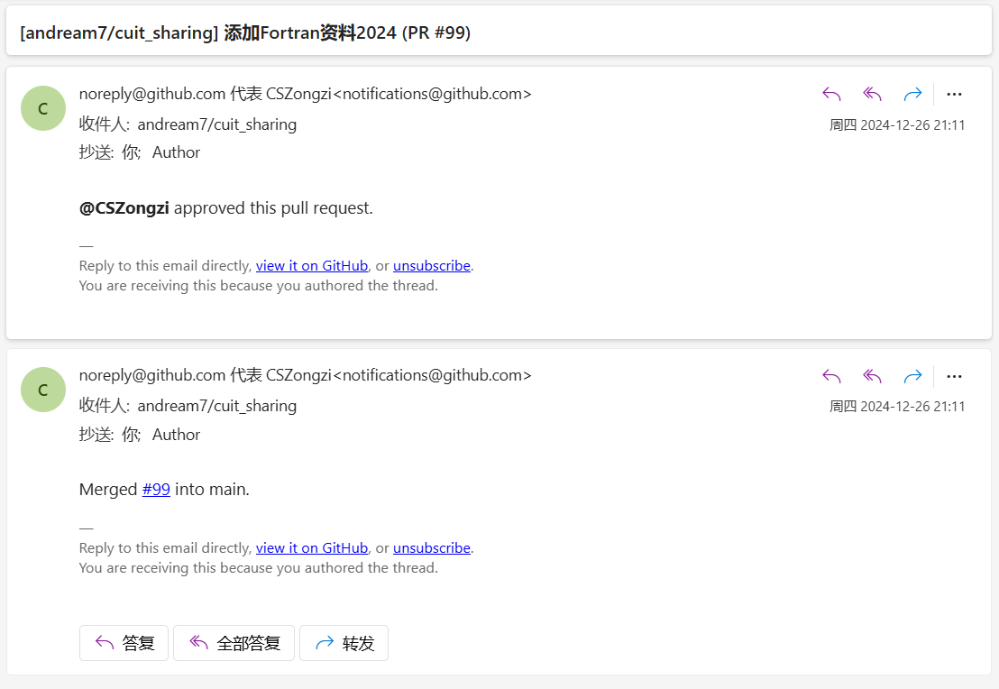
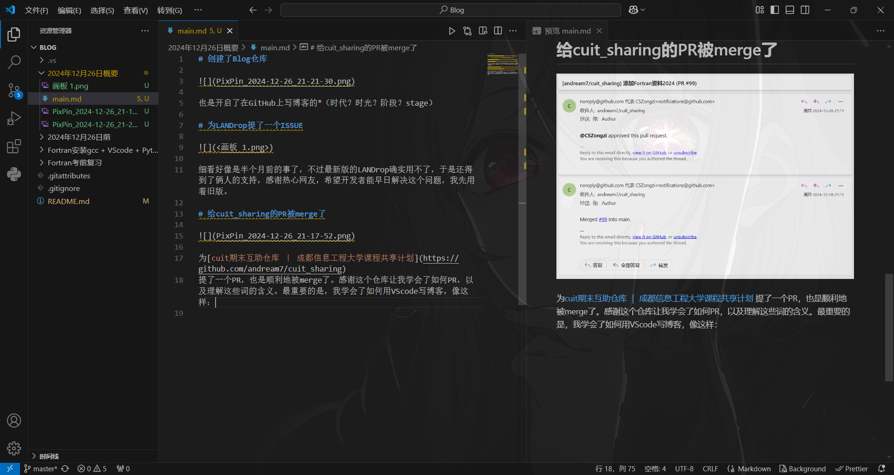

# 2024年12月26日概要

**我已经在这条道路上愈行愈远了**

## 创建了Blog仓库

也是开启了在GitHub上写博客的*（时代？时光？阶段？stage）

## 为LANDrop提了一个ISSUE

细看好像是半个月前的事了，不过最新版的LANDrop确实用不了，于是还得到了俩人的支持，感谢热心网友，希望开发者能早日解决这个问题，我先用着旧版。

## 给cuit_sharing的PR被merge了

为[cuit期末互助仓库 ｜ 成都信息工程大学课程共享计划](https://github.com/andream7/cuit_sharing)
提了一个PR，也是顺利地被merge了。感谢这个仓库让我学会了如何PR，以及理解这些词的含义。

最重要的是，我学会了如何用VScode写博客，把它直接推送到GitHub，Visual Studio也可以，只是编辑功能弱一点，像这样：

以及在仓库添加这些东西：

  <h2>QKStart</h3>

  
  
  
  
  
  
  
  

 

不过都是000.

我会继续加油的！以后就在这发文章吧，反正也没人看，不如方便一点。QQ空间和bilibili不太适合我生存（现在）。

# 其他

C#我差不多入门了，但是（技术）绝对是不如Python的，后面就先好好复习，考完试了再鼓捣Unity。