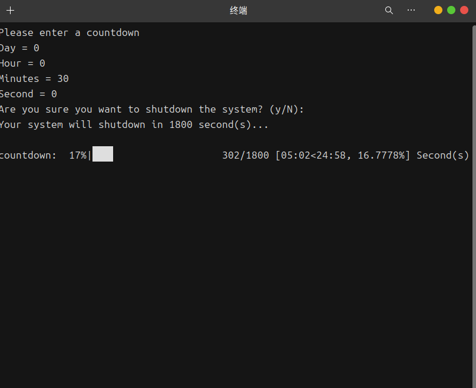

# 动机

以前用windows的时候，就写了一个定时关机程序，效果还不错，这回又觉得不太舒服，于是在ubuntu上写了出来

# Python Code

~~~Python
# -*- coding: UTF-8 -*-
"""
@Project ：Python_projects 
@File    ：AutoShutdownLinux
@IDE     ：PyCharm 
@Author  ：pfolg
@Date    ：2/5/25 11:09 AM 
"""
import time
import tqdm
import os

class ShutdownLinux:
    def __init__(self, total_time: int):
        self.total_time = total_time
        self.last_time()

    def last_time(self):
        confirm = input("Are you sure you want to shutdown the system? (y/N): ")
        if confirm in ["y", "Y"]:
            print("Shutdown canceled.")
            exit()
        print(f"Your system will shutdown in {self.total_time} second(s)...\n")

        # 自定义进度条格式
        bar_format = '{l_bar}{bar} {n_fmt}/{total_fmt} [{elapsed}<{remaining}, {percentage:.4f}%] Second(s)'
        #'{l_bar}{bar} {n_fmt}/{total_fmt} Second(s)'

        for _ in tqdm.tqdm(range(self.total_time), desc="countdown", bar_format=bar_format, unit_scale=False):
            time.sleep(1)
        # for _ in tqdm.tqdm(range(self.total_time), desc="countdown",colour="blue"):
        #     time.sleep(1)
        print("\nThe countdown ended!")
        os.system("poweroff")
        # Linux：sudo poweroff
        # windows：shutdown /s /t 0
        # macos：sudo shutdown -h now
        # 其他自己查

if __name__ == '__main__':
    while True:
        print("Please enter a countdown")
        try:
            day = int(input("Day = "))
            hour = int(input("Hour = "))
            mins = int(input("Minutes = "))
            sec = int(input("Second = "))
            total = day * 24 * 60 ** 2 + hour * 60 ** 2 + mins * 60 + sec
            break
        except ValueError:
            print('\033[31m' + 'ValueError, please check!' + '\033[0m')
    example = ShutdownLinux(total)
~~~
使用了两个内置库，一个第三方库（进度条，其实没有必要），然后打包又费了我一番脑筋，结果还是pyinstaller上大分。

以下命令是将脚本打包成一个带终端的linux可执行程序
~~~shell
pyinstaller -F main.py
~~~

打包又让我配了一下镜像源和虚拟环境，最终还是花了9MB，其实没必要打包的吧。不过这毕竟是Linux第一次——爽！

那么运行呢？双击运行不了！！！

# 双击运行

没错，就是快捷方式！

~~~txt
[Desktop Entry]
Version=1.0
Type=Application
# use terminal
Terminal=true
# This file is for use in appimages, which rewrite the path.
# Other uses would have to replace these with the correct path.
Exec="/home/pfolg/Linux_Scripts/shutdownLinux/AutoShutdownLinux"
Name=AutoShutdownLinux
Icon=None
# "Shell" would be the proper category, but it's reserved so we can't use it.
Categories=ConsoleOnly;System;
~~~

我把fish的.desktop搬过来，改了一下，然后赋予可执行权限，最终实现了“呆”的双击执行！

将它放到桌面就成为了桌面快捷方式，放到menu文件夹就成了主菜单程序了。

效果还不错吧！

最后呢，咱们的电脑也是成功的关上了……

一波三折，学到了很多，又真是自我感动的一天呐！

# 补 2025-2-6

最新写的带有图形界面的程序

~~~python
# -*- coding: UTF-8 -*-
"""
@Project ：Python_projects 
@File    ：autoShutdownPro
@IDE     ：PyCharm 
@Author  ：pfolg
@Date    ：2/6/25 2:19 PM 
"""
import os
import tkinter as tk
from tkinter import ttk,messagebox
import time
import threading

commands={
    "Windows":"shutdown /s /t 0",
    "Linux":"poweroff",
    "MacOs":"shutdown -h now"
}

class A:
    def __init__(self,name):
        # 赋值
        self.root=tk.Tk()
        self.name=name
        self.system=tk.StringVar()
        self.frame=ttk.Frame(self.root)
        self.countdown=None

        self.isstart=False
        self.day,self.hour,self.min,self.sec=tk.IntVar(),tk.IntVar(),tk.IntVar(),tk.IntVar()

        # 设定函数
        self.set_win()
        self.set_frame()

        # 运行
        self.root.mainloop()

    def set_win(self):
        self.root.title(self.name)
        sw,sh=self.root.winfo_screenwidth(),self.root.winfo_screenheight()
        self.root.geometry("{}x{}+{}+{}".format(int(sw/4),int(sh/4),int(sw/4),int(sh/4)))
        # self.root.resizable(False,False)
        # self.root.config(background="white")

    def set_frame(self,):
        systems=list(commands.keys())
        self.system.set("Windows")

        ttk.Label(self.frame,text="System").place(relx=.02,rely=.02)
        ttk.Combobox(self.frame,values=systems,textvariable=self.system,width=10,state="readonly").place(relx=.2,rely=.02)

        x ,y= .02,.2
        ttk.Label(self.frame,text="Day",).place(relx=x,rely=y)
        ttk.Entry(self.frame,textvariable=self.day,width=8,).place(relx=x+.2,rely=y)
        ttk.Label(self.frame, text="Hour", ).place(relx=x, rely=y+.2)
        ttk.Entry(self.frame, textvariable=self.hour, width=8, ).place(relx=x + .2, rely=y+.2)
        ttk.Label(self.frame, text="Min", ).place(relx=x, rely=y+.4)
        ttk.Entry(self.frame, textvariable=self.min, width=8, ).place(relx=x + .2, rely=y+.4)
        ttk.Label(self.frame, text="Second", ).place(relx=x, rely=y+.6)
        ttk.Entry(self.frame, textvariable=self.sec, width=8, ).place(relx=x + .2, rely=y+.6)

        ttk.Button(self.frame,text="Start",command=lambda :threading.Thread(target=self.shutdown,daemon=True).start()).place(relx=.6,rely=.5)
        ttk.Button(self.frame,text="Cancel",command=self.cancel).place(relx=.6,rely=.7)

        self.countdown=tk.Label(self.frame,text="NA",font=("微软雅黑",16))
        self.countdown.place(relx=.6,rely=.1)

        self.frame.place(x=50,y=20,height=240,width=380)

    def shutdown(self):
        total = self.day.get() * 24 * 60 ** 2 + self.hour.get() * 60 ** 2 + self.min.get() * 60 + self.sec.get()
        isconfirm=messagebox.askyesno("Confirm","Do you want to shutdown your system in {} second(s)".format(total))
        print(isconfirm)
        if not isconfirm:
            return
        self.isstart=True
        for i in range(total):
            if not self.isstart:
                return
            self.countdown.config(text="{:.4f}%\n{}/{}".format(i/total*100,i,total))
            print("{:.4f}%\t{}/{}".format(i/total*100,i,total),self.isstart)
            time.sleep(1)
        # 执行关机
        os.system(commands.get(self.system.get()))

    def cancel(self):
        self.isstart=False
        self.countdown.config(text="NA")
        print("Canceled")

if __name__ == '__main__':
    window_a=A("Window")
~~~
请看效果：

![](image.pn