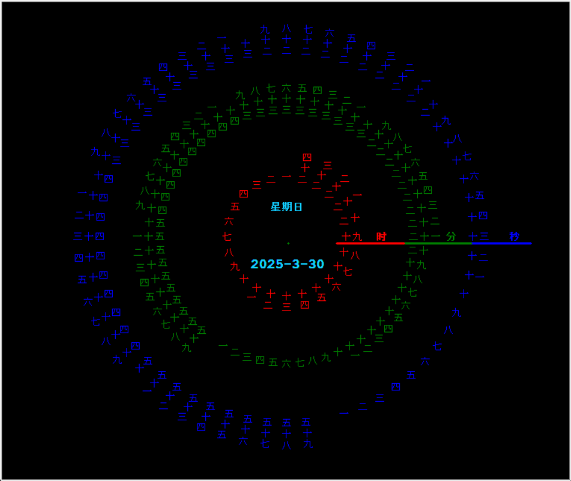
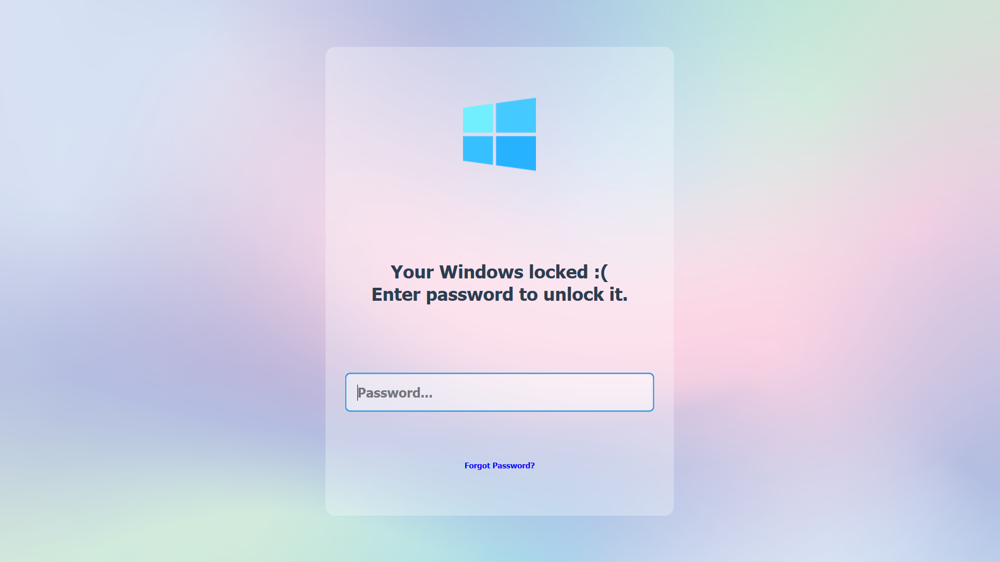

这两天（2025年3月30日的周末），不想写作业，打游戏也乏味——为了——呃，不知道为了什么。

    或许是假装努力吧
    或许是想创造什么吧
    或许是为了证明自己还活着吧
    或许或许是虚无

好吧，连着写了两个程序出来，我实在是不能逗您开心，您看着看吧，或者**直接划走**。

**别期待了，都是用Python写的**

### windows时钟

#### turtle
猴子网站上的垃圾终究是垃圾：

帅吧，但是不实用，我承认这个代码作者的厉害，但是不实用（于我而言），代码附上，是从CSDN来的，链接没记，见谅！

~~~Python
import turtle
from datetime import *

# 抬起画笔，向前运动一段距离放下
def Skip(step):
    turtle.penup()
    turtle.forward(step)
    turtle.pendown()

def drawCircle(content, content_len, init_data, init_data_type, circle_radius, circle_radius_step, color, font_size):
    '''
	content:传入的数组，代表要画的圆上面写的内容，比如1-12月
	content_len：数组长度，用这个元素来做循环，便于调整每次的偏置角度
	init_data： x轴正方向显示当前时间，这个数据就是当前时间
	init_data_type:代表这个是什么类型的，时，分，秒之类的
	circle_radius：圆的半径
	circle_radius_step： 圆环上的数据根据半径和这个长度结合写上内容
	color： 画笔颜色
    '''
    # turtle.pos()
    turtle.home()
    # turtle.mode("logo")
    turtle.pensize(3)
    turtle.pencolor(color)
    turtle.fillcolor('#33BB00')

    # turtle.right(90)
    # turtle.right(-360/content_len)
    # Skip(circle_radius+circle_radius_step+10*3)
    # turtle.write(' ', align="center", font=("Courier", font_size,'bold'))
    # Skip(-circle_radius-circle_radius_step-10*3)
    # #turtle.right(360/content_len)

    Skip(circle_radius + circle_radius_step + 10 * 3)
    turtle.write(init_data_type, align="center", font=("Courier", font_size, 'bold'))
    Skip(-circle_radius - circle_radius_step - 10 * 3)

    # turtle.right(-90)

    initdata_index = content.index(init_data)
    for i in range(initdata_index, content_len):
        Skip(circle_radius)
        fantilen = len(content[i])
        if i == initdata_index:
            turtle.forward(75)
            turtle.forward(-90)
            turtle.forward(15)

        for name in range(fantilen):
            turtle.write(content[i][name], align="center", font=("Courier", font_size))
            Skip(15)
        Skip(-15 * fantilen)
        Skip(-circle_radius)
        turtle.left(360 / content_len)
    for i in range(initdata_index):
        Skip(circle_radius)
        fantilen = len(content[i])
        for name in range(fantilen):
            turtle.write(content[i][name], align="center", font=("Courier", font_size))
            Skip(15)
        Skip(-15 * fantilen)
        Skip(-circle_radius)
        turtle.left(360 / content_len)

def Week(t):
    week = ["星期一", "星期二", "星期三",
            "星期四", "星期五", "星期六", "星期日"]
    return week[t.weekday()]

def Date(t):
    y = t.year
    m = t.month
    d = t.day
    return "%s-%d-%d" % (y, m, d)

def runclock():
    turtle.reset()
    t = datetime.today()
    print(t)
    second = t.second  # + t.microsecond * 0.000001
    minute = t.minute  # + second / 60.0
    hour = t.hour  # + minute / 60.0

    Traditional_Chinese = [' ', '壹', '贰', '叁', '肆', '伍', '陆', '柒', '捌', '玖',
                           '拾', '拾壹', '拾贰', '拾叁', '拾肆', '拾伍', '拾陆', '拾柒', '拾捌', '拾玖',
                           '贰拾', '贰拾壹', '贰拾贰', '贰拾叁', '贰拾肆', '贰拾伍', '贰拾陆', '贰拾柒', '贰拾捌',
                           '贰拾玖',
                           '叁拾', '叁拾壹', '叁拾贰', '叁拾叁', '叁拾肆', '叁拾伍', '叁拾陆', '叁拾柒', '叁拾捌',
                           '叁拾玖',
                           '肆拾', '肆拾壹', '肆拾贰', '肆拾叁', '肆拾肆', '肆拾伍', '肆拾陆', '肆拾柒', '肆拾捌',
                           '肆拾玖',
                           '伍拾', '伍拾壹', '伍拾贰', '伍拾叁', '伍拾肆', '伍拾伍', '伍拾陆', '伍拾柒', '伍拾捌',
                           '伍拾玖']
    Simplified_Chinese = [' ', '一', '二', '三', '四', '五', '六', '七', '八', '九', '十',
                          '十一', '十二', '十三', '十四', '十五', '十六', '十七', '十八', '十九',
                          '二十', '二十一', '二十二', '二十三', '二十四', '二十五', '二十六', '二十七', '二十八',
                          '二十九',
                          '三十', '三十一', '三十二', '三十三', '三十四', '三十五', '三十六', '三十七', '三十八',
                          '三十九',
                          '四十', '四十一', '四十二', '四十三', '四十四', '四十五', '四十六', '四十七', '四十八',
                          '四十九',
                          '五十', '五十一', '五十二', '五十三', '五十四', '五十五', '五十六', '五十七', '五十八', '五十九'
                          ]

    hours = ['壹', '贰', '叁', '肆', '伍', '陆', '柒', '捌', '玖', '拾', '拾壹', '拾贰',
             '拾叁', '拾肆', '拾伍', '拾陆', '拾柒', '拾捌', '拾玖', '贰拾', '贰拾壹', '贰拾贰', '贰拾叁', '贰拾肆']
    Simplified_hours = ['一', '二', '三', '四', '五', '六', '七', '八', '九', '十',
                        '十一', '十二', '十三', '十四', '十五', '十六', '十七', '十八', '十九',
                        '二十', '二十一', '二十二', '二十三', '二十四']

    drawCircle(Simplified_Chinese, len(Simplified_Chinese), Simplified_Chinese[second], '秒', 250, 25, 'blue', 10)
    drawCircle(Simplified_Chinese, len(Simplified_Chinese), Simplified_Chinese[minute], '分', 170, 20, 'green', 10)
    drawCircle(Simplified_hours, len(Simplified_hours), Simplified_hours[hour - 1], '时', 80, 15, 'red', 10)

    printer = turtle.Turtle()
    # 隐藏画笔的turtle形状
    printer.hideturtle()
    printer.color('#11CCFF')
    printer.right(-90)
    printer.penup()
    printer.forward(40)
    printer.write(Week(t), align="center", font=("Courier", 10, "bold"))
    printer.back(80)
    printer.write(Date(t), align="center", font=("Courier", 14, "bold"))
    print(Week(t), Date(t))
    printer.right(90)
    turtle.ontimer(runclock, 1000)

def main():
    # 打开/关闭龟动画，并为更新图纸设置延迟。
    turtle.tracer(False)
    ts = turtle.getscreen()
    ts.bgcolor("black")

    runclock()
    turtle.mainloop()

if __name__ == "__main__":
    main()
~~~

#### PySide6

好的，接下来看我写的，灵感大约来自某个wallpaper壁纸：

代码附上：

~~~Python
# -*- coding: UTF-8 -*-
"""
PROJECT_NAME Python_projects
PRODUCT_NAME PyCharm
NAME myclock
AUTHOR Pfolg
TIME 2025/3/30 0:36
"""
import sys

from PySide6 import QtCore, QtGui
from PySide6.QtCore import Qt, QTimer, QDateTime
from PySide6.QtGui import QAction, QIcon
from PySide6.QtWidgets import QApplication, QLabel, QWidget, QVBoxLayout, QSystemTrayIcon, QMenu

class RainbowLabel(QLabel):
    def __init__(self, text="", parent=None):
        super().__init__(text, parent)
        self.setAlignment(
            QtCore.Qt.AlignmentFlag.AlignRight | QtCore.Qt.AlignmentFlag.AlignTrailing | QtCore.Qt.AlignmentFlag.AlignVCenter)
        self.setMinimumSize(200, 200)
        font = QtGui.QFont()
        font.setFamily("Ubuntu Mono")
        font.setPointSize(28)
        self.setFont(font)
        self.setStyleSheet(
            """
            background-color: transparent;
            color: rgba(255, 255, 255, .7);
            font-weight: bold;
        """)

        # 动画参数
        self.hue = 0.0  # 色相初始值 (0-360)
        self.speed = 1.0  # 颜色变化速度
        self.saturation = 1.0  # 饱和度 (0-1)
        self.lightness = 0.5  # 亮度 (0-1)
        self.alpha = 1.0  # 透明度 (0-1)

        # 彩虹变色线程
        # self.timer1 = QTimer(self)
        # self.timer1.timeout.connect(self.update_color)
        # self.timer1.start(80)  # 50 FPS

        # 时间线程
        self.timer2 = QTimer(self)
        self.timer2.timeout.connect(self.update_time)
        self.timer2.start(200)  # 5 FPS

    def hsv_to_rgb(self, h):
        """将HSV颜色空间转换为RGB"""
        h = h % 360
        c = self.lightness * self.saturation
        x = c * (1 - abs((h / 60) % 2 - 1))
        m = self.lightness - c

        if 0 <= h < 60:
            r, g, b = c, x, 0
        elif 60 <= h < 120:
            r, g, b = x, c, 0
        elif 120 <= h < 180:
            r, g, b = 0, c, x
        elif 180 <= h < 240:
            r, g, b = 0, x, c
        elif 240 <= h < 300:
            r, g, b = x, 0, c
        else:
            r, g, b = c, 0, x

        return (
            int((r + m) * 255),
            int((g + m) * 255),
            int((b + m) * 255),
            int(self.alpha * 255)
        )

    def update_color(self):
        """更新颜色并应用样式"""
        # 色相递增
        self.hue = (self.hue + self.speed) % 360

        # 转换为RGB
        r, g, b, a = self.hsv_to_rgb(self.hue)

        # 应用样式
        self.setStyleSheet(f"""
            QLabel {{
                color: rgba({r}, {g}, {b}, {a});
                background-color: transparent;
                border-radius: 100px;
                
            }}
        """)  # font-size: 24px;

    @staticmethod
    def calculate_time(t1: int, t2: int, mode: str) -> str:
        if (not t2 in [1, 2]) or (t1 > 60 | t1 < 0) or (not mode in ["+", "-"]):
            return ""
        t = t1
        if mode == "+":
            t = t1 + t2
            if t > 60:
                t -= 60
        elif mode == "-":
            t = t1 - t2
            if t < 0:
                t += 60
        if 0 <= t < 10:
            return "0" + str(t)
        else:
            return str(t)

    def update_time(self):
        crt_time = QDateTime.currentDateTime()
        weekday = crt_time.toString("dddd")
        sec = crt_time.time().second()
        minute = crt_time.time().minute()
        mode1, mode2 = "+", "-"

        time_text = (
            f"{self.calculate_time(sec, 2, mode2)}\n"
            f"{self.calculate_time(minute, 1, mode2)}:{self.calculate_time(sec, 1, mode2)}\n"
            f"{crt_time.toString('yyyy-MM-dd hh:mm:ss')}\n"
            f"    {weekday}      {self.calculate_time(minute, 1, mode1)}:{self.calculate_time(sec, 1, mode1)}\n"
            f"{self.calculate_time(sec, 2, mode1)}")
        self.setText(time_text)

class MainWindow(QWidget):
    def __init__(self):
        super().__init__()
        layout = QVBoxLayout(self)
        self.label = RainbowLabel()
        layout.addWidget(self.label)

def set_tray(icon: QSystemTrayIcon):
    icon.setToolTip("时钟正在运行")
    menu = QMenu()
    action_quit = QAction(menu)
    action_quit.setText("Quit")
    action_quit.triggered.connect(sys.exit)
    menu.addAction(action_quit)
    icon.setContextMenu(menu)
    icon.setIcon(QIcon("clock.ico"))

if __name__ == '__main__':
    # 格式 "00\n00:00\n0000-00-00 00:00:00\n    Saturday    00:00\n00"
    app = QApplication(sys.argv)
    root = MainWindow()
    root.setGeometry(0, 100, 500, 500)  # 位置
    # 启用透明度
    root.setAttribute(Qt.WidgetAttribute.WA_TranslucentBackground, True)
    root.setWindowFlags(
        Qt.WindowType.FramelessWindowHint |  # 去除标题栏
        Qt.WindowType.Tool |  # 去除任务栏图标
        Qt.WindowType.WindowTransparentForInput  # 鼠标穿透
    )
    root.show()

    tray = QSystemTrayIcon()
    set_tray(tray)
    tray.show()
    sys.exit(app.exec())
~~~

取消下面的代码注释可以应用彩虹渐变
~~~
# 彩虹变色线程
# self.timer1 = QTimer(self)
# self.timer1.timeout.connect(self.update_color)
# self.timer1.start(80)  # 1000/80 FPS
~~~

主要是作为桌面挂件而设计。

### windows锁定程序

看看效果

可以禁用快捷键以达到不能启动一些程序的目的，然后使用窗口顶置，嗯，差不多就这样，比windows的要弱一点，放小白不防大佬，比如我的截屏程序就能攻破它。

代码附上：

~~~Python
# -*- coding: UTF-8 -*-
"""
PROJECT_NAME Python_projects
PRODUCT_NAME PyCharm
NAME test1
AUTHOR Pfolg
TIME 2025/3/30 13:45
"""
import os
import sys
import ctypes
from ctypes import wintypes, WinDLL, CFUNCTYPE, Structure, c_int

from PySide6 import QtGui
from PySide6.QtCore import Qt
from PySide6.QtGui import QIcon
from PySide6.QtUiTools import QUiLoader
from PySide6.QtWidgets import QLabel, QWidget, QApplication, QGraphicsBlurEffect, QVBoxLayout, QLineEdit, QMessageBox, \
    QPushButton, QSpinBox, QInputDialog

# 手动定义缺失的类型
if not hasattr(wintypes, 'LRESULT'):
    if ctypes.sizeof(ctypes.c_void_p) == 4:
        wintypes.LRESULT = ctypes.c_long
    else:
        wintypes.LRESULT = ctypes.c_longlong

if not hasattr(wintypes, 'HHOOK'):
    wintypes.HHOOK = ctypes.c_void_p

# 定义键盘钩子结构体
class KBDLLHOOKSTRUCT(Structure):
    _fields_ = [
        ("vkCode", wintypes.DWORD),
        ("scanCode", wintypes.DWORD),
        ("flags", wintypes.DWORD),
        ("time", wintypes.DWORD),
        ("dwExtraInfo", ctypes.POINTER(ctypes.c_ulong))
    ]
    _pack_ = 8 if ctypes.sizeof(ctypes.c_void_p) == 8 else 4

user32 = WinDLL('user32', use_last_error=True)

# Windows API常量
WH_KEYBOARD_LL = 13
WM_KEYDOWN = 0x0100
WM_SYSKEYDOWN = 0x0104

# 定义回调函数类型
HOOKPROC = CFUNCTYPE(wintypes.LRESULT, c_int, wintypes.WPARAM, ctypes.POINTER(KBDLLHOOKSTRUCT))

# 设置API函数原型
user32.SetWindowsHookExW.argtypes = (
    c_int,
    HOOKPROC,
    wintypes.HINSTANCE,
    wintypes.DWORD
)
user32.SetWindowsHookExW.restype = wintypes.HHOOK

user32.CallNextHookEx.argtypes = (
    wintypes.HHOOK,
    c_int,
    wintypes.WPARAM,
    ctypes.POINTER(KBDLLHOOKSTRUCT)
)
user32.CallNextHookEx.restype = wintypes.LRESULT

user32.UnhookWindowsHookEx.argtypes = (wintypes.HHOOK,)
user32.UnhookWindowsHookEx.restype = wintypes.BOOL

class LockScreen(QWidget):
    def __init__(self):
        super().__init__()
        # 先初始化图片属性
        self.original_pixmap = QtGui.QPixmap()  # 先声明属性
        self.background_label = QLabel(self)

        # 正确的初始化顺序
        self.init_ui()  # 拆分初始化步骤

    def init_ui(self):
        """分离UI初始化逻辑"""
        self.setWindowFlags(Qt.WindowType.WindowStaysOnTopHint | Qt.WindowType.FramelessWindowHint)
        blur = QGraphicsBlurEffect()
        blur.setBlurRadius(15)
        self.setGraphicsEffect(blur)
        # 加载图片（必须在显示窗口前完成）
        self.load_background_image()

        self.showFullScreen()  # 显示全屏窗口
        self.setup_ui()
        self.setup_hook()

    def load_background_image(self):
        """安全的图片加载方法"""
        image_path = png1
        if not os.path.exists(image_path):
            image_path = png2  # 备用图片

        self.original_pixmap = QtGui.QPixmap(image_path)
        if self.original_pixmap.isNull():
            # 创建纯色背景
            self.original_pixmap = QtGui.QPixmap(800, 600)
            self.original_pixmap.fill(Qt.GlobalColor.darkGray)

        self.update_background()  # 初始设置背景

    def resizeEvent(self, event):
        """确保在有效状态下更新"""
        if hasattr(self, 'original_pixmap') and not self.original_pixmap.isNull():
            self.update_background()
        super().resizeEvent(event)

    def update_background(self):
        """智能缩放图片算法"""
        # 计算最佳缩放比例
        window_ratio = self.width() / self.height()
        pixmap_ratio = self.original_pixmap.width() / self.original_pixmap.height()

        if window_ratio > pixmap_ratio:
            # 窗口更宽，按高度缩放
            scaled_height = self.height()
            scaled_width = int(self.original_pixmap.width() * (scaled_height / self.original_pixmap.height()))
        else:
            # 窗口更高，按宽度缩放
            scaled_width = self.width()
            scaled_height = int(self.original_pixmap.height() * (scaled_width / self.original_pixmap.width()))

        # 高质量缩放
        scaled_pixmap = self.original_pixmap.scaled(
            scaled_width, scaled_height,
            Qt.AspectRatioMode.KeepAspectRatio,
            Qt.TransformationMode.SmoothTransformation
        )

        # 创建最终画布
        final_pixmap = QtGui.QPixmap(self.size())
        final_pixmap.fill(Qt.GlobalColor.transparent)

        painter = QtGui.QPainter(final_pixmap)
        painter.drawPixmap(
            (self.width() - scaled_width) // 2,  # 水平居中
            (self.height() - scaled_height) // 2,  # 垂直居中
            scaled_pixmap
        )
        painter.end()

        self.background_label.setPixmap(final_pixmap)
        self.background_label.resize(self.size())  # 关键！必须同步尺寸

    def setup_ui(self):
        # 创建半透明登录容器
        login_container = QWidget()
        login_container.setMinimumSize(500, 400)
        login_container.setStyleSheet("""
            QWidget {
                background-color: rgba(255, 255, 255, 0.3);
                border-radius: 15px;
                padding: 40px;
            }
            QLabel {
                color: #2c3e50;
                font-size: 28px;
                background-color: rgba(255, 255, 255, 0);
                qproperty-alignment: AlignCenter;
                margin-bottom: 30px;
            }
            QLineEdit {
                font-size: 20px;
                padding: 15px;
                border: 2px solid #bdc3c7;
                border-radius: 8px;
                background: rgba(255, 255, 255, 0.5);
                margin: 15px 0;
            }
            QLineEdit:focus {
                border-color: #3498db;
            }
        """)

        # 登录框布局
        layout = QVBoxLayout(login_container)
        layout.setContentsMargins(30, 30, 30, 30)
        layout.setSpacing(20)

        # 图标
        icon_label = QLabel()
        icon_pixmap = QtGui.QPixmap(png3).scaled(
            128, 128,
            Qt.AspectRatioMode.KeepAspectRatio,
            Qt.TransformationMode.SmoothTransformation
        )
        icon_label.setPixmap(icon_pixmap)
        icon_label.setAlignment(Qt.AlignmentFlag.AlignCenter)

        # 文字提示
        text_label = QLabel("Your Windows locked :(\nEnter password to unlock it.")

        # 密码输入框
        self.password_input = QLineEdit()
        self.password_input.setPlaceholderText("Password...")
        self.password_input.setEchoMode(QLineEdit.EchoMode.Password)
        self.password_input.setMinimumHeight(50)
        self.password_input.returnPressed.connect(self.check_password)

        # 忘记密码
        self.pushButton = QPushButton()
        self.pushButton.setStyleSheet(
            "color: rgb(0, 0, 255);background: rgba(255, 255, 255, 0),")  # min-width: 30px;min-height: 10px;")
        self.pushButton.setText("Forgot Password?")
        self.pushButton.setFlat(True)
        self.pushButton.clicked.connect(chang_password_ui)

        # 将组件添加到布局
        layout.addWidget(icon_label)
        layout.addWidget(text_label)
        layout.addWidget(self.password_input)
        layout.addWidget(self.pushButton)

        # 主窗口布局
        main_layout = QVBoxLayout(self)
        main_layout.addStretch()
        main_layout.addWidget(login_container, 0, Qt.AlignmentFlag.AlignHCenter)
        main_layout.addStretch()

        self.setLayout(main_layout)

    def setup_hook(self):
        def low_level_handler(nCode, wParam, lParam):
            if nCode >= 0:
                kbd = lParam.contents
                blocked_keys = {
                    0x5B,  # Win键
                    0x09,  # Tab键
                    0x73,  # F4
                    0x1B  # Esc
                }

                # 拦截Alt组合键 (flags的0x20位表示Alt按下)
                if wParam in (WM_KEYDOWN, WM_SYSKEYDOWN):
                    if kbd.vkCode in blocked_keys or (kbd.flags & 0x20):
                        return 1
            return user32.CallNextHookEx(None, nCode, wParam, lParam)

        self.hook_proc = HOOKPROC(low_level_handler)
        self.hook = user32.SetWindowsHookExW(
            WH_KEYBOARD_LL,
            self.hook_proc,
            None,
            0
        )

    def check_password(self):
        if self.password_input.text() == password:
            self.unlock()
        else:
            QMessageBox.warning(self, "Warning", "Wrong PWD!")

    def unlock(self):
        if self.hook:
            user32.UnhookWindowsHookEx(self.hook)
        self.close()

def chang_password_ui():
    global ui
    if not ui:
        ui = loader.load(ui_file)
    ui.setWindowFlags(Qt.WindowType.WindowStaysOnTopHint)
    ui.setWindowIcon(QIcon(png3))
    spinBox: QSpinBox = ui.spinBox
    lineEdit: QLineEdit = ui.lineEdit
    lineEdit2: QLineEdit = ui.lineEdit_2
    pushButton: QPushButton = ui.pushButton

    def change_pwd():
        global password
        if spinBox.value() == 114514 and lineEdit.text() == "Pfolg" and lineEdit2.text() == "PgBox":
            r1, r2 = QInputDialog.getText(ui, "Set Password", "Enter New Password")
            if r2:
                password = r1
                with open(pwd_file, "w", encoding="utf-8") as file:
                    file.write(password)
                    ui.close()
                    window.unlock()
                    QMessageBox.information(ui, "Information", "Password Changed!")
                    sys.exit()
        else:
            ui.close()
            QMessageBox.critical(ui, "Error", "Wrong Answer!")

    lineEdit2.returnPressed.connect(change_pwd)
    pushButton.clicked.connect(change_pwd)
    ui.show()

if __name__ == "__main__":
    pwd_file = r"pwd.txt"
    png1 = r"simple.png"
    png2 = r"c324fa8a880411ebb6edd017c2d2eca2.jpg"
    png3 = r"windows.png"
    ui_file = r"re_pwd.ui"
    if not os.path.exists(ui_file):
        QMessageBox.warning(None, "Warning", "ui file not found!")
        sys.exit()
    if os.path.exists(pwd_file):
        with open(pwd_file, "r", encoding="utf-8") as file:
            password = file.read().strip()
    else:
        password = "87654321"
        with open(pwd_file, "w", encoding="utf-8") as file:
            file.write(password)
    # 请求管理员权限
    # if ctypes.windll.shell32.IsUserAnAdmin() == 0:
    #     ctypes.windll.shell32.ShellExecuteW(
    #         None, "runas", sys.executable, __file__, None, 1
    #     )
    #     sys.exit()
    app = QApplication(sys.argv)
    loader = QUiLoader()
    ui = None
    window = LockScreen()
    sys.exit(app.exec()) 
~~~
更改下面的代码以实现密保问题的更改：
~~~
if spinBox.value() == 114514 and lineEdit.text() == "Pfolg" and lineEdit2.text() == "PgBox":
            r1, r2 = QInputDialog.getText(ui, "Set Password", "Enter New Password")
~~~
这里修改图片什么的：
~~~Python
    png1 = r"simple.png"
    png2 = r"c324fa8a880411ebb6edd017c2d2eca2.jpg"
    png3 = r"windows.png"
~~~
ui文件我放[这里](re_pwd.ui)了，如果没用请到这篇文章所在的仓库位置找，当然，自己画也要不了多久：

或者，复制：

~~~html
<?xml version="1.0" encoding="UTF-8"?>
<ui version="4.0">
 <class>Form</class>
 <widget class="QWidget" name="Form">
  <property name="geometry">
   <rect>
    <x>0</x>
    <y>0</y>
    <width>400</width>
    <height>300</height>
   </rect>
  </property>
  <property name="windowTitle">
   <string>Change Your Password</string>
  </property>
  <property name="windowIcon">
   <iconset>
    <normaloff>windows.png</normaloff>windows.png</iconset>
  </property>
  <widget class="QScrollArea" name="scrollArea">
   <property name="geometry">
    <rect>
     <x>20</x>
     <y>20</y>
     <width>371</width>
     <height>261</height>
    </rect>
   </property>
   <property name="verticalScrollBarPolicy">
    <enum>Qt::ScrollBarAsNeeded</enum>
   </property>
   <property name="horizontalScrollBarPolicy">
    <enum>Qt::ScrollBarAlwaysOff</enum>
   </property>
   <property name="widgetResizable">
    <bool>false</bool>
   </property>
   <widget class="QWidget" name="scrollAreaWidgetContents">
    <property name="geometry">
     <rect>
      <x>0</x>
      <y>0</y>
      <width>369</width>
      <height>550</height>
     </rect>
    </property>
    <property name="autoFillBackground">
     <bool>true</bool>
    </property>
    <widget class="QGroupBox" name="groupBox">
     <property name="geometry">
      <rect>
       <x>20</x>
       <y>60</y>
       <width>311</width>
       <height>131</height>
      </rect>
     </property>
     <property name="title">
      <string>Question1</string>
     </property>
     <widget class="QLabel" name="label">
      <property name="geometry">
       <rect>
        <x>20</x>
        <y>30</y>
        <width>281</width>
        <height>21</height>
       </rect>
      </property>
      <property name="text">
       <string>How old are you?</string>
      </property>
     </widget>
     <widget class="QSpinBox" name="spinBox">
      <property name="geometry">
       <rect>
        <x>20</x>
        <y>80</y>
        <width>271</width>
        <height>22</height>
       </rect>
      </property>
      <property name="maximum">
       <number>114514</number>
      </property>
     </widget>
    </widget>
    <widget class="QGroupBox" name="groupBox_2">
     <property name="geometry">
      <rect>
       <x>20</x>
       <y>210</y>
       <width>311</width>
       <height>131</height>
      </rect>
     </property>
     <property name="title">
      <string>Question2</string>
     </property>
     <widget class="QLabel" name="label_2">
      <property name="geometry">
       <rect>
        <x>20</x>
        <y>30</y>
        <width>281</width>
        <height>21</height>
       </rect>
      </property>
      <property name="text">
       <string>Your User Name?</string>
      </property>
     </widget>
     <widget class="QLineEdit" name="lineEdit">
      <property name="geometry">
       <rect>
        <x>20</x>
        <y>80</y>
        <width>271</width>
        <height>20</height>
       </rect>
      </property>
     </widget>
    </widget>
    <widget class="QGroupBox" name="groupBox_3">
     <property name="geometry">
      <rect>
       <x>20</x>
       <y>360</y>
       <width>311</width>
       <height>131</height>
      </rect>
     </property>
     <property name="title">
      <string>Question3</string>
     </property>
     <widget class="QLabel" name="label_3">
      <property name="geometry">
       <rect>
        <x>20</x>
        <y>30</y>
        <width>281</width>
        <height>21</height>
       </rect>
      </property>
      <property name="text">
       <string>What's Your First Application Name？</string>
      </property>
     </widget>
     <widget class="QLineEdit" name="lineEdit_2">
      <property name="geometry">
       <rect>
        <x>20</x>
        <y>80</y>
        <width>271</width>
        <height>20</height>
       </rect>
      </property>
     </widget>
    </widget>
    <widget class="QPushButton" name="pushButton">
     <property name="geometry">
      <rect>
       <x>140</x>
       <y>510</y>
       <width>76</width>
       <height>23</height>
      </rect>
     </property>
     <property name="text">
      <string>Confirm</string>
     </property>
    </widget>
    <widget class="QLabel" name="label_4">
     <property name="geometry">
      <rect>
       <x>20</x>
       <y>10</y>
       <width>311</width>
       <height>31</height>
      </rect>
     </property>
     <property name="font">
      
       <family>Ubuntu Mono</family>
       <pointsize>18</pointsize>
      
     </property>
     <property name="text">
      <string>Answer Some Questions</string>
     </property>
    </widget>
   </widget>
  </widget>
 </widget>
 <resources/>
 <connections/>
</ui>
~~~

### 最后

欲了解更多请前往：https://github.com/Pfolg/PfolgBlog

当然啦，那里的文章和这篇也是一样的。