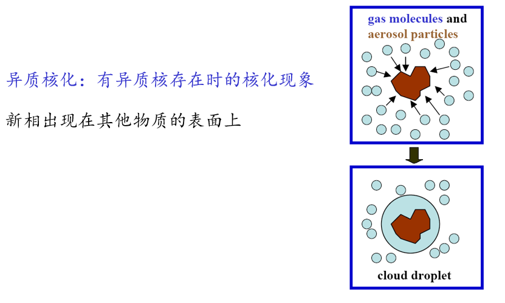

# Main

## 1/3图

1.6 growth_yl.pdf  **14**/30

# 云雾的组成

云是悬浮在大气中的小水滴或冰晶微粒，或两者混合的可见聚合体，有时也包含一些较大的雨滴、冰晶或雪粒，它底部不接触地面，有一定的厚度。

雾是由悬浮近地面空气中微小水滴或冰晶组成的天气现象，是近地面层空气中水汽凝结（或凝华）的产物 （接地的云）。
雾滴普遍比云滴小，而且含水量也小些。但特别浓的雾能见度<50m，含水量也不小。

# 积云的形成理论

积云（Cumulus clouds）是常见的对流性云，通常呈现为白色、蓬松的云块，具有明显的垂直发展。积云的形成主要与大气中的对流过程有关，以下是其形成的主要理论：

### 1. 对流理论

积云的形成主要与大气中的对流运动有关。对流是指由于温度差异引起的空气上升和下降运动。以下是对流理论的具体步骤：

1. **地表加热**：太阳辐射加热地表，导致地表温度升高。
2. **空气受热膨胀**：地表加热使贴近地表的空气受热膨胀，密度降低。
3. **空气上升**：由于密度降低，暖空气开始上升，形成上升气流。
4. **绝热冷却**：上升的空气在上升过程中由于气压降低而膨胀，膨胀过程中空气温度降低（绝热冷却）。
5. **水汽凝结**：当上升的空气冷却到露点温度时，空气中的水汽开始凝结，形成小水滴，这些小水滴聚集在一起形成云滴。
6. **积云形成**：随着水汽的不断凝结和云滴的聚集，形成了可见的积云。

### 2. 动力抬升理论

除了对流运动，动力抬升也是积云形成的重要机制。动力抬升是指空气在遇到地形障碍或天气系统时被迫上升的过程。

1. **地形抬升**：当空气流动遇到山脉等地形障碍时，空气被迫上升。
2. **锋面抬升**：冷暖空气相遇时，暖空气被冷空气抬升。
3. **辐合抬升**：在低压系统中，空气从四周向中心辐合，导致空气上升。

### 3. 湿度条件

积云的形成还需要足够的水汽含量。如果空气过于干燥，即使有强烈的对流运动，也难以形成积云。通常，相对湿度较高时，更容易形成积云。

### 4. 稳定性条件

大气层结的稳定性也会影响积云的形成。在不稳定的大气层结中，对流运动更容易发展，有利于积云的形成。而在稳定的大气层结中，对流运动受到抑制，积云难以形成。

### 5. 积云的演变

积云在形成后，可能会经历不同的演变过程：

- **淡积云（Cumulus humilis）**：云体较小，垂直发展不显著。
- **中积云（Cumulus mediocris）**：云体较大，垂直发展较为显著。
- **浓积云（Cumulus congestus）**：云体高大，垂直发展显著，可能发展成积雨云。
- **积雨云（Cumulonimbus）**：云体非常高大，垂直发展极强，可能产生雷暴、暴雨等剧烈天气。

### 总结

积云的形成是一个复杂的过程，涉及对流运动、动力抬升、湿度条件和大气层结稳定性等多个因素。对流运动是积云形成的主要机制，而其他因素则在不同程度上影响积云的形成和发展。

---

# 云形成的宏观条件_流程图

---

热泡的形成：积云顶花椰菜状凸起，启发人们设想初生的积云就是由较高温度的热气泡浮升造成的。

# 云雾滴大小

临界温度：加压力使气体液化之最高温度称为临界温度。如水之临界温度为374℃，若温度高于374℃，则不可能加压使水蒸气液化。

# 水的表面张力

### 水的表面张力与水汽压、饱和水汽压的关系

#### 1. **表面张力**

水的表面张力是由于水分子之间的内聚力（氢键作用）导致的，使得水的表面像一层有弹性的膜。表面张力使水的表面趋向于收缩到最小的表面积。

#### ~~2. **水汽压**~~

~~水汽压是指在特定温度下，水面上方的空气中水蒸气的分压。当水蒸气的分压低于该温度下的饱和水汽压时，水会继续蒸发；当水蒸气的分压等于饱和水汽压时，水和蒸汽达到动态平衡。~~

#### ~~3. **饱和水汽压**~~

~~饱和水汽压是指在特定温度下，水蒸气在空气中达到饱和状态时的水汽压。饱和水汽压与温度有关，温度越高，饱和水汽压越大。~~

#### 4. **表面张力与水汽压、饱和水汽压的关系**

- **Kelvin效应**：由于表面张力的存在，弯曲的液面（如水滴）会产生附加的压力，这种压力会影响液体的蒸气压。<u>具体来说，凹液面（如水滴内部）会降低液体的蒸气压，而凸液面（如水滴外部）会升高液体的蒸气压</u>。
- **Gibbs-Thomson效应**：表面张力会影响液体的化学势，从而影响液体的蒸气压。<u>表面张力越大，液体的蒸气压越低</u>。

### 水的表面张力的影响因素

#### 1. **温度**

温度对水的表面张力有显著影响。<u>随着温度的升高，水的表面张力会降低</u>。这是因为温度升高会增加水分子的动能，减弱分子间的氢键作用，从而降低表面张力。

- **具体表现**：在0°C时，水的表面张力约为75.6 mN/m，而在100°C时，水的表面张力降至58.9 mN/m。

#### 2. **溶质**

溶解在水中的溶质会影响水的表面张力：

- **无机盐**：<u>大多数无机盐（如氯化钠）会增加水的表面张力</u>。这是因为无机盐离子会增强水分子之间的内聚力。
- **表面活性剂**：表面活性剂（如肥皂、洗涤剂）会显著降低水的表面张力。这是因为表面活性剂分子在水面排列，减弱了水分子之间的氢键作用。

#### 3. **压力**

压力对水的表面张力的影响相对较小。在常压范围内，压力变化对水的表面张力影响不大。但在极高压力下，表面张力可能会略有增加。

#### 4. **杂质**

水中的杂质（如油、灰尘等）会影响表面张力。某些杂质会降低表面张力，而某些杂质（如无机盐）会增加表面张力。

#### 5. **其他因素**

- **电场**：电场会影响水分子的排列，从而影响表面张力。
- **磁场**：磁场对水的表面张力的影响较小，但在某些特定条件下，磁场可能会略微改变表面张力。

### 总结

- **表面张力与水汽压、饱和水汽压的关系**：表面张力通过影响液体的蒸气压来影响水汽压和饱和水汽压。具体来说，表面张力越大，液体的蒸气压越低。
- **表面张力的影响因素**：温度、溶质、压力、杂质、电场和磁场等都会影响水的表面张力。其中，温度和溶质的影响最为显著。

### 参考文献

"Surface tension of water", Wikipedia, https://en.wikipedia.org/wiki/Surface_tension

---

# 寇拉曲线

[Köhler（寇拉）方程 - 知乎](https://zhuanlan.zhihu.com/p/649198279)

#### Import

- 盐核质量愈大，起始的饱和溶液滴半径也愈大

- 盐核质量愈大，则临界相对湿度愈小，但[临界半径](https://zhida.zhihu.com/search?content_id=232396183&content_type=Article&match_order=1&q=%E4%B8%B4%E7%95%8C%E5%8D%8A%E5%BE%84&zhida_source=entity)却愈大

- 当环境湿度小于临界相对湿度的时候，盐核可以增长到对应的大小，处于稳定态

- 环境湿度等于临界相对湿度的时候，处于亚稳定态，就像在山顶，可能往回倒退也可能继续增大，处于亚稳定态

- 当环境湿度大于临界相对湿度，不需要这么大的过饱和度也可以继续长大成云滴
  
  
  
  
  
  个人分析：一个气溶胶粒子超过了临界半径，即使是在相对湿度不大的情况下，它也能发生凝结；但是如果他的质量（半径）不够大，即使相对湿度再大，它也难以凝结

## AI：

寇拉曲线（Köhler curve）是云物理学中的一个重要概念，用于描述水滴在凝结和生长过程中的行为，特别是在异质核化过程中。以下是关于寇拉曲线的详细解释：

### 1. **寇拉方程**

寇拉方程（Köhler equation）是描述水滴在吸收水汽凝结并长大过程中，不同半径的盐溶液滴与大气相对湿度或过饱和度之间关系的公式。该方程结合了以下两个主要效应：

1. **拉乌尔定律（Raoult's Law）**：描述了溶液的蒸气压与其浓度之间的关系。溶液中溶质的浓度越高，溶液的蒸气压越低。
2. **开尔文效应（Kelvin Effect）**：描述了由于液滴表面曲率引起的饱和蒸气压变化。液滴的曲率越大，饱和蒸气压越高。

### 2. **寇拉曲线的形成**

寇拉曲线是寇拉方程的图像描述，显示了云滴在不同直径下与环境（大气）平衡的过饱和度。曲线的确切形状取决于溶质的量和组成成分。例如，氯化钠的寇拉曲线与硝酸钠或硫酸铵的曲线不同。

### 3. **寇拉曲线的特点**

- **临界直径（Critical Diameter）**：寇拉曲线的峰值对应的液滴直径称为临界直径。在这个直径下，液滴的过饱和度达到最大值。
- **临界过饱和度（Critical Supersaturation）**：液滴能够无限制增长的过饱和度称为临界过饱和度。如果大气中的过饱和度超过这个值，液滴将继续增长，可能形成降水。

### 4. **寇拉曲线的应用**

寇拉曲线在云物理学中具有重要意义，主要用于：

- **解释云滴的生长过程**：寇拉曲线解释了云滴在凝结和生长过程中的行为，特别是在不同过饱和度条件下的生长速度。
- **研究云的形成和降水机制**：通过分析寇拉曲线，可以更好地理解云的形成、发展和降水机制。
- **云凝结核（CCN）的作用**：寇拉曲线帮助理解云凝结核（如气溶胶粒子）在云滴形成和生长中的作用。

### 5. **寇拉曲线的具体应用实例**

- **氯化钠溶液的寇拉曲线**：对于溶解直径等于0.05微米的氯化钠溶液滴，寇拉曲线显示在过饱和度为0.35%时，液滴会增大直到达到热力学平衡。如果过饱和度仅为0.3%，则液滴将仅增长至约0.5微米。
- **气溶胶的影响**：气溶胶粒子作为云凝结核（CCN）会影响寇拉曲线的形状，从而影响云滴的生长和降水形成。

### 6. **寇拉曲线的物理意义**

寇拉曲线揭示了液滴表面张力、溶液浓度和过饱和度之间的关系。具体来说，寇拉曲线表明：

- **表面张力效应**：液滴的表面张力会导致饱和蒸气压增加，从而影响液滴的生长。
- **溶液浓度效应**：溶液中溶质的浓度越高，溶液的蒸气压越低，液滴的生长速度越慢。

### 总结

寇拉曲线是理解云滴生长和云形成过程的重要工具。它结合了拉乌尔定律和开尔文效应，描述了液滴在不同过饱和度条件下的生长行为。通过分析寇拉曲线，可以更好地理解云的形成、发展和降水机制，以及气溶胶粒子在云滴形成中的作用。

---

# 成核作用

结论：<u>自然条件下不可能出现水汽同质核化凝结形成水滴</u>。

###### 异质核化

主要与核的水湿性相关：如在潮湿环境下的平石板、墙面，浴室的镜面、磁砖表面上发生的凝结现象。

结论：<u>要产生相同的核化率，亲水性表面比憎水性表面容易</u>。

**可能出现的考题**

# 水滴的下落蒸发

水滴在等温大气中蒸发前的下落距离，假设温度为280°K，饱和度S' = 0.8

---

# 云滴群的凝结增长

**不管你愿不愿意，你得把下面这三张图给吞下去**

这三张图是可以一起看的，他们的思想基本上是一致的

## ★云滴群的凝结增长

## ★云滴群的凝结增长

自然云中许多云滴常一起增长，并争食云内可被利用的水汽。当微滴相当大或者数量充分多时，消耗水汽的速率可以超出产生过饱和度的速率，这将阻碍或终止微滴的增长过程。

过饱和度是先增大后减小的。
含盐粒较大的云滴都易于活化增大。而半径小的难以达到活化半径；而且在以后湿度下降时，甚至会蒸发变小。

过到活化半径而增大的各种大小的云滴，它们会渐渐增大到尺度相近的半径。

## ★云滴群的凝结增长

---

# 暖云降水理论

**暖云降水和冷云降水是两种不同的降水机制，它们在云的形成过程、物理结构和降水机制上有显著的区别。以下是它们的主要区别：**

### 1. **云体温度**

- **暖云降水**：暖云是指云体温度高于0℃的云。在这种云中，水滴以液态形式存在，没有冰晶。
- **冷云降水**：冷云是指云体温度低于0℃的云。在这种云中，水滴可能以过冷却水滴（0℃以下）和冰晶的形式共存。

### 2. **降水机制**

- **暖云降水**：
  
  - **主要机制**：暖云降水的机制主要是水滴之间的重力碰并增长。云滴在上升、下降及乱流混合作用下发生相互碰撞，并合并成较大云滴。
  - **过程**：水滴通过凝结增长和碰并增长形成较大的水滴，最终形成降水。在这个过程中，连锁反应（chain reaction）是一个重要的机制，即大水滴在下降过程中破碎成小水滴，再被上升气流携带上升，形成新的胚胎并继续增长。
  - **人工影响**：为了促进暖云降水，可以通过撒播吸湿性粉末（如氯化钠、氯化钾等）或直接引入大水滴来破坏云的胶性稳定，促进水滴的碰并增长。

- **冷云降水**：
  
  - **主要机制**：冷云降水的机制主要是通过贝吉龙过程（Bergeron process）和凇附（riming）过程。在冷云中，冰晶通过吸附水汽和碰并过冷却水滴而增长，最终形成降水。
  - **过程**：过冷却水滴在冰晶表面凝结，形成更大的冰晶，这些冰晶在下降过程中通过碰并和聚集进一步增长，最终形成降水。
  - **人工影响**：为了促进冷云降水，可以通过撒播碘化银成冰剂或干冰等致冷剂来增加冰晶的数量，从而促进降水的形成。

### 3. **云滴谱分布**

- **暖云降水**：暖云中的水滴大小较为均匀，缺乏大水滴，因此不易产生降水。通过人工手段引入大水滴或吸湿性物质可以改变水滴谱分布，促进降水。
- **冷云降水**：冷云中存在过冷却水滴和冰晶，水滴谱分布较为不均匀，冰晶的存在促进了水滴的增长和降水的形成。

### 4. **人工影响天气**

- **暖云降水**：人工影响暖云降水主要通过撒播吸湿性粉末或直接引入大水滴来促进水滴的碰并增长。
- **冷云降水**：人工影响冷云降水主要通过撒播碘化银成冰剂或干冰等致冷剂来增加冰晶的数量，从而促进降水的形成。

### 5. **降水效率**

- **暖云降水**：由于缺乏大水滴，暖云降水的效率较低。
- **冷云降水**：由于冰晶的存在，冷云降水的效率较高。

### 总结

暖云降水和冷云降水在云体温度、降水机制、云滴谱分布和人工影响方法上都有显著的区别。暖云降水主要依靠水滴之间的碰并增长，而冷云降水则主要依靠冰晶的增长和凇附过程。理解这些区别对于人工影响天气和气象预报具有重要意义。

---

### ★凝结与随机碰并结合的作用

这个图显示的是水滴数量和过饱和度随时间的变化。

1.**横轴（时间）**：表示时间，单位是分钟。

2.**左纵轴（水滴数量）**：表示水滴的数量。

3.**右纵轴（过饱和度）**：表示空气中的水汽过饱和度，单位是百分比。

从图中可以看到：

- 在最初的15分钟内，水滴数量保持不变，过饱和度也保持不变。这说明在这段时间内，没有发生凝结现象。

- 15分钟后，水滴数量突然急剧减少，同时过饱和度急剧增加。这是因为水滴开始凝结成更大的水滴，导致水滴数量减少，而空气中的水汽过饱和度增加。

- 水汽过饱和度增加，能产生新的凝结核，从而引起水滴数再次增加，造成一个小的峰值，但它的持续时间短。

- 随着时间的推移，水滴数量继续减少，过饱和度也逐渐增加，直到达到一个稳定的状态。
  
  ---

水滴的凝结增长和重力碰并增长的不同特点： 凝结增长是一个减速的过程， 碰并增长是加速的过程

A：大云滴与小云滴碰并形成雨滴；

B：雨滴继续下降，与云滴碰并；

C：大滴破碎；

D：大云滴与小云滴碰并形成雨滴。

# 冷云降水

1、雹胚沿主上升气流边缘上升增长，可增大到1mm

2、被上升气流带到前方弱上升气流区

3、在上升气流前面下落入雹胚帘，可增大到5mm

4、从雹胚帘底随主上升气流上升迅速增长

5、在上升气流边缘下落

4-5可多次重复

6、冰雹在零度层上与过冷水碰并

7、长到足够大后下落到地面

冰雹活动具有三大特性：冰雹的活动有明显的地区性、时间性和季节性等特征。

---

冰雹的透明层和不透明层是由于冰雹在云层中上升和下降时经历的不同的冻结条件所形成的。

1. **透明层**：当冰雹在云层中**上升**时，它会穿过含有过冷水滴的区域。这些过冷水滴迅速冻结在冰雹表面，形成一层透明的冰。由于**冻结速度较快**，**气泡没有时间形成**，因此这层冰是透明的。

2. **不透明层**：当冰雹在云层中**下降**时，它会穿过含有较多水汽和较大水滴的区域。这些水滴在冰雹表面冻结时，由于**冻结速度较慢**，**气泡有时间形成并被困在冰中**，使得这层冰变得不透明。

冰雹在云层中反复上升和下降，不断形成新的透明层和不透明层，最终形成我们看到的具有层状结构的冰雹。

# 人工影响天气

2.1 weathermod.ppt

[大型纪录片《9.2摇裤危机》，重庆人民不会忘记这沉重的一天_哔哩哔哩_bilibili](https://www.bilibili.com/video/BV1vspPeQEv7/)

[大型纪录片《摇裤危机2.0》_哔哩哔哩_bilibili](https://www.bilibili.com/video/BV1dkHQeQEoL)

[“摇裤危机”：一场人工降雨引发的社会镜像](https://baijiahao.baidu.com/s?id=1809454222007933890)

人工影响天气（Weather Modification）是指通过人为手段，对天气过程进行干预，以达到防灾减灾、增加降水、抑制冰雹等目的。以下是人工影响天气的主要方法和原理：

### 1. **人工增雨**

人工增雨是通过在云中引入凝结核或冰核，促进云滴增长，从而增加降水量。主要方法包括：

- **冷云催化**：在冷云中撒播碘化银、干冰等致冷剂，增加冰晶数量，促进冰晶增长和降水形成。
- **暖云催化**：在暖云中撒播吸湿性粉末（如氯化钠、氯化钾等）或直接引入大水滴，促进水滴碰并增长，增加降水。

### 2. **人工消雾**

人工消雾是通过引入冷空气或冰核，加速雾滴的凝结和沉降，从而消除雾霾。主要方法包括：

- **冷却法**：通过引入冷空气或撒播干冰，降低雾滴温度，加速凝结和沉降。
- **吸湿法**：撒播吸湿性物质，促进雾滴增长和沉降。

### 3. **人工抑制冰雹**

人工抑制冰雹是通过在云中引入大量冰核，促进冰晶增长，从而减少冰雹的形成。主要方法包括：

- **冷云催化**：撒播碘化银等冰核，促进冰晶增长，减少大冰雹的形成。
- **暖云催化**：撒播吸湿性物质，促进水滴增长，减少冰雹的形成。

### 4. **人工防霜冻**

人工防霜冻是通过在低温条件下引入暖空气或撒播防冻剂，防止作物冻害。主要方法包括：

- **加热法**：通过燃烧燃料或使用电加热器，提高作物周围的温度，防止霜冻。
- **防冻剂**：撒播防冻剂，降低作物表面温度，防止冻害。

### 5. **人工影响台风的尝试**

虽然技术上尚不成熟，但人工影响台风的尝试也在进行。主要方法包括：

- **冷云催化**：在台风眼墙云系中撒播碘化银等冰核，试图改变台风结构和路径。
- **吸湿法**：撒播吸湿性物质，试图改变台风降水分布。

### 6. **技术和挑战**

人工影响天气技术虽然取得了一定成果，但仍面临许多挑战：

- **科学基础**：需要深入研究云物理和天气过程，才能更有效地进行干预。
- **环境风险**：人工影响天气可能带来不可预见的环境影响，需要谨慎评估。
- **伦理和法律问题**：人工影响天气涉及跨国界问题，需要国际合作和法律规范。

### 总结

人工影响天气是一项复杂的系统工程，涉及气象学、物理学、化学和环境科学等多个领域。虽然技术在不断发展，但仍需深入研究和谨慎应用，以确保其在防灾减灾中的有效性和安全性。

---

# 雷雨云的起电机制

雷雨云的起电机制是一个复杂的过程，涉及多种物理现象。主要的起电机制包括以下几种：

### 1. **碰撞-分离机制（Collision-Coalescence Mechanism）**

这是雷雨云起电的主要机制之一。当云中的水滴和冰晶相互碰撞时，较小的水滴会被较大的水滴吸收，这个过程称为碰撞-合并。由于水滴的大小和质量不同，它们在重力作用下的下落速度也不同。较大的水滴下落较快，而较小的水滴被上升气流携带上升。这种相对运动导致了水滴之间的碰撞和电荷分离。

### 2. **冰晶机制（Ice Crystal Mechanism）**

在雷雨云的高层，温度较低，水汽会直接在冰晶表面凝华，形成更大的冰晶。当冰晶相互碰撞时，较小的冰晶会被较大的冰晶吸收，或者破碎成更小的冰晶。在这个过程中，冰晶之间会发生电荷转移，导致电荷分离。较小的冰晶通常带正电，而较大的冰晶带负电。

### 3. **水滴破碎机制（Raindrop Breakup Mechanism）**

当水滴在下落过程中受到空气阻力的作用，会发生形变并最终破碎。破碎的水滴会产生大量的细小水滴，这些细小水滴带正电，而较大的水滴带负电。这种电荷分离也会导致雷雨云中的电荷积累。

### 4. **温度梯度机制（Temperature Gradient Mechanism）**

雷雨云中存在明显的温度梯度，不同温度区域的水滴和冰晶会表现出不同的电荷特性。在温度梯度的影响下，水滴和冰晶之间的电荷转移也会导致电荷分离。

### 5. **离子捕获机制（Ion Capture Mechanism）**

大气中的离子会被水滴和冰晶捕获，不同的离子带不同的电荷。当这些离子被捕获后，会导致水滴和冰晶带电，从而引起电荷分离。

### 总结

雷雨云的起电机制是一个复杂的过程，涉及多种物理现象的相互作用。主要的起电机制包括碰撞-分离机制、冰晶机制、水滴破碎机制、温度梯度机制和离子捕获机制。这些机制共同作用，导致雷雨云中电荷的积累和分离，最终形成雷电现象。

---

### 可能的考题

### 1. 云中上正下负的电荷中心是如何形成的？

雷雨云中的电荷分布通常表现为上层带正电，下层带负电。这种电荷分布的形成主要与以下几个过程有关：

- **碰撞-分离机制**：水滴和冰晶相互碰撞，较小的水滴带正电，上升；较大的水滴带负电，下落，导致负电荷集中在云的下部，正电荷集中在云的上部。

- **冰晶机制**：冰晶在碰撞和破碎过程中，较小的冰晶带正电，较大的冰晶带负电，导致电荷分离。

### 2. 主要的起电过程

主要的起电过程包括：

- **碰撞-分离机制**：水滴和冰晶碰撞，较小的带正电，上升；较大的带负电，下落。

- **冰晶机制**：冰晶碰撞和破碎，较小的带正电，较大的带负电。

- **水滴破碎机制**：水滴下落过程中破碎，小水滴带正电，大水滴带负电。

这些过程共同作用，导致雷雨云中电荷的积累和分离，形成上正下负的电荷中心。

自己画的烂图：

3.4 雷暴云闪电.pptx

# 学不进去？看看散装课

[降水微物理过程简述_哔哩哔哩_bilibili](https://www.bilibili.com/video/BV1si4y157XF/)

[雷电是怎么产生的？_哔哩哔哩_bilibili](https://www.bilibili.com/video/BV1GT411x7V3/)

[[高中地理拓展x地球科学竞赛]云滴碰并与降水的形成_哔哩哔哩_bilibili](https://www.bilibili.com/video/BV1MK42117Nj/)

★[云降水物理期末复习笔记_同质核化和异质核化的区别-CSDN博客](https://blog.csdn.net/m0_60394632/article/details/128774503)

★[Köhler（寇拉）方程 - 知乎](https://zhuanlan.zhihu.com/p/649198279)

★[人工影响天气期末复习笔记_人工影响天气的方式有哪些-CSDN博客](https://blog.csdn.net/m0_60394632/article/details/130982564)

[闪电是如何形成的？_哔哩哔哩_bilibili](https://www.bilibili.com/video/BV1LU4y1L7BY/)
