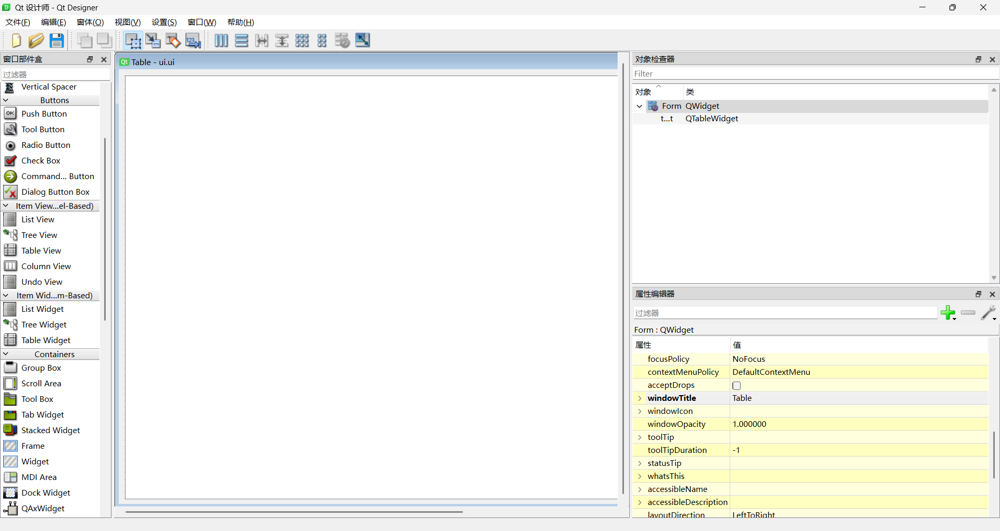
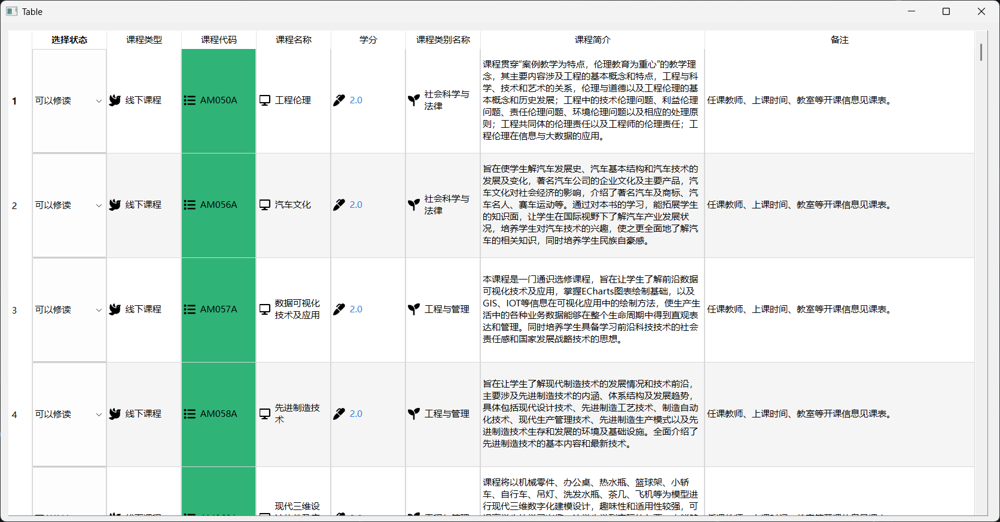

[原文](https://github.com/Pfolg/PfolgBlog/blob/master/%E5%AD%A6%E4%B9%A0%E7%AC%94%E8%AE%B0%E2%80%94%E2%80%94QTableWidget/main.md)

# 什么是QTableWidget
这就是QTableWidget：
~~~Python
class QTableWidget(QTableView):
    """
    QTableWidget(parent: Optional[QWidget] = None)
    QTableWidget(rows: int, columns: int, parent: Optional[QWidget] = None)
    """
~~~
开玩笑的，QTableWidget是PyQt里面的一个控件。

我是参照一个[up主的视频](https://www.bilibili.com/video/BV11C4y1P7fj?p=50)学到这里的

# 正题
pandas读取数据，PyQt实现界面
## 数据读取

利用pandas读取表格数据，表格`sample.xlsx`，我放到了当前目录下，注意查找。

Python实现如下：
~~~Python
def get_data():
    table = pd.read_excel("sample.xlsx", sheet_name="sheet1")
    header = []
    # 获取表头
    for it in table:
        header.append(it)
    # print(header)
    np_table = table.to_numpy()
    # print(np_table, header, len(np_table), len(np_table[0]))
    # print(*header)
    # for i in np_table:
    # print(*i)
    return header, np_table
~~~
这个函数会返回标题行以及主要数据

## 界面实现

界面我使用`Designer.exe`设计，其实就是拖一拖就完成了：

## 主要代码

~~~Python
# -*- coding: UTF-8 -*-
"""
PROJECT_NAME Python_projects
PRODUCT_NAME PyCharm
NAME run
AUTHOR Pfolg
TIME 2025/2/26 19:51
"""
from PyQt6.QtGui import QIcon, QBrush, QColor
from PyQt6.QtWidgets import QApplication, QTableWidget, QTableWidgetItem, QAbstractItemView, QComboBox
import sys
from PyQt6 import uic
import pandas as pd

def get_data():
    table = pd.read_excel("sample.xlsx", sheet_name="sheet1")
    header = []
    # 获取表头
    for it in table:
        header.append(it)
    # print(header)
    np_table = table.to_numpy()
    # print(np_table, header, len(np_table), len(np_table[0]))
    # print(*header)
    # for i in np_table:
    # print(*i)
    return header, np_table

if __name__ == '__main__':
    table_header, table_data = get_data()
    app = QApplication(sys.argv)
    ui = uic.loadUi("./ui.ui")
    tableWidget: QTableWidget = ui.tableWidget

    row = len(table_data)
    column = len(table_header)
    tableWidget.setRowCount(row)
    tableWidget.setColumnCount(column + 1)
    tableWidget.setHorizontalHeaderLabels(["选择状态", *table_header])

    for i in range(row):
        for j in range(column):
            if j == 2:
                tableWidget.setItem(i, j + 1, QTableWidgetItem(
                    QIcon(r"D:\Users\21460\Pictures\fontawesome-free-6.7.2-desktop\svgs\solid\display.svg"),
                    str(table_data[i][j])))
            elif j == 0:
                tableWidget.setItem(i, j + 1, QTableWidgetItem(
                    QIcon(r"D:\Users\21460\Pictures\fontawesome-free-6.7.2-desktop\svgs\solid\dove.svg"),
                    str(table_data[i][j])))
            elif j == 1:
                data = QTableWidgetItem(
                    QIcon(r"D:\Users\21460\Pictures\fontawesome-free-6.7.2-desktop\svgs\solid\list.svg"),
                    str(table_data[i][j]))
                data.setBackground(QBrush(QColor("#2fb376")))
                tableWidget.setItem(i, j + 1, data)
            elif j == 3:
                data = QTableWidgetItem(
                    QIcon(r"D:\Users\21460\Pictures\fontawesome-free-6.7.2-desktop\svgs\solid\marker.svg"),
                    str(table_data[i][j]))
                data.setForeground(QBrush(QColor("#367ed9")))
                tableWidget.setItem(i, j + 1, data)
            elif j == 4:
                tableWidget.setItem(i, j + 1, QTableWidgetItem(
                    QIcon(r"D:\Users\21460\Pictures\fontawesome-free-6.7.2-desktop\svgs\solid\seedling.svg"),
                    str(table_data[i][j])))
            elif j in [7, 6]:
                tableWidget.setColumnWidth(j, 300)  # 设置列宽
                tableWidget.setItem(i, j + 1, QTableWidgetItem(str(table_data[i][j])))
            else:
                tableWidget.setItem(i, j + 1, QTableWidgetItem(str(table_data[i][j])))

        tableWidget.setRowHeight(i, 140)  # 设置行高

        Combobox = QComboBox()
        Combobox.addItems(["正在修读", "可以修读", "未修读", "不可修读"])
        Combobox.setCurrentIndex(1)
        tableWidget.setCellWidget(i, 0, Combobox)
    # tableWidget.resizeRowsToContents()  # 设置行高随内容改变
    # tableWidget.resizeColumnsToContents()  # 设置列宽随内容改变
    tableWidget.setAlternatingRowColors(True)  # 斑马线
    tableWidget.horizontalHeader().setStretchLastSection(True)  # 最后一列填满表格
    tableWidget.setEditTriggers(QAbstractItemView.EditTrigger.DoubleClicked)  # 设置编辑模式=不可编辑
    # tableWidget.sortItems(0, Qt.SortOrder.DescendingOrder)  # 降序 0列,A为升序
    # tableWidget.setSpan(0, 0, 2, 2)  # 合并单元格
    print(row, column)
    ui.show()
    sys.exit(app.exec())
~~~
其中，main之下是程序要执行的，我们先获取数据，然后load一下ui，加载好ui后，我们主要对tableWidget进行设计，比如根据数据设置行数和列数，然后载入数据，并在载入的同时进一步设计单元格样式。

我没有像up视频中提到的那样使用数据库（我也不会），这个嘛，虽然他有引流的嫌疑，但也是人之常情。学一下数据库挺好。

至于颜色代码和图标包，自己研究吧，代码拿出来基本上不是用来看的，而是用来炫技的，虽然我本来就很菜。
# 运行结果
