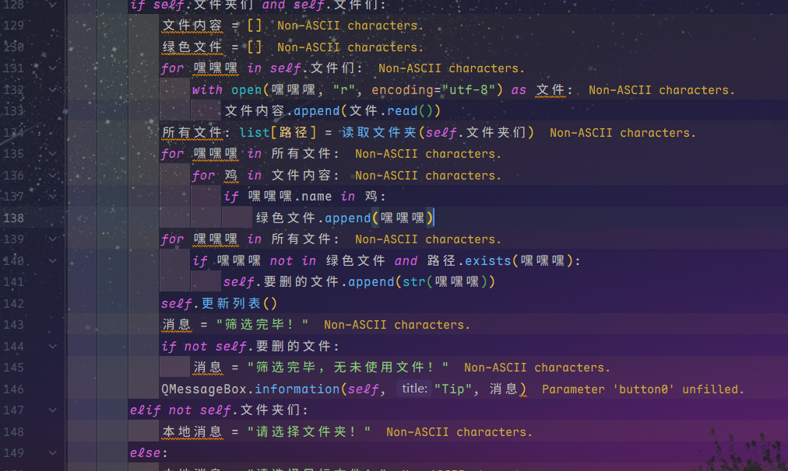
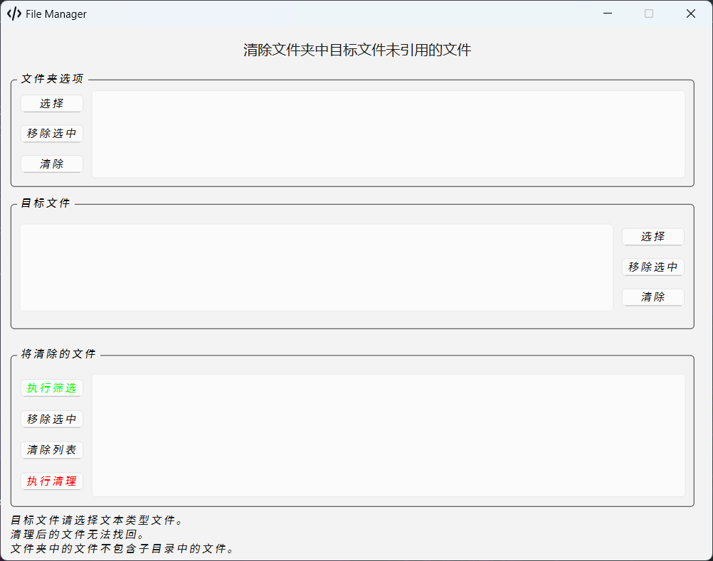

哦，实际上并不是用中文写的，只是改了一下变量，剩下的没啥了。

<u>主要是为了**清理** **`所选文件夹`** 中 **`所选目标文本文件`** 中 **`未引用的文件`**</u>

~~~python
# -*- coding: UTF-8 -*-
"""
PROJECT_NAME Python_projects
PRODUCT_NAME PyCharm
NAME main
AUTHOR Pfolg
TIME 2025/6/14 16:57
"""
import sys
from pathlib import Path

from PySide6.QtCore import QTimer
from PySide6.QtGui import QStandardItemModel, QStandardItem, QIcon
from PySide6.QtUiTools import QUiLoader
from PySide6.QtWidgets import QApplication, QWidget, QLabel, QPushButton, QListView, QAbstractItemView, QFileDialog, \
    QMessageBox

# 读取屏幕长宽
def get_screen_info() -> tuple:
    # 获取现有的 QApplication 实例
    _app = QApplication.instance()

    if _app is not None:
        screen = _app.primaryScreen().geometry()

        return screen.width(), screen.height()
    else:
        return 800, 600

def get_out_repeat_element(a: list) -> list:
    b = []
    for i in a:
        if i not in b:
            b.append(i)
    return b

def read_folders_files(data: list):
    all_files = []
    for i in data:
        current_dir = Path(i)
        if Path.exists(current_dir):
            all_items = current_dir.iterdir()
            # 过滤出文件（排除文件夹）
            for item in all_items:
                if item.is_file():
                    all_files.append(item)
    print(all_files)
    return get_out_repeat_element(all_files)

class Window(QWidget):
    def __init__(self):
        super().__init__()
        QUiLoader().load("main.ui", self)
        self.folders = []
        self.files = []
        self.delete_files = []
        self.timer = QTimer()

        self.model1 = QStandardItemModel()
        self.model2 = QStandardItemModel()
        self.model3 = QStandardItemModel()
        # 引用
        self.global_label1: QLabel = self.findChild(QLabel, "label")
        self.global_label2: QLabel = self.findChild(QLabel, "label_2")
        self.global_label3: QLabel = self.findChild(QLabel, "label_3")

        self.f1_b1: QPushButton = self.findChild(QPushButton, "pushButton")
        self.f1_b2: QPushButton = self.findChild(QPushButton, "pushButton_2")
        self.f1_b3: QPushButton = self.findChild(QPushButton, "pushButton_3")
        self.f2_b1: QPushButton = self.findChild(QPushButton, "pushButton_4")
        self.f2_b2: QPushButton = self.findChild(QPushButton, "pushButton_5")
        self.f2_b3: QPushButton = self.findChild(QPushButton, "pushButton_6")
        self.f3_b1: QPushButton = self.findChild(QPushButton, "pushButton_7")
        self.f3_b2: QPushButton = self.findChild(QPushButton, "pushButton_8")
        self.f3_b3: QPushButton = self.findChild(QPushButton, "pushButton_9")
        self.f3_b4: QPushButton = self.findChild(QPushButton, "pushButton_10")

        self.lv1: QListView = self.findChild(QListView, "listView")
        self.lv2: QListView = self.findChild(QListView, "listView_2")
        self.lv3: QListView = self.findChild(QListView, "listView_3")

        self.global_label3.hide()
        self.init()

    def remove_files(self):
        if self.delete_files:
            # 确认
            if QMessageBox.question(
                    self, "Confirm",
                    "确认删除吗？",
                    QMessageBox.StandardButton.Ok,
                    QMessageBox.StandardButton.Cancel
            ) == QMessageBox.StandardButton.Ok:
                for i in self.delete_files:
                    Path.unlink(Path(i))
                self.delete_files.clear()
                self.update_listView()
                msg = "清理完毕！"
            else:
                return
        else:
            msg = "无可清理文件！"

        QMessageBox.information(self, "Tip", msg, QMessageBox.StandardButton.Ok)

    def start_remove(self):
        if self.timer.isActive():
            self.timer.stop()
        self.timer = QTimer()
        self.timer.timeout.connect(self.remove_files)
        self.timer.setSingleShot(True)
        self.timer.start()

    def start_compare(self):
        if self.timer.isActive():
            self.timer.stop()
        self.timer = QTimer()
        self.timer.timeout.connect(self.compare_content)
        self.timer.setSingleShot(True)
        self.timer.start()

    def compare_content(self):
        _msg = ""
        if self.folders and self.files:
            file_content = []
            green_files = []
            for i in self.files:
                with open(i, "r", encoding="utf-8") as file:
                    file_content.append(file.read())
            all_files: list[Path] = read_folders_files(self.folders)
            for i in all_files:
                for j in file_content:
                    if i.name in j:
                        green_files.append(i)
            for i in all_files:
                if i not in green_files and Path.exists(i):
                    self.delete_files.append(str(i))
            self.update_listView()
            msg = "筛选完毕！"
            if not self.delete_files:
                msg = "筛选完毕，无未使用文件！"
            QMessageBox.information(self, "Tip", msg, QMessageBox.StandardButton.Ok)
        elif not self.folders:
            _msg = "请选择文件夹！"
        else:
            _msg = "请选择目标文件！"
        if _msg:
            QMessageBox.warning(self, "Warning", _msg)

    def remove_selected(self, list_view: QListView, model: QStandardItemModel) -> None:
        """移除所有选中项（支持多选）"""
        # 获取选中项的索引（按行号降序排序）
        selected_indexes = sorted(
            [index.row() for index in list_view.selectedIndexes()],
            reverse=True
        )
        # 从后向前移除避免索引变化导致错误
        for row in selected_indexes:
            item = model.item(row).text()
            model.removeRow(row)
            if model == self.model1:
                self.folders.remove(item)
                print("文件夹：", self.folders)
            elif model == self.model2:
                self.files.remove(item)
                print("文件：", self.files)
            elif model == self.model3:
                self.delete_files.remove(item)
                print("欲删除文件：", self.delete_files)

    def clear_listView(self, target: int) -> None:
        if target == 1:
            self.model1.clear()
            self.folders.clear()
        elif target == 2:
            self.model2.clear()
            self.files.clear()
        elif target == 3:
            self.model3.clear()
            self.delete_files.clear()

    def bind_functions(self):
        self.f1_b1.clicked.connect(self.select_folder)
        self.f1_b2.clicked.connect(lambda: self.remove_selected(self.lv1, self.model1))
        self.f1_b3.clicked.connect(lambda: self.clear_listView(1))

        self.f2_b1.clicked.connect(self.select_files)
        self.f2_b2.clicked.connect(lambda: self.remove_selected(self.lv2, self.model2))
        self.f2_b3.clicked.connect(lambda: self.clear_listView(2))

        self.f3_b1.clicked.connect(self.start_compare)
        self.f3_b2.clicked.connect(lambda: self.remove_selected(self.lv3, self.model3))
        self.f3_b3.clicked.connect(lambda: self.clear_listView(3))
        self.f3_b4.clicked.connect(self.start_remove)

    def update_listView(self):
        self.model1.clear()
        self.model2.clear()
        self.model3.clear()
        if self.folders:
            for i in self.folders:
                self.model1.appendRow(QStandardItem(i))
        if self.files:
            for i in self.files:
                self.model2.appendRow(QStandardItem(i))
        if self.delete_files:
            for i in self.delete_files:
                self.model3.appendRow(QStandardItem(i))

    def select_folder(self):
        fd = QFileDialog()
        fd.setFileMode(QFileDialog.FileMode.Directory)
        fd.setViewMode(QFileDialog.ViewMode.List)
        if fd.exec():
            a = fd.selectedFiles()
            print(a)
            for i in a:
                self.folders.append(i)
            # 去重
            self.folders = get_out_repeat_element(self.folders)
            self.update_listView()

    def select_files(self):
        fd = QFileDialog()
        fd.setFileMode(QFileDialog.FileMode.ExistingFiles)
        fd.setViewMode(QFileDialog.ViewMode.List)
        if fd.exec():
            a = fd.selectedFiles()
            print(a)
            for i in a:
                self.files.append(i)
            self.files = get_out_repeat_element(self.files)
            self.update_listView()

    def init(self):
        w, h = get_screen_info()
        self.setGeometry(int((w - 800) / 2), int((h - 600) / 2), 800, 600)
        self.setMaximumSize(800, 600)
        self.setWindowTitle("File Manager")
        self.setWindowIcon(QIcon("code.svg"))
        self.lv1.setModel(self.model1)
        self.lv2.setModel(self.model2)
        self.lv3.setModel(self.model3)
        for i in [self.lv1, self.lv2, self.lv3]:
            i.setSelectionMode(QAbstractItemView.SelectionMode.ExtendedSelection)
            i.setEditTriggers(QAbstractItemView.EditTrigger.NoEditTriggers)
        self.bind_functions()

if __name__ == '__main__':
    app = QApplication(sys.argv)
    window = Window()
    window.show()
    sys.exit(app.exec())
~~~