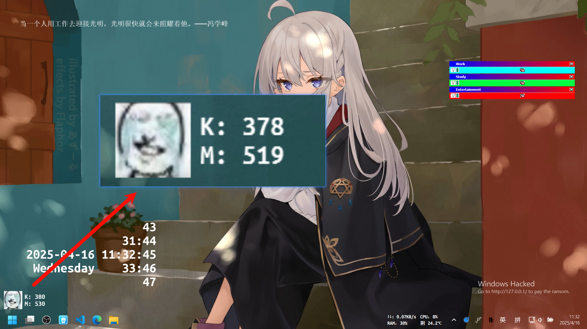

### 简要介绍

在屏幕上显示按键和鼠标点击的次数，基于PySide6和pynput。

### 代码

#### 界面与功能实现
可以更改图标与显示文字（在代码中）
~~~Python
# -*- coding: UTF-8 -*-
"""
PROJECT_NAME Python_projects
PRODUCT_NAME PyCharm
NAME counter
AUTHOR Pfolg
TIME 2025/4/12 12:20
"""
import os
import sys
import threading

from PySide6 import QtCore, QtGui
from PySide6.QtCore import Qt
from PySide6.QtGui import QFont, QAction, QIcon
from PySide6.QtWidgets import QLabel, QWidget, QApplication, QSystemTrayIcon, QMenu

from pynput import keyboard, mouse

class LKMLabel(QWidget):
    def __init__(self):
        super().__init__()
        screen_geometry = app.primaryScreen().geometry()
        self.setGeometry(10, screen_geometry.height() - 100, 160, 60)
        # 启用透明度
        self.setAttribute(Qt.WidgetAttribute.WA_TranslucentBackground, True)
        self.setWindowFlags(
            Qt.WindowType.FramelessWindowHint |  # 去除标题栏
            Qt.WindowType.Tool |  # 去除任务栏图标
            Qt.WindowType.WindowTransparentForInput  # 鼠标穿透
            # Qt.WindowType.WindowStaysOnTopHint  # 顶置
        )

        self.logo = QLabel(self)
        self.logo.setPixmap(QtGui.QPixmap("default_win.png"))
        self.logo.setScaledContents(True)
        self.logo.setAlignment(QtCore.Qt.AlignmentFlag.AlignCenter)
        self.logo.setGeometry(0, 0, 48, 48)

        font = QFont()
        font.setFamily("Ubuntu Mono")
        font.setBold(True)
        font.setPointSize(12)
        self.textLabel = QLabel(self)
        self.textLabel.setFont(font)
        self.textLabel.setStyleSheet("color:#ffffff")
        self.textLabel.setGeometry(54, 0, 100, 48)
        # self.textLabel.setText("K: 9999\nM: 9999")

        self.show()

    def closeEvent(self, event, /):
        event.ignore()

# 键盘监听回调函数
def on_key_release(key):
    global key_press_count
    key_press_count += 1
    change_key_mouse()
    print(f"键盘按键次数: {key_press_count}")

# 鼠标点击监听回调函数
def on_mouse_click(x, y, button, pressed):
    global mouse_click_count
    if pressed:  # 按下时计数
        mouse_click_count += 1
        change_key_mouse()
        print(f"鼠标点击次数: {mouse_click_count}")

# 启动键盘监听
def start_keyboard_listener():
    with keyboard.Listener(on_release=on_key_release) as listener:
        listener.join()

# 启动鼠标监听
def start_mouse_listener():
    with mouse.Listener(on_click=on_mouse_click) as listener:
        listener.join()

def change_key_mouse():
    LKM_win.textLabel.setText(f"K: {key_press_count}\nM: {mouse_click_count}")
    with open("count.txt", "w", encoding="utf-8") as file:
        file.write(str([key_press_count, mouse_click_count]))

def read_count():
    if os.path.exists("count.txt"):
        with open("count.txt", "r", encoding="utf-8") as file:
            x = file.read()
            return eval(x.strip())
    else:
        return 0, 0

def set_tray(icon: QSystemTrayIcon):
    icon.setToolTip("Counter is running")
    menu = QMenu()
    action_quit = QAction(menu)
    action_quit.setText("Quit")
    action_quit.triggered.connect(sys.exit)

    action_set = QAction(menu)
    action_set.setText("Set")
    action_set.triggered.connect(lambda: os.startfile("count.txt"))
    menu.addActions([action_set, action_quit])
    icon.setContextMenu(menu)
    icon.setIcon(QIcon("logo.png"))

if __name__ == '__main__':
    app = QApplication(sys.argv)
    tray = QSystemTrayIcon()
    set_tray(tray)
    tray.show()
    LKM_win = LKMLabel()

    # 全局计数器
    key_press_count, mouse_click_count = read_count()
    # 启动键盘和鼠标监听线程
    keyboard_thread = threading.Thread(target=start_keyboard_listener, daemon=True)
    mouse_thread = threading.Thread(target=start_mouse_listener, daemon=True)

    keyboard_thread.start()
    mouse_thread.start()

    # 手动修改显示计数
    change_key_mouse()

    sys.exit(app.exec())
~~~

#### 处理日志

**你必须手动处理日志**

这是一个单独的程序，没有集成到主程序中，处理日志时主程序不得运行！
~~~py
# -*- coding: UTF-8 -*-
"""
PROJECT_NAME Python_projects
PRODUCT_NAME PyCharm
NAME get_format
AUTHOR Pfolg
TIME 2025/4/13 11:39
"""
import datetime
import os

def get_days_since_last_modified(file_path):
    # 获取文件的修改时间戳（秒）
    creation_timestamp = os.path.getctime(file_path)

    # 转换为可读时间格式
    creation_time = datetime.datetime.fromtimestamp(creation_timestamp)
    formatted_time = creation_time.strftime("%Y-%m-%d %H:%M:%S")
    # 获取当前时间戳
    current_time = datetime.datetime.now().strftime("%Y-%m-%d %H:%M:%S")
    with open(file_path, "r", encoding="utf-8") as f:
        tue: list = eval(f.read())
    print(f"{formatted_time}&{current_time}&{tue}")
    with open("log.txt", "a", encoding="utf-8") as file:
        file.write(f"{formatted_time}&{current_time}&{tue}\n")

    os.remove(file_path)

if __name__ == '__main__':
    get_days_since_last_modified("count.txt")
~~~

**日志**
~~~txt
2025-04-12 12:25:48&2025-04-13 11:59:04&[15527, 4840]
2025-04-13 11:59:24&2025-04-15 17:44:40&[3283, 2752]

~~~

#### 打包

首先你需要有python环境，并且安装好了所需第三方库（强烈推荐在虚拟环境中打包，避免与全局环境冲突！）

在打包之前，请安装
    
    pip install pyinstaller

然后运行打包命令：

    pyinstaller -F -w -i logo.ico counter.py

具体图片和文件名需自己提供，这里只是模板。

### 结束

差不多就这样了，没什么花头。

嗯，灵感基于一个steam游戏，至于是哪个这里不便讲（懒得开steam查），可以问AI。

Know more: https://github.com/Pfolg/PfolgBlog