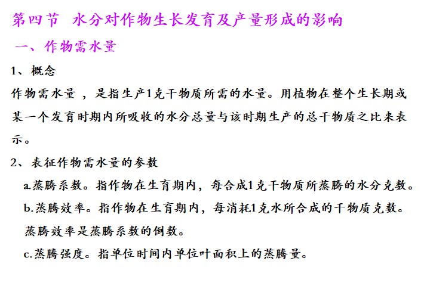

### 写在前面

怎么说呢，啰嗦一下吧，字多不想看也没办法。

老师教得还不错，但是我一点也没学到。

本文整理的只是某些个复习PPT的内容，照片什么的看都没法看。

?? ，还好PPT能看，**主要还是以课件为主**，这里面的内容基本上是复制粘贴来的。

Tips：

+ <span style="background-color:yellow;font-weight:bold">Windows</span> 推荐用 _marktext_ 阅读，有钱的可以考虑 _Typora_ 。

+ <span style="background-color:yellow;font-weight:bold">其他平台</span> 优先考虑 _VScode_ 。

+ <span style="background-color:yellow;font-weight:bold">Android</span> 用 _markor_ 。
  
  这些软件都可以在一个叫 **`GitHub`** 的网站找到，它的logo是一只猫？蜥蜴？随便啦。

### 考试信息

| 日期         | 星期  | 时间            | 活动名称  | 备注   |
| ---------- | --- | ------------- | ----- | ---- |
| 2024-06-17 | 星期二 | 18:30 ~ 20:30 | 农业气象学 | 第17周 |

1、单项选择题：（每题2分，共7题，总分14分）

2、名词解释：（每题4分，共3题，总分12分）

3、判断题：（每题2分，共10题，总分20分，对的打√，错的打×）

4、填空题：（每空1分，共5题，总分8分）

```python
>>> 14+12+20+8
54
```

==

5、简答题：（每题6分，共3题，总分18分）

6、论述题：（每题14分，共2题，总分28分）

```python
>>> 18+28
46
```


| 章节          | 百分比 |
|:-----------:|:---:|
| 绪 论         | 5%  |
| 太阳辐射与农业生产   | 25% |
| 热量条件与农业生产   | 20% |
| 水分条件与农业生产   | 20% |
| 温室气体、风与农业生产 | 8%  |
| 农业气象模式      | 12% |
| 农业气象灾害与风险评估 | 10% |

<!-- 绪 论 5%
太阳辐射与农业生产 25%
热量条件与农业生产 20%
水分条件与农业生产 20%
温室气体、风与农业生产 8%
农业气象模式 12%
农业气象灾害与风险评估 10% -->

### 复习题

#### 1、植物的低CO2补偿点指什么？

当光合作用速率与呼吸作用速率相等时，净光合速率为零，此时环境中的CO₂浓度就是该植物的CO₂补偿点。

#### 2、连阴雨天气的显著特点？

**持续阴雨时间长**，**低温寡照**，**降水形式多样但强度不均**，**环流稳定导致冷暖空气对峙**。

#### 3、低温冷害？

是指**农作物在生长期内遭遇零度以上低温（通常0～15℃）导致的生理性伤害**。

+ **零上低温伤害**：区别于冻害（0℃以下），冷害发生在气温高于冰点但低于作物生理需求时，如水稻分蘖期遇15℃以下低温即可受害。

+ **隐蔽性危害**  
     **"哑巴灾"效应**：植株外观可能无明显损伤，但内部生理活动（光合、授粉、养分运输等）受阻，导致减产或品质下降。例如玉米灌浆期低温会使籽粒不饱满。

+ **核心受害机制**
  
  + **膜系统损伤**：低温破坏细胞膜流动性，引发电解质渗漏。
  
  + **代谢紊乱**：呼吸作用异常增强消耗能量，光合酶活性下降，花粉发育受阻（如水稻颖花不育）。

+ **类型与典型表现**
  
  | 类型  | 发生时期     | 主要危害               |
  |:---:|:--------:|:------------------:|
  | 延迟型 | 营养生长期    | 生长迟缓，抽穗/成熟期推迟      |
  | 障碍型 | 生殖关键期    | 花粉败育、结实率骤降（如水稻孕穗期） |
  | 混合型 | 全生育期持续低温 | 延迟生长+生殖障碍双重伤害      |

常见于中高纬度地区（如东北、云贵高原）及热带高海拔农田，水稻、玉米、大豆、果树（如芒果花期）等对低温敏感的作物最易受害。

#### 4、植物光合作用处于CO2补偿点的时候：说明什么？

此时植物 **净光合速率为零**，**无有机物质积累**，**生长基本暂停**。反映环境存在 **CO₂浓度不足** 或 **光照/温度不适** 等限制因素。

#### 5、高温热害标准是什么？

高温热害的标准主要指**对农作物生长发育产生显著危害的高温阈值及其持续时间**，具体因作物和生育期而异。判定需同时满足 **“温度≥35℃ + 持续≥3天”** 的基本条件，并结合**作物关键生育期**和**湿度协同效应**综合评估。

#### 6、麦区干热风产生的气候背景是什么？

干热风是**大陆热低压驱动干热气团东移**，在**下沉增温、地形焚风及高压系统维持**下，于**雨季前高温干旱期**形成的灾害性天气

#### 7、农田系统中CO2浓度分布规律及二氧化碳浓度对作物有哪些影响？

农田CO₂呈 **“近地高、冠层低”** 的垂直梯度，动态受生物活动和环境调控；适度升高CO₂可增产提效，但过量将导致品质下降与生态风险，需结合通风、施肥等措施优化管理。

#### 8、农业气象模式模拟的相关问题？

**1. 模拟目标与核心问题**：灾害预警优化，资源高效利用，种植制度优化。

**2. 关键技术挑战**：多源数据融合，模型本地化适配，长期适应性评估。

**3. 典型应用场景**：精准农事决策，产量与品质预估，设施环境调控。

**4. 瓶颈与未来方向**：算力与实时性，跨领域协同不足，生态链整合。

### 第一章

**本章重点与难点**

生物有机体与自然环境的相互关系；气象条件对农业生产的影响；农业气象学研究内容及方法；

#### 第三节


**作业**：`P20 `二、三（2、4）

### 第二章

**本章重点与难点**

    光的生物学意义、作物的光学特性、光合有效辐射、光周期现象、感光性、光饱和点与光补偿点、光能利用率等基本概念。

    光周期学说在农业生产中的应用，光―光合作用关系理论分析，光能利用状况及提高途径分析。

#### 第一节 植物的光学特性


#### 第二节 光照长度对植物的影响


**作业**：`P71`一、三（1、2、4）

### 第三章

**本章重点与难点**

     三基点温度、农业界限温度、活动积温、有效积温、作物的感温性和温周期现象等基本概念。

    积温的求算方法、稳定性分析、改进措施及其应用，近地层及土壤温度调控技术。

#### 第一节 温度的农业意义


#### 第二节 温度强度及其对农业生物的影响


_划重点PPT未涉及_


#### 第三节 积温学说及其在农业上的应用


1）给定上下限温度求算积温的方法

    比较简单，即按照前面讲到的积温表达式求算即可。

    例如：给定作物的生物学零度（下限温度）为10℃ ，某一周的逐日平均气温分别为：12、13、11、10、9、13、12℃，可求得该周的活动积温和有效积温分别为：Aa = 12+13+11+13+12=61℃   Ae = 2+3+1+3+2=11℃

2）没有给定上下限温度求算积温的方法 [PPT](第三章 温度与农业生产 .pptx)-page-46

#### 第四节 温度周期性变化对农业生物的影响


**作业**：`P142`一、三（2、3、4）

### 第四章

**本章重点与难点**

土壤水分常数、土壤水势、作物需水量、蒸散、作物水分临界期与关键期、土壤水分滞后现象等基本概念，“土壤―植物―大气”

系统水分传输、农作物需水规律、土壤水分特征曲线、土壤水分有效性分析，土壤水分调控技术。

#### 什么是农业气象中的凋萎系数、吸湿水、膜状水、最大吸湿量、最大分子持水量、田间持水量、毛管悬着水？

DeepSeek R1 解答：<u>[个人认为理清概念即可，用作填空判断选择]</u>

这些术语是**土壤水分常数**中的核心概念，在农业气象、土壤学、农学和灌溉管理中至关重要。它们描述了土壤水分的不同存在形态、有效性以及对植物的可利用性。

下面是对每个概念的详细解释：

1. **凋萎系数 (Permanent Wilting Point, PWP)**
   
   * **定义：** 当土壤水分减少到一定程度，植物因吸收不到足够水分而发生**永久性凋萎**，即使将其置于水汽饱和的大气中也不能恢复膨压时的土壤含水量。
   * **物理意义：** 这是植物能够从土壤中吸收水分的**下限**。低于此值的水分，植物根系无法克服土壤颗粒的强大吸附力将其吸收利用。
   * **农业意义：** **无效水的上限**。土壤含水量低于凋萎系数时，水分对植物无效。是确定灌溉下限（即需要灌溉的临界点）和计算**土壤有效水最大含量**的重要参数之一（有效水最大含量 = 田间持水量 - 凋萎系数）。
   * **影响因素：** 主要受土壤质地（粘粒含量越高，凋萎系数越大）、土壤结构和植物种类影响。通常在土壤吸力 **15 bar (1500 kPa)** 时测定。

2. **吸湿水 (Hygroscopic Water)**
   
   * **定义：** 干燥土壤颗粒表面依靠**分子引力（吸附力）** 从空气中吸收气态水分子，在其表面形成的极薄水膜。
   * **物理意义：** 土壤颗粒表面**最紧实**的一层水膜。水分子定向排列紧密，密度大于普通液态水，具有固态水性质，几乎不能移动。
   * **农业意义：** **无效水**。植物根系无法吸收利用（土壤吸力远大于植物根系的吸水能力，通常 > 31 bar）。土壤风干状态下的水分基本就是吸湿水。
   * **影响因素：** 土壤质地（粘粒和有机质含量越高，吸湿水越多）、空气相对湿度。

3. **膜状水 (Film Water / Pellicular Water)**
   
   * **定义：** 在吸湿水层的外围，由土壤颗粒剩余的**分子引力（吸附力）** 所吸附的、较厚的一层水膜。
   * **物理意义：** 水膜较吸湿水厚，但仍受强大的分子引力束缚（土壤吸力在 **31 bar 到 6.25 bar 之间**）。水分子移动非常缓慢（从水膜厚处向薄处移动）。
   * **农业意义：** **部分有效水**。靠近土壤颗粒的内层膜状水（吸力接近31 bar）植物难以利用，属于**无效水**；外层膜状水（吸力接近6.25 bar），植物根系在凋萎点之前可以缓慢吸收利用一部分，但效率很低。通常认为膜状水的上限（即吸力下降到6.25 bar时）接近**最大分子持水量**。
   * **与吸湿水的关系：** 两者都是靠土壤颗粒分子引力吸附保持的，合称为**结合水**。吸湿水是内层最紧实的部分，膜状水是外层相对松散的部分。

4. **最大吸湿量 (Maximum Hygroscopicity)**
   
   * **定义：** 土壤在**饱和水汽**（接近100%相对湿度）的大气环境中，所能吸附的**吸湿水**的最大量。
   * **物理意义：** 代表了土壤颗粒依靠纯分子引力（吸附力）所能吸附的气态水的最大能力。此时土壤吸力约为 **31 bar (3100 kPa)**。
   * **农业意义：** 标志着**吸湿水的上限**和**膜状水的下限**。土壤含水量等于最大吸湿量时，植物完全无法吸收水分，开始凋萎（但还未达到永久凋萎点）。是计算**凋萎系数**的经验公式参数之一（凋萎系数 ≈ 最大吸湿量 × 1.5 左右）。
   * **影响因素：** 同吸湿水。

5. **最大分子持水量 (Maximum Molecular Water Holding Capacity)**
   
   * **定义：** 土壤颗粒依靠**分子引力（吸附力）** 所能保持的**液态水**的最大量。这包括了吸湿水和膜状水的总和。
   * **物理意义：** 是土壤靠分子引力（而非毛管力）持水的最大能力。通常对应于土壤吸力 **6.25 bar (625 kPa)** 左右时的含水量。
   * **农业意义：** **膜状水的上限**。达到此含水量时，土壤颗粒的分子引力已饱和。含水量超过此值，水分的保持和移动开始主要受毛管力作用（进入毛管水范畴）。是**凋萎系数**的上限（凋萎系数接近但略高于最大分子持水量）。
   * **与最大吸湿量的关系：** 最大分子持水量 > 最大吸湿量。最大吸湿量是最大分子持水量中靠吸附气态水达到的部分（最内层）。

6. **田间持水量 (Field Capacity, FC)**
   
   * **定义：** 在自然条件下，当土壤被充分饱和（如大雨或灌溉后），多余的重力水已经排除（通常需要1-3天），土壤中主要依靠**毛管力**和**分子力**所保持的水量达到相对稳定状态时的土壤含水量。
   * **物理意义：** 标志着**重力水消失的下限**和**毛管悬着水达到最大值**。此时土壤吸力通常在 **0.1 bar 到 0.33 bar (10-33 kPa)** 之间。
   * **农业意义：** 这是**土壤有效水最大含量**的上限。是计算灌溉定额（灌水量 = (田间持水量 - 灌溉前土壤含水量) × 土壤容重 × 计划湿润深度）和确定**土壤有效水最大含量**（有效水最大含量 = 田间持水量 - 凋萎系数）的最关键参数。代表了在良好排水条件下，土壤自然保持的、可供植物利用的水分最大值。
   * **影响因素：** 土壤质地（粘粒和有机质含量越高，田间持水量越大）、土壤结构和层次。

7. **毛管悬着水 (Capillary Suspended Water)**
   
   * **定义：** 存在于土壤孔隙中，由**毛管力**（弯液面张力）所保持的、**不与地下水相连**的水分。它像悬挂在土壤孔隙中一样。
   * **物理意义：** 是**田间持水量**状态下土壤所保持的主要水分形态。它依靠孔隙的毛管作用克服重力而保持在土壤上层。
   * **农业意义：** **最有效的植物可利用水**。这部分水存在于土壤孔隙中，移动性相对较好（在毛管力作用下可以向水势低的地方移动，如植物根系附近），容易被植物根系吸收利用。**田间持水量**实质上就是土壤中毛管悬着水达到最大时的含水量。
   * **与毛管上升水的区别：** 毛管悬着水的水源来自上方（降雨、灌溉），不与地下水面相连。而**毛管上升水**的水源来自下方的地下水，通过毛管作用从地下水面上升上来的水分。

**总结与关系：**

* **有效性：** 土壤水主要分为**无效水**（吸湿水、部分膜状水）和**有效水**（部分膜状水、毛管悬着水）。重力水虽然能被植物利用，但会很快流失，且过多时会造成涝害。
* **关键阈值：**
  * **凋萎系数 (PWP)：** 有效水的**下限**。低于此值植物永久凋萎。
  * **田间持水量 (FC)：** 有效水的**上限**（毛管悬着水最大量）。高于此值的水分（重力水）会流失。
  * **有效水最大含量 = FC - PWP**
* **吸附力主导：**
  * **吸湿水：** 最紧实，吸力>31 bar。上限是**最大吸湿量**。
  * **膜状水：** 较厚但移动慢，吸力约31 bar - 6.25 bar。上限是**最大分子持水量**。
* **毛管力主导：**
  * **毛管悬着水：** 田间持水量状态下的主体，是主要的有效水来源。
* **重力主导：**
  * **重力水：** 超过田间持水量的部分，会下渗流失。

理解这些土壤水分常数对于科学评价土壤墒情、制定合理的灌溉计划、预测干旱胁迫以及研究植物-水分关系都具有极其重要的理论和实践意义。

---

#### 第三节 农田生态系统的水分循环及水分平衡


#### 第四节 水分对作物生长发育及产量形成的影响




**作业**：`P221`一、二、三（2、5）

---

==**以下内容为Pfolg自己整理**==

### 第五章

查看文件：[PDF](1_第五章 温室气体、风与农业生产(2).pdf)

**本章重点与难点**
CO2饱和点与补偿点等基本概念，C循环、CO2与光合作用、CO2增加对农业生产的影响、群体CO2通量及浓度变化规律、CO2调控技术。


**作业**：`P267`一、二、三

### 第七章

查看文件：[PDF](第七章 农业气象灾害.pdf)

**作业**：

+ `P385` 一、二、三

+ 附加：1. 温度、水分、复合因子异常的农业气象灾害的有哪些？
  概念？主要发生时段和影响作物是什么？

### [复习思考题](复习思考题.md)

