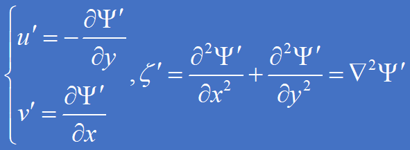
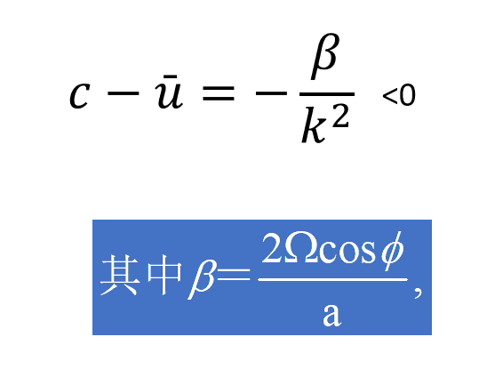
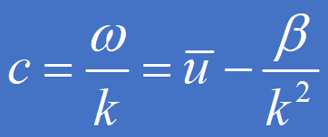

### 重力外波

处于大气上、下边界附近的空气指点由于某种原因受到扰动后偏离平衡位置，在重力作用下产生的波动，叫做重力外波，或者表面重力波，也叫做浅水波。

例如，如果均匀大气下边界是不平坦的，有山脉的存在，其产生的动力扰动会引起重力外波。

### 已学的几种波动

**纯重力外波**

**水平声波**

**惯性波**

**重力惯性波**

### 静力平衡与重力外波 补充内容

λ为示踪系数，λ=0为静力平衡，λ=1为非静力平衡。

#### **线性化：**

#### **消元：**

#### **边界条件**

#### **静力平衡大气：λ=0**

#### **非静力平衡大气：λ=1**

---

### 滤去重力内波的方法

### 惯性波（inertial  wave）

质点受扰动后，在科氏力作用下，产生惯性振荡，惯性振荡传播出去，形成惯性波。

+ 分为惯性内波、惯性外波。

+ 与重力波一样，也与中尺度天气相联系。

+ 惯性波可以在水平方向和垂直方向传播。

**惯性振荡**：由于地球自转，产生最主要的惯性力是科氏力。质点受扰动后，只在科氏力作用下，产生振荡。

**科氏力**：

仅在科氏力作用下的大气运动方程：

实际上，大气中纯惯性波并不常见，因为科氏力和重力是同时起作用的.

惯性波与重力波形成混合波，称为重力惯性波。

### 重力惯性外波

重力惯性外波的波速公式：

+ 是重力外波和惯性波的混合解。

   由于实际大气中，重力和科氏力都存在，故重力外波与惯性波混合并存。

+ 重力惯性外波：频散波

+ 传播机制：水平辐合辐散。

    故对应中尺度天气过程，是高频波、快波，对应局地、短时、强烈的天气现象。

+ 滤波的方法： 水平无辐散、准地转近似

### 惯性重力内波

### 滤波方法

目的是**从复杂的大气运动（包含多种尺度和类型的运动）中分离或提取出特定类型或特定尺度的波动信号**。

可以将其理解为对大气变量（如气压、风场、高度场、温度场等）的时间序列或空间序列进行“筛选”，保留感兴趣的波动成分，滤除其他“噪音”或不需要的成分。

#### 声波滤波

1、大气均质不可压

2、水平无辐合辐散

3、准地转运动

4、静力平衡

#### 重力外波滤波

1、上下刚性边界

2、水平无辐合辐散

3、准地转运动

4、纯水平运动

#### 惯性波滤波

1、不计科氏力

2、水平无辐合辐散

3、准地转运动

#### 重力内波滤波

1、中性层结

2、水平无辐合辐散

3、准地转运动

4、纯水平运动或扰动与z无关

5、静力平衡

### 大气长波

大气长波很重要，从任一张天气图上都可以看出。

一、长波的特点：

**①大尺度波动，准地转，与重力惯性波的重要区别之一。**

    等压线、等高线、流场——波状（高低相间），最多有3－6个槽，故波长为几十个经度，为大尺度波动。称为大气长波，或Rossby波，或行星波（尺度与地球半径相当）。

**还具有准水平无辐散，准水平运动、涡旋运动的特点。**

**②慢波：c～10m/s, 控制日常天气过程。**

**③强度：振幅——10hPa，大振幅。**

**④水平向横波：振动在南北方向，传播在东西方向。**

`2011年7月15日 位势高度场（单位：10gpm）`

#### 大气长波（Rossby波）的基本方程组

##### 简化的涡度方程和连续方程：

##### 线性化：

即假设大气长波叠加在均匀的西风基流上（中高纬大气上空的西风气流并不均匀，存在西风急流）

代入方程，得到：

略去二阶小量，得到：

有旋无辐散：可以引入流函数

引入流函数，并略去方程中扰动量的二次乘积项，得到：

##### **设波动解：**

代入上面的一元线性微分方程中，得到：

##### C&C_g

超长波：一个纬圈有1-3个波，波长L~10000km

行星波：一个纬圈有4-7个波

短波：一个纬圈有8个或以上个波

超长波水平散度与垂直涡度同量级，水平辐散项为大项，不能忽略辐散项，因此正压无辐散条件推导出的波速公式不适用于超长波。

#### 波速大小

### Rossby波的频散

#### 上下游效应

### Rossby波机制 β－效应

波速公式：

**β的存在，是Rossby波产生的必要条件。**

β－效应：（由β的存在产生的结果）

由于科氏参数f随纬度是变化的（β不等于0），当系统作南北运动时（v不等于0），这时系统的牵连涡度发生变化；为保持绝对涡度守恒，系统的相对涡度也要发生相应的变化。由这种机制产生的结果，称为β－效应，它是Rossby波的机制。

3种说法

Rossby波产生、传播、振荡所有机制，都是β－效应。

### Rossby波特点 generated by DeepSeek(R1)

罗斯贝波（Rossby wave）是发生在大气和海洋中大尺度流体运动中的一种特殊波动，是地球流体（大气和海洋）中最重要的波动类型之一。它的特点主要体现在以下几个方面：

1. **准地转性：**
   
   * 罗斯贝波发生在大尺度运动中（水平尺度远大于垂直尺度，且远大于流体深度），其运动非常接近地转平衡（气压梯度力与科里奥利力近似平衡）。这是理解其动力学的基础。

2. **恢复力机制：位涡守恒与β效应：**
   
   * **核心机制：** 这是罗斯贝波最根本、区别于其他波（如重力波、声波）的最大特点。其恢复力来源于**位涡守恒**以及**科里奥利参数随纬度变化（β效应）**。
   * **位涡守恒：** 在大尺度、准地转运动中，位势涡度是一个重要的守恒量（忽略摩擦和非绝热加热）。
   * **β效应：** 科里奥利参数 `f = 2Ω sinφ` 随纬度 `φ` 增大而增大（`Ω` 是地球自转角速度，`β = df/dy`，在北半球为正）。
   * **波动产生：** 当一个流体块在南北方向（经向）发生位移时，为了保持其位涡守恒：
     * 如果它**向北**移动（进入 `f` 更大的区域），它的行星涡度 `f` 增加。为了保持总位涡不变，它的相对涡度（`ζ`，主要由旋转或曲率引起）必须**减小**（例如，产生反气旋式曲率或减弱气旋式旋转），这会使其有向南返回的趋势。
     * 如果它**向南**移动（进入 `f` 更小的区域），`f` 减小，相对涡度 `ζ` 必须**增大**（例如，产生气旋式曲率），这会使其有向北返回的趋势。
   * 这种由位涡守恒和 `β` 效应提供的恢复力驱动了流体的振荡，形成了罗斯贝波。这种恢复力是**转动的行星所特有的**。

3. **低频性：**
   
   * 罗斯贝波的周期相对较长。在大气中，典型的罗斯贝波周期为数天到数周（例如，天气尺度系统的发展演变）。在海洋中，周期则更长，可达数月甚至数年。这远比重力波（周期几分钟到几小时）和声波（周期极短）慢。

4. **大尺度（行星尺度）：**
   
   * 罗斯贝波的波长很长。在大气中，典型波长在**3000-6000公里**量级，与行星半径相当，因此常被称为**行星波**。它们构成了中纬度西风带中观测到的大尺度槽脊系统（大气长波）。在海洋中，波长也非常长。

5. **传播方向（西传特性）：**
   
   * **相速度：** 对于**无基本流**的纯罗斯贝波，其相速度在经向（东西方向）上**总是有向西的分量**。具体来说：
     * 纯西传波：当波动是纯纬向传播时（`k ≠ 0, l = 0`），相速度 `cₓ = -β / k²` **恒为负值**，即**向西传播**。
     * 斜传波：当波动在经向也有传播时（`k ≠ 0, l ≠ 0`），相速度的纬向分量 `cₓ = -β / (k² + l²)` **仍然恒为负值**，即**相速度总有向西的分量**。
   * **群速度：** 能量传播的方向由群速度决定。对于罗斯贝波，群速度在纬向既可以向西也可以向东，但在经向只能向赤道或极地传播（取决于波数）。**一个极其重要的特点是：在无基本流或弱基本流情况下，罗斯贝波的能量（群速度）在纬向总是向西传播的**。这是罗斯贝波能量传播的普遍特性。

6. **横波：**
   
   * 罗斯贝波中流体质点的振动方向与波的传播方向是垂直的（更准确地说是准水平的环流），因此属于横波。

7. **频散性：**
   
   * 罗斯贝波是频散波。这意味着不同波长的波以不同的相速度传播。长波（波数小）比短波（波数大）传播得更快（向西）。频散关系为：`ω = Ūk - βk / (k² + l²)` （其中 `Ū` 是基本气流速度，`k` 和 `l` 是纬向和经向波数）。这个关系清楚地表明了 `β` 效应导致的频散特性。

8. **重要应用与影响：**
   
   * **大气：**
     * 构成中纬度西风带中的大尺度槽脊系统（大气长波），是天气系统（如气旋、反气旋）生成、发展和移动的背景场和引导者。
     * 影响天气尺度的能量传播和上下游效应。
     * 与阻塞高压、切断低压等持续性天气系统的形成密切相关。
     * 在行星尺度上形成遥相关型（如 PNA, NAO），影响全球天气和气候异常。
   * **海洋：**
     * 是调整大洋环流（尤其是风生环流）对风应力变化响应的主要机制。
     * 在海洋内部和沿边界（特别是西边界）传播，调整质量场和压力场。
     * 在赤道附近有特殊形式（赤道罗斯贝波），对 ENSO 等热带气候现象有重要作用。
     * 将能量从风强迫区（中纬度）向西传递。

**总结关键特点：**

* **恢复力：** 位涡守恒 + 科里奥利参数随纬度变化 (`β` 效应) —— 这是其最核心、最独特的性质。
* **尺度：** 大尺度（行星尺度）。
* **频率：** 低频（周期长）。
* **传播：** 相速度总有向西分量；能量（群速度）在无基本流时总是西传。
* **重要性：** 支配大尺度大气长波和海洋环流调整，对天气和气候至关重要。

理解罗斯贝波是理解地球流体（大气和海洋）大尺度动力过程的基础。

### 滤波

**为什么要滤波？**

前面我们着重讨论了特定物理因素作用下产生的大气中的基本波型，如由大气可压缩性引起的大气声波、由重力或重力和层结作用产生的重力波以及与地球旋转有关的惯性波和大气长波等。这对深入了解大气中可能存在哪些基本波型以及各种基本波型的性质、存在的物理条件及其产生的物理机制是必不可少的。但是，实际上，形成各种大气基本波型的物理条件是同时存在的，因此，实际大气中的波动不可能只是某种单一的波型，而是两种或以上单一波型混合而成的“混合波”，例如惯性重力波、惯性声波和Rossby重力波等都是混合波的例子。

### 例子

为使问题更简单，假设一维波动 ，方程组变为：

作线性化：

※由于基本量满足原方程，即有：

线性化后得：

设波动解：

代入方程，得到一组代数方程：

### 思考

