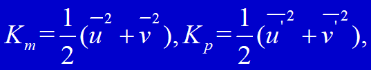
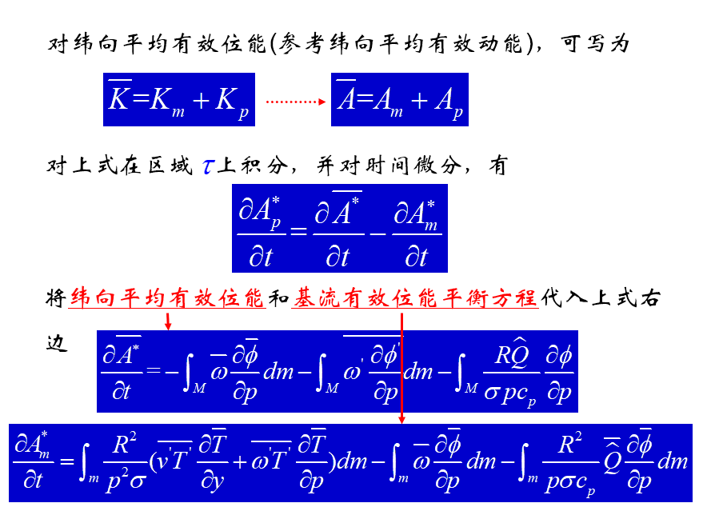
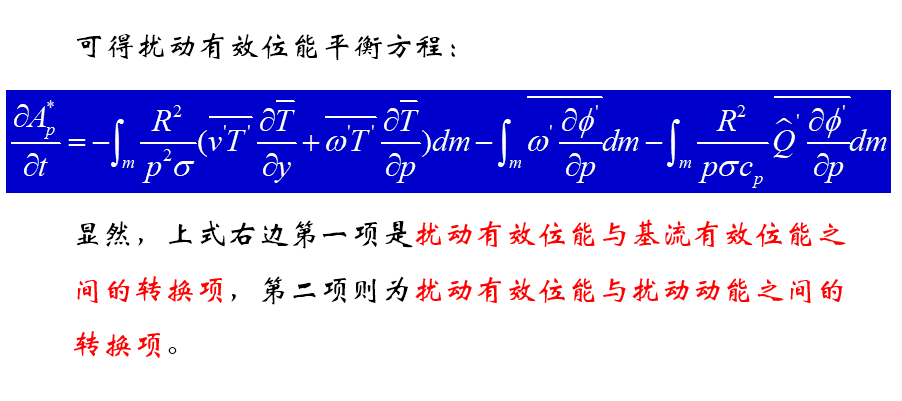
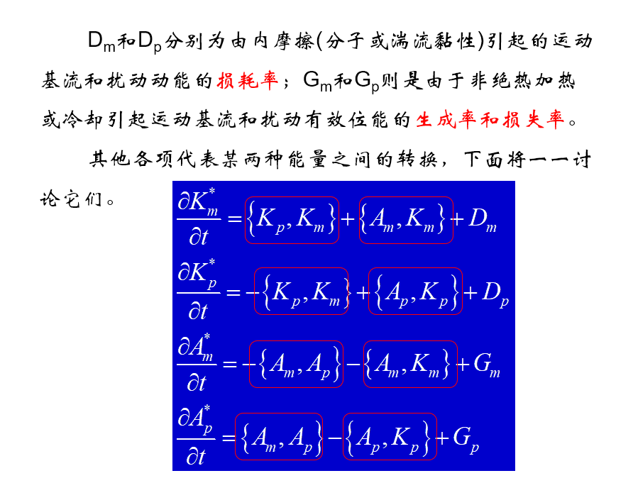
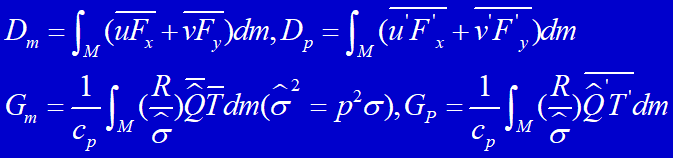
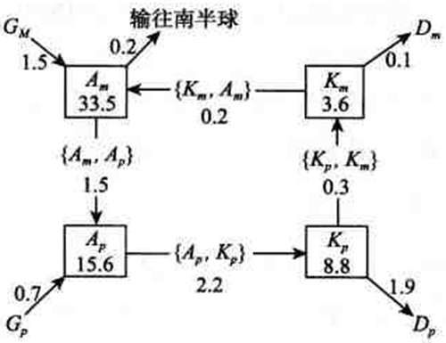

分别为单位质量空气运动的基流动能和平均扰动动能。

**自PPT第二章 page-60开始**

+ 1、由于<a style="color:red">纬向平均的太阳辐射加热的纬向分布是非均匀的</a>，热带为净辐射加热，极地为净辐射冷却，于是形成了<a style="color:red">基本气流(纬向平均)的有效位能</a><a style="color:blue">(GM—>AM)</a>。

+ 2、非均匀的加热决定了纬向平均的大气温度分布，对流层低纬温度高于高纬，低空高于高空；中纬度斜压扰动，温度槽落后于高度草的结构有利于涡动感热向北和高空输送，使部分<a style="color:red">基流有效位能转变为扰动有效位能</a>。<a style="color:blue">(AM—>AP)</a>。

+ 3、平均经圈环流在基流有效位能与动能的转换中作用相反，但实际大气中这两种环流的净作用是使<a style="color:red">基流动能向基流有效位能转换</a><a style="color:blue">(AP—>KP)</a>。

+ 4、通过斜压扰动中暖空气上升、冷空气下沉，扰动有效位能向扰动动能转换<a style="color:blue">(KP—>KM)</a>。

+ 5、在有水平和垂直切边的纬向基本风带中的螺旋罗斯贝波导致涡动西风动量向上向北输送，使扰动动能向基本流动能转换即扰动动能成为基本流动能来源<a style="color:blue">(KM—>AM)</a>。

+ 6、基流和扰动动能都由于摩擦作用而损耗<a style="color:blue">(KP—>DP;KM—>DM)</a>。
