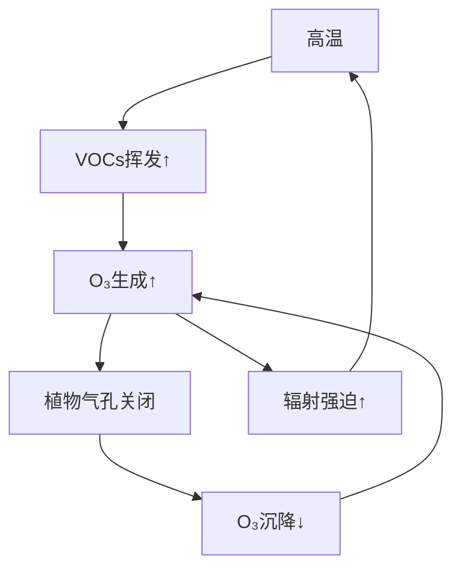

大气环境化学中的臭氧（O₃）是兼具**保护性与危害性**的双面体，其行为深刻影响空气质量、生态系统及气候变化。以下从**化学特性、源汇机制、环境影响及前沿挑战**四方面系统解析：

---

### 🧪 一、化学特性与空间分异

| **特性**     | **平流层臭氧（距地15–35 km）** | **对流层臭氧（地面–10 km）**        |
| ---------- | --------------------- | -------------------------- |
| **浓度峰值**   | 10–15 ppm（臭氧层）        | 0.02–0.2 ppm（污染区可达0.5 ppm） |
| **功能**     | 吸收97% UV-B，保护地球生物     | 强氧化剂，危害健康与植被               |
| **寿命**     | 数月–数年                 | 数小时–数周（受沉降和反应控制）           |
| **人类活动影响** | 因CFCs破坏出现空洞（正缓慢修复）    | 工业排放导致浓度持续上升               |

> 🔬 **关键反应**：  
> 
> - **平流层**：O₂光解 → O + O₂ → O₃（Chapman机制）  
> - **对流层**：NO₂光解 → NO + O(³P) → O₃（光化学循环）

---

### ⚖️ 二、源与汇的动态平衡（对流层）

#### **来源（输入）**

1. **光化学生成（90%+）**  
   $$ \ce{NO2 + \mathit{h\nu} -> NO + O} \quad \ce{O + O2 -> O3} $$  
   - **前体物依赖**：  
     - **高臭氧生成效率**：VOCs/NOₓ ≈ 8（如烯烃+中等NOₓ）  
     - **低效率区**：VOCs/NOₓ < 4（城市核心区）或 >15（偏远森林）  
2. **平流层输入（5–10%）**  
   - 通过**对流层顶折叠**事件向下输送，春季贡献最大。  
3. **非均相生成（新兴源）**  
   - 矿尘/黑碳表面催化：$$\ce{2NO2 + H2O ->[矿尘] HNO2 + HNO3}$$ → HNO₂光解→NO + OH → 加速O₃生成  

#### **汇（消耗）**

1. **干沉降（60–70%）**  
   - **植被吸收**：气孔调控（占陆面沉降80%）  
   - **海洋/土壤**：化学分解（O₃ → O₂）  
2. **化学反应（30–40%）**  
   - 与·OH前体反应：$$\ce{O3 + HO2 -> \cdot OH + 2O2}$$  
   - 与NO反应（夜间）：$$\ce{O3 + NO -> NO2 + O2}$$  
   - 与烯烃反应：$$\ce{O3 + isoprene -> SOA + HCHO}$$  
3. **湿沉降（<5%）**  
   - 雨水冲刷溶解态O₃，效率较低。  

---

### 🌍 三、臭氧污染的驱动机制

#### **1. 时空分布特征**

| **区域** | **臭氧峰值特征**           | **主导因素**          |
| ------ | -------------------- | ----------------- |
| 城市工业区  | 午后（14:00–16:00），夏高冬低 | VOCs+NOₓ光化学，机动车排放 |
| 森林地区   | 日间中等，夜间近零            | 生物源VOCs（异戊二烯）生成   |
| 背景区域   | 春季最高（平流层输入+传输累积）     | 跨大陆污染传输           |

#### **2. 前体物协同效应**

```mermaid
graph LR
A[NOₓ↑] -- 低VOCs/NOₓ --> B[O₃↓]  // NO滴定效应
A[NOₓ↑] -- 高VOCs/NOₓ --> C[O₃↑]  // 自由基循环加速
D[VOCs↑] --> C[O₃↑]               // 提供RO₂·原料
```

#### **3. 气候反馈环路**



---

### ⚠️ 四、环境与健康影响

#### **1. 健康损伤（WHO, 2025）**

- **短期暴露**：每增加10 μg/m³，呼吸道死亡率↑0.4%  
- **长期暴露**：加速肺功能衰退（等效于每日吸半包烟）  

#### **2. 生态胁迫**

| **对象** | **临界阈值**           | **效应**          |
| ------ | ------------------ | --------------- |
| 小麦     | 累积暴露40 ppm·h       | 减产5–15%（叶片褐斑）   |
| 森林     | AOT40 > 5000 ppb·h | 光合速率↓20%，碳汇能力减弱 |
| 材料     | 年均>50 ppb          | 橡胶老化加速300%      |

#### **3. 气候效应**

- **辐射强迫**：+0.40 W/m²（第三大温室气体）  
- **抵消降温效应**：通过抑制CH₄氧化（·OH消耗↑），间接增强温室效应  

---

### 🛠️ 五、污染控制与前沿挑战

#### **1. 协同减排策略**

- **VOCs优先控排物种**：乙烯、丙烯、甲醛（OFP > 5 gO₃/g）  
- **NOₓ深度治理**：国七标准要求柴油车NOₓ限值≤30 mg/km（较国六降50%）  
- **分区施策**：  
  - **城市核心区**：严控VOCs（降低O₃生成效率）  
  - **郊区/农村**：协同削减NOₓ（避免滴定效应减弱）  

#### **2. 科学挑战**

- **非线性响应**：VOCs/NOₓ减排比例需精准模拟（CMAQ模型不确定性达30%）  
- **新型前体物**：乙醇燃料推广→乙醛排放↑→PAN与O₃协同上升  
- **气候联动**：全球变暖背景下，2100年全球O₃背景值或上升8–12 ppb  

#### **3. 中国治理进展**

- **成效**：2025年京津冀O₃-8h超标率较2020年下降15%  
- **瓶颈**：VOCs监测网络覆盖率不足40%，醛类在线监测缺位  

---

### 💎 六、臭氧与“双碳”战略的关联

臭氧既是**治理对象**（大气十条重点污染物），也是**气候调节因子**：  

- **负面**：O₃浓度↑ → 农作物减产 → 碳汇损失（相当年排放1.5亿吨CO₂）  
- **正面**：控VOCs/NOₓ → 协同减排CO₂（如石化行业能效提升）  

> 🌐 **总结**：臭氧污染的本质是**光化学自由基链式反应失控**。破解需融合“前体物精准溯源-区域传输调控-气候反馈量化”三重路径，助力美丽中国与碳中和目标协同实现。