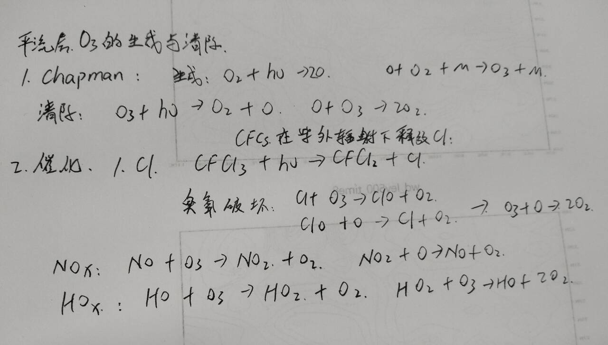

# 平流层臭氧的生成与清除反应机理

## 一、Chapman 自然平衡机制

描述臭氧通过光化学反应自然生成与清除的动态平衡过程。

### 1. 生成反应

- **氧分子光解**  
  $\ce{O2 + h\nu (\lambda < 240\ nm) -> 2O}$  
  *（紫外线裂解氧分子产生氧原子）*
- **臭氧形成**  
  $\ce{O + O2 + M -> O3 + M}$  
  *（M 为 $\ce{N2}$/$\ce{O2}$ 等第三体，吸收反应能量）*

### 2. 清除反应

- **臭氧光解**  
  $\ce{O3 + h\nu (\lambda=240-320\ nm) -> O2 + O}$  
  *（臭氧吸收紫外线分解）*
- **原子重组清除**  
  $\ce{O + O3 -> 2O2}$  
  *（氧原子与臭氧结合释放氧气）*

### 3. 动态平衡

$$ \ce{O2 <=>[\text{光解}][\text{重组}] 2O <=>[\text{形成}][\text{清除}] O3} $$
自然条件下反应速率平衡，维持稳定臭氧浓度（约 300 DU）。

---

## 二、催化破坏机制

人为排放的催化物质通过链式反应加速臭氧分解，破坏自然平衡。

### 1. 氯催化循环（主要人为因素）

- **氯原子释放**  
  $\ce{CFCl3 + h\nu -> CFCl2 + Cl}$

- **链式破坏反应**  
  
  $$
  \begin{align}
&\ce{Cl + O3 -> ClO + O2} \\
&\ce{ClO + O -> Cl + O2} \\
&\textbf{总反应:}\ \ce{O3 + O -> 2O2}
\end{align}
  $$

*（单个 Cl 原子可破坏 $\bf{10^4-10^5}$ 个 $\ce{O3}$ 分子）*

### 2. 其他催化途径

| 催化剂       | 循环反应                                                                                         | 效率       |
| --------- | -------------------------------------------------------------------------------------------- | -------- |
| **NOx**   | $\ce{NO + O3 -> NO2 + O2}$ $\ce{NO2 + O -> NO + O2}$                                      | 中        |
| **HOx**   | $\ce{HO + O3 -> HO2 + O2}$ $\ce{HO2 + O3 -> HO + 2O2}$                                    | 低        |
| **Br/Cl** | $\ce{BrO + ClO -> Br + Cl + O2}$ $\ce{Br + O3 -> BrO + O2}$ $\ce{Cl + O3 -> ClO + O2}$ | 极高（协同效应） |

### 3. 极地臭氧洞强化机制

- **低温条件**：南极冬季温度 ≤ -80°C 形成 **极地平流层云（PSCs）**
- **非均相反应**（冰晶表面）：  
  $\ce{ClONO2 + HCl -> Cl2 + HNO3}$  
  $\ce{ClONO2 + H2O -> HOCl + HNO3}$
- **活性氯爆发**：春季光照时 $\ce{Cl2}$/$\ce{HOCl}$ 光解释放大量 $\ce{Cl}$  
  *（导致南极臭氧浓度下降 >60%）*

---

## 三、机制对比与全球影响

| 维度       | Chapman 自然机制               | 催化破坏机制                    |
| -------- | -------------------------- | ------------------------- |
| **驱动力**  | 太阳紫外线                      | 人为排放（CFCs, Halons, NOx 等） |
| **反应特点** | 速率平衡                       | 链式反应（催化剂再生）               |
| **臭氧变化** | 稳态波动（±5%）                  | 急剧损耗（空洞面积 >2500 万 km²）    |
| **生态作用** | 吸收 UV-B（290-320 nm），保护地表生物 | 臭氧层减薄导致地表紫外线辐射增强          |

### 全球应对措施

- **《蒙特利尔议定书》**（1987）：全面限制 CFCs/Halons 生产
- **效果**：平流层氯浓度峰值下降，南极臭氧洞预计 **2070 年恢复**至1980年水平
- **当前挑战**：N₂O（农业排放）成为最大臭氧消耗物质，且具温室效应

> 补充说明：自然机制中约 80% 的臭氧清除实际由催化反应完成（主要来自天然 HOx/NOx），Chapman 机制仅贡献约 20%。

