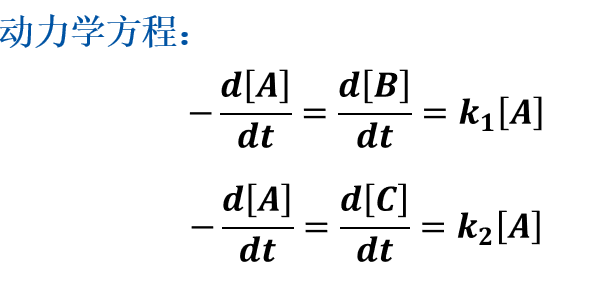
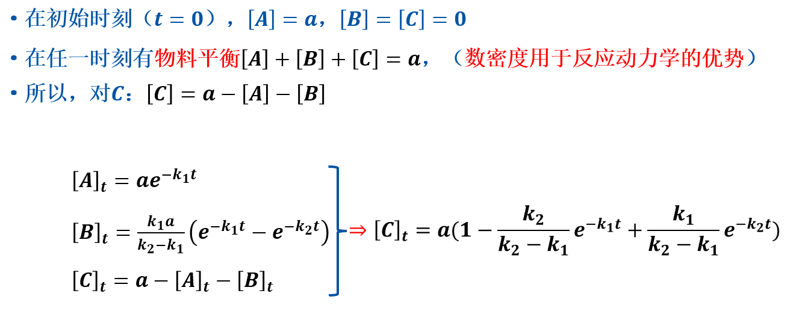
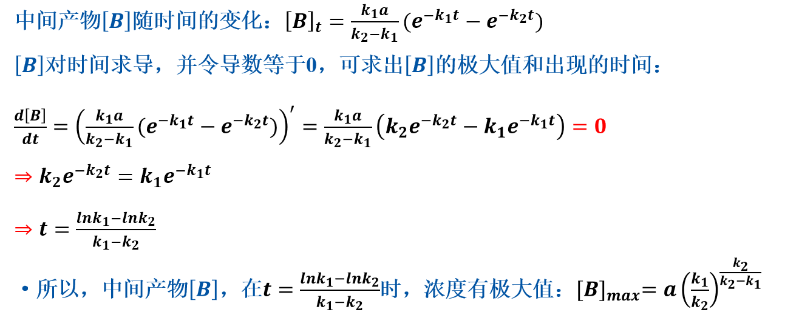
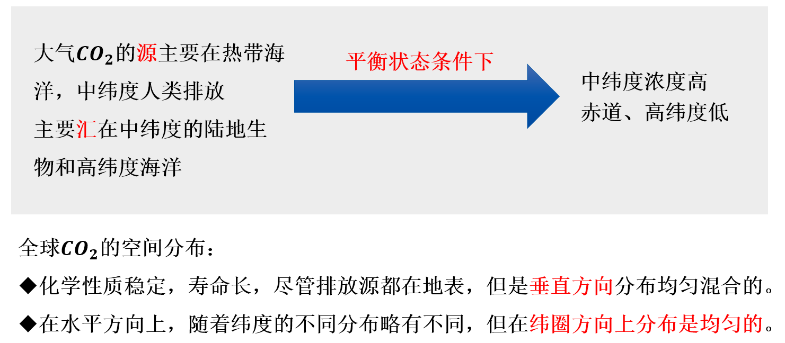
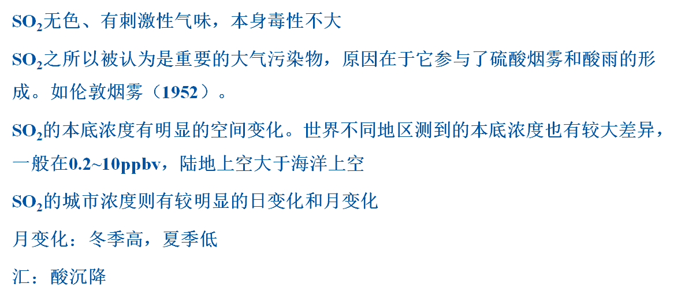

本笔记以《大气环境化学》第三版 唐孝炎等 为基准。

使用 **[VScode](https://code.visualstudio.com/) + [Markdown Preview Enhanced](https://marketplace.visualstudio.com/items?itemName=shd101wyy.markdown-preview-enhanced)** 查看

[相关文件](#相关文件)

[题目构成](#题目构成)

---

# 划重点

**并不是说没有标记的就不重要**，有可能没注意到，编辑者实力底下，易疏忽的点特别多，复习笔记——2天后考试，复习时长2d，来证明我是怎么考上大学的吧！！！

+ 1
  
  + 1.6.0 大气中的自由基

+ 第二章 第二节 大气污染物的汇机制
  
  + 干沉降
  
  + 湿沉降
  
  + 化学反应去除
  
  + 向平流层输送
    
    > 选择、填空题

+ 第三章 大气化学反应动力学基础——以PPT为主
  
  + 1.1 化学反应速率与方程
  + 1.3 温度对反应速率的影响
  + 2.2 **光化学的初级过程和量子产额**
  + 2.4 **光化学反应速率**

+ 4
  
  + 4.1.0 NO、NO~2~、和O~3~的基本光化学循环
  + 4.4.1 VOCs/NO~x~值对臭氧生成的影响

+ 5
  
  + 5.2.3 **大气颗粒物模态分布及其特性** PPT
  + 5.3.2 新粒子生成与增长

+ 6 
  
  + 酸雨一大堆 做过PPT，浅尝辄止（大概）

+ 7
  
  + 7.1.1 模式及其发展历史 page382 扩散模型

+ 8
  
  + 8.4 气溶胶的辐射强迫

+ 9
  
  + 9.2.1 平流层臭氧的生成和清除反应

> page438 大气污染和气候变化的相互作用
> 二次气溶胶的生成机制、与臭氧的协同机制（控制、策略、建议）

---

# 第一章 地球的大气环境

---

### 大气环境化学主要研究大气中对环境有影响的重要组分在**大气中的来源**（源排放）、存在形式、迁移过程中的**化学转化**（化学过程）、**归宿**（输送）及**对大气质量的影响**（消除）等。

---

### 全氯氟烃（CFCs）一类**人工合成的有机化合物**，

 **基本特性**

1. **化学组成**
   
   + 分子通式为 CXx​ClXy​​FXz​（如CFC-11：CClX3​F，CFC-12：CClX2​FX2​）。
   
   + 不含氢，稳定性极高，在低层大气中几乎不分解。

2. **物理性质**
   
   + 无色、无味、无毒，不易燃。
   
   + 易液化，汽化时吸热，适合作为制冷剂。

3. **环境危害：臭氧层破坏**
   
   + CFCs释放后缓慢上升至平流层（10–50 km高空），在紫外线照射下分解出氯原子
   
   + 单个氯原子可破坏数万个臭氧分子，形成“臭氧层空洞”。
   
   + 增加地表紫外线辐射（UV-B），导致皮肤癌、白内障风险上升，破坏生态系统和农作物。

---

### 大气环境化学的**研究方法**主要可概括为以下三类：

+ 现场实验研究
  
  + 是指在所研究地区采用实地布点采样或直接测量的办法，取得所需污染物的直接数据。
  
  + 现场实测是了解大气污染物的时空分布和变化规律最直接的手段，能得到真实的第一手资料。

+ 实验室研究
  
  + <u>烟雾箱</u>：
    
    + 研究气体和气溶胶的光化学性质；
    
    + 研究气体和气溶胶在“老化”（aging）过程中光学性质的变化。

+ 模式计算

对污染物来源的解析方法：

    源清单法、受体模型法、源模型法

---

### 地球大气情况

 地球大气平均压力为1个大气压（atm，101325Pa），大气的总质量约为5.2 x 10^18^ kg，大气质量**分布极其不均**，约50%的质量集中在6km高度以下。75%的质量集中在10km高度以下。99%的质量集中在35km的高度以下。

| Height | Index |
|:------:|:-----:|
| <=6km  | 50%   |
| <=10km | 75%   |
| <=35   | 90%   |

其主要成分是氢气（H~2~）氦气（He），并含有氮气（N~2~）、水蒸气（H~2~O）和二氧化碳（CO~2~）等

---

### E~c~

能量 $E=hv=hc/λ$ 

h：普朗克常数；c：光速

---

### 根据垂直温度梯度的方向，把大气分为**对流层、平流层、中层和热层四层**。

+ 对流层：在对流层顶内，气温随高度不变，或变化较小

+ 平流层：水汽尘埃的含量甚微，很少出现天气现象

+ etc.

---

### 按大气的组分结构，可把大气分为均匀层和非均匀层。

**均匀层**：大气<=90km，主要成分的组成比率几乎不变

干洁大气：不包含水汽的纯净大气，主要成分是：N~2~，O~2~，Ar（约占干结大气总容积的99.9%），其他少量成分包括二氧化碳、臭氧、氮氧化物。这些成分之间大致保持固定的**比例**。平均分子量为**28.966**。

非均匀层：大气>90km

---

太阳常数：S~0~ = 1367 ± 7 W/m^2^

---

### 大气停留时间，重点在PPT

某种组分在大气储库中存在的平均时间，称为平均停留时间或停留时间（τ）

---

### 浓度的表示方法：

· 混合比——mixing ratio

· 数密度——number density

· 分压——partial pressure

· 质量浓度

#### 混合比C~x~

由于大气的实际状态近似**理想气体**（误差小于1 %），所以由PV=NRT，当同T同P时，V与N成正比。

对痕量气体：常使用**ppm，ppb，ppt**来表示混合比，1 ppm=1×10^-6^  mol/mol

如，对N~2~：C~N2~=0.78 mol/mol=78 %；对CH~4~：C~CH4~=1.5 ppm=1.5×10^-6^  mol/mol

当表示浓度相对较高的组分时，如源排放的组分，浓度可用体积或质量分数表示：

| ppm           | pphm          | ppb           | ppt            |
|:------------- |:------------- |:------------- |:-------------- |
| x=部分/全部x10^6^ | x=部分/全部x10^8^ | x=部分/全部x10^9^ | x=部分/全部x10^12^ |

> book-page-27 **数浓度表示法**

#### 数密度n~x~

#### 数密度n~x~和混合比C~x~的关系：

#### 分压P~x~

#### 单箱模型 τ的求法？

**τ=1/k**

---

### ·OH~x~的重要性

<u style="color:blue">O(^1^D) + H~2~O → 2·OH</u>

**非常重要**

·OH浓度水平可以作为大气氧化能力的指标，也是大气自清洁能力的一个量度，因此·OH又有 **“大气清洁剂”** 之称

---

## 大气中·OH的源、汇有哪些？

**非常重要** | [出门左转](大气中·OH的源、汇有哪些.md)

---

# 第二章 大气组分的源、汇与循环

### 过氧乙酰硝酸酯 PAN

在大气中寿命很短、只有在光化学烟雾中才生成的强刺激产物 **过氧乙酰硝酸酯（简称PAN CH₃C(O)OONO₂）**。是光化学烟雾中的关键二次污染物，具有强氧化性、生物毒性和长距离传输能力。其形成与消耗深刻影响区域空气质量及生态系统。
| 对象  |                              效应                              |
| :---: | :------------------------------------------------------------: |
| 植物  | 破坏叶绿体，抑制光合作用（敏感物种：菜豆、烟草叶片出现青铜斑） |
| 人体  |    强烈刺激眼睛、呼吸道；高浓度引发肺水肿（阈值约0.2 ppm）     |
| 材料  |                     加速橡胶老化、染料褪色                     |

---

### 污染物分类

环境中的主要大气污染物种类很多，若按**物理状态**，则可分为**气态污染物**和**颗粒物**两大类。若按**形成过程**，则可分为**一次污染物**和**二次污染物**。所谓一次污染物，是指**从污染源排放的污染物**，如 CO、SO~2~、NO 等。而**二次污染物指由一次污染物经过化学反应或光化学反应形成的污染物**，如光化学氧化剂（O~x~）、O~3~、硫酸盐颗粒物等。
| 大气污染物种类 |        |                                           |                                                                                                            |
| -------------- | ------ | ----------------------------------------- | ---------------------------------------------------------------------------------------------------------- |
| 物理状态       |        | 形成过程                                  |                                                                                                            |
| 气态污染物     | 颗粒物 | 一次污染物                                | 二次污染物                                                                                                 |
|                |        | 从污染源排放的污染物，如 CO、SO~2~、NO 等 | 二次污染物指由一次污染物经过化学反应或光化学反应形成的污染物，如光化学氧化剂（O~x~）、O~3~、硫酸盐颗粒物等 |

---

### 大气污染物具有人为源和天然源两种来源

+ 人为源：燃料燃烧、工业排放、固体废物焚烧、农业活动排放、生物质燃烧。
+ 天然源：
  1. 自然尘（扬尘、沙尘暴、土壤粒子等）
  2. 森林、草原火灾（排放出CO、CO~2~、SO~x~、NO~x~、VOCs）
  3. 火山活动
  4. 森林排放
  5. 海洋飞沫
  6. 海洋浮游植物，海洋表层

---

### 污染物的来源分析技术

+ 源清单法
+ 扩散模式法
+ 受体模式法
+ 大气污染源解析的发展趋势

---

### 大气污染物的汇机制

+ **干沉降**
   重力沉降，与植物、建筑物或地面（土壤）相碰撞而被捕获（被表面吸附或吸收）的过程统称为干沉降。
+ **湿沉降**
   大气中的**物质通过降水而落到地面的过程**，湿沉降对气体和颗粒物都是有效的大气净化机制。湿沉降有两类：**雨除和冲刷（洗脱）**.
   雨除是指被去除物，只参与了成云过程及作为云的凝结核，使水蒸气在其上凝结。冲刷指在云层下部及降雨过程中的去除。酸雨就是由于酸性物质的湿沉降而形成的。
+ 化学反应去除
+ **向平流层输送**

---

### 含N化合物

NO~2~-NO-O~3~光化学循环：

$NO_2 + hv → NO + O $

$O+O_2→O_3$

$O_3+NO→NO_2+O_2$

[NO、NO2、和O3的基本光化学循环.md](NO、NO2、和O3的基本光化学循环.md)

> 总的结果是产生热量

### 含碳化合物

#### CO

CO是一种无色、无味、无臭的气体，是主要且排放量较大的大气污染物之一。

CO是在燃料不完全燃烧时产生的，如氧气不足时发生下列反应：

$C + \frac{1}{2}O_2 → CO$

$C + CO_2 → 2CO$

+ CO的天然源
  + 甲烷的氧化
  + 海水中 co 的挥发
  + 植物排放
  + 其他，森林火灾，农业废物焚烧
+ **CO的去除**
   大气中的 CO 可与 ·OH 反应，转化为 CO~2~。CO 可扩散至平流层，在那里与 ·OH 反应，被氧化为 CO~2~
   CO的大气浓度及浓度分布 停留时间约0.4a

#### CO~2~

+ CO~2~的天然源
  + 海洋脱气
  + 甲烷转化：CH~4~在平流层与·OH反应，最终被氧化为CO~2~。
  + 动植物呼吸、腐败作用及生物质燃烧
+ CO~2~的人为源
  + 主要是矿物燃料燃烧。

#### 挥发性有机物

+ 甲烷：主要汇是与·OH反应
+ 非甲烷VOCs

#### O~3~

**比较重要** | [出门左转](O3.md)

天然源

+ 由平流层输入
+ 由对流层光化学反应生成：许多实验研究表明，自然界的光化学反应是对流层臭氧的重要来源

人为源

+ 交通运输 汽车尾气的主要成分包括O~3~的前体物NO和烯烃类碳氢化合物，只要在阳光及合适的气象条件下，就可以生成O~3~。

### 大气中的自由基

**非常重要**

<!-- $\rightarrow$    →  
$\leftarrow$     ←  
$\uparrow$       ↑  
$\downarrow$     ↓  
$\Rightarrow$    ⇒  
$\Leftrightarrow$ ⇔  
$\xrightarrow{text}$ 带文字箭头 -->

羧基自由基（·OH）是大气中最重要的氧化剂，它控制了绝大多数大气含量组分的氧化去除。

+ ·OH的来源
  
  + 在清洁大气中，·OH 最重要的形成途径是 O~3~ 的光解离
      O~3~ + hv(λ<=320nm) → O(^1^D) + O~2~
    
      O(^1^D) + H~2~O → 2·OH
  
  + 而在污染大气中，HONO 和 H~2~O~2~ 的光解反应相对更为重要。
      HONO + hv(λ<=400nm) → ·OH + NO
    
      H~2~O~2~ + hv(λ<=360nm) → ·OH + ·OH

从·OH的来源可以看到，其生成与**太阳辐射**直接相关。

大气浓度分布特征：白天高于晚上，夏季高于冬季，热带上空为全球最高。

### 大气气溶胶

气溶胶指液体或固体的微粒均匀地分散在气体中形成的相对稳定的悬浮体系。

汇：干沉降，湿沉降（雨除&冲刷）

---

**[哪些成分是大气气溶胶的二次成分，研究其来源有何重要意义？](大气气溶胶二次成分研究意义.md)**

---

# 光化学反应动力学和化学反应机理

### 化学反应速率

+ $α$——该反应对反应物A的级数

+ $β$——该反应对反应物B的级数

+ $n = α+β$，——该反应的总级数

[化学反应速率与级数分析-解析](化学反应速率与级数分析.md)

### 一级反应

### 二级反应

### 基元反应

注意：**基元反应的反应级数一般不会超过三**

虽然在一些复杂的反应机理中可能包括许多基元反应，但基元反应的**组合方式**总可以分为几种简单类型，如**对峙**、**平行**、和 **串联（连续）** 反应

#### 基元反应的几种组合——对峙反应（可逆反应）

**对峙反应**也称为**可逆反应**。严格来说，没有绝对不能进行的逆反应，只是在于正、逆反应的速率相差的大小。当**逆反应速率远小于正反应时（即𝒌~𝟏~≫𝒌~-1~），可将逆反应忽略。**

#### 基元反应的几种组合——平行反应

若反应物𝑨**同时**参与两个**不同，但相互独立**的反应，产生两种产物𝑩和𝑪，则此种基元反应的**组合**称为**平行反应**。

$𝑨→𝑩 \space 𝒌_𝟏 \space \space \space 𝑨→𝑪 \space  𝒌_𝟐$

将$[𝑩]_𝒕$与$[𝑪]_𝒕$作商，得$\frac{[𝑩]𝒕}{[𝑪]𝒕}= \frac{𝒌_𝟏}{𝒌_𝟐}$

可以看出平行反应中，两种产物的浓度比取决于两个基元反应速率系数之比

#### 基元反应的几种组合——串联反应（连续反应）

~~感觉太复杂，不想学。~~

#### 速率控制步和平衡假设

在**串联（连续）反应**中，如果其中一步的反应速率最慢，则**总反应速率将受这一最慢步骤所控制**，总反应速率即是此最慢的反应速率。这一步即称为**速率控制步**或**速率决定步**（𝒓𝒂𝒕𝒆 𝒄𝒐𝒏𝒕𝒓𝒐𝒍𝒍𝒊𝒏𝒈 𝒔𝒕𝒆𝒑或𝒓𝒂𝒕𝒆 𝒅𝒆𝒕𝒆𝒓𝒎𝒊𝒏𝒊𝒏𝒈 𝒔𝒕𝒆𝒑）

[转PPT查看详情-page14](AC_2_3.pptx)

**稳态假设**、**速率控制步**及**平衡假设**都是化学动力学中的近似处理方法。对于复杂的反应机理，这些方法的恰当应用可以免去求解复杂的联立微分方程，从而简便地由已知的反应机理得出与实验结果相符的速率方程。

---

### 链式反应

链式反应是一组**互相连接的反应**，可包括前述的对峙（可逆）、平行和串联（连续）反应。反应一旦开始，如不加以控制，反应便会发展下去，如一条锁链一样，一般可分为**三个阶段：链引发、链传递和链终止**。

[转PPT查看详情-page4](AC_2_4.pptx)

### 大气光化学反应 光与物质的作用

太阳辐射不仅可以加热大气，而且也驱动大气的**化学过程**，从而使大气成为一个巨大的光化学反应器。紫外和可见波段的**太阳辐射**使一些大气组分**光解**，产生**原子、自由基和离子**，或使组分**激发**而改变其反应能力。

**光化学第二定律**：一个分子只能被一个光子激发活化

光化学反应是由**分子、原子、自由基**等**吸收光子**后发生的反应。

通常用𝒉𝝂来表示光波频率为𝝂的光子的能量，𝒉为普朗克常数（𝒉=𝟔.𝟔𝟐𝟔×𝟏𝟎^−𝟑𝟒^ 𝑱）。光化学中经常用到阿伏伽德罗（𝑨𝒗𝒐𝒈𝒂𝒅𝒓𝒐）常数𝑨~𝒗~=𝟔.𝟎𝟐×𝟏𝟎^𝟐𝟑^，𝑨~𝒗~个光子称为𝟏 𝒎𝒐𝒍光子，即**𝟏爱因斯坦单位**。

所以𝟏爱因斯坦单位的光子所具有的能量是：𝑬~𝒄~ = 𝑨~𝒗~𝒉𝝂

在讨论光化学反应过程时，常常把基态分子吸收光子形成激发态分子，随后所发生的**涉及激发态**的反应步骤称为光化学反应的初级过程，

把由初级过程中形成的中间产物及其所发生的后继反应步骤，称为光化学的次级过程。

一个有效的光化学反应是激发态分子化学退活与物理退活过程相竞争的结果。

由于激发态的寿命很短，对于一个有效的光化学反应，欲生成大量的光化学反应产物，则激发态的化学退活过程速度常数应足够大，否则难于与凯苏的辐射退活等激发态的物理退活过程相竞争。

有的化学退活过程速率常数很小，与快速的物理退活过程相竞争的结果，生成光化学反应产物很少，甚至表观上观察不到光化学反应发生。

如果一个分子吸收一个光量子，则𝟏 𝒎𝒐𝒍的分子吸收的光总能量为𝑨~𝒗~𝒉𝝂。 $E_c = A_v hv = A_v h \frac{c}{λ}$

由于一般化学键的键能大于𝟒𝟎 𝒌𝑱/𝒎𝒐𝒍，所以波长大于𝟕𝟎𝟎 𝒏𝒎的光子不能引起光离解。所以，能够引发光化学反应的光的波长处于可见和紫外区域

### 大气光化学反应（光化学反应的量子产率）

**光化学第一定律**：只有吸收了光子的激发态活化分子，才能够发生光解

[转PPT-page25](AC_2_4.pptx)

---

> 思考题：page-192 2

---

# 对流层化学

## PPT

> + 占有𝟖𝟓%以上的大气质量
> + 处于大气圈底部，氧化性氛围（𝑶~𝟐~、𝑶~𝟑~）
> + 下垫面是大气微量成分的主要来源
> + 𝑪𝑯~𝟒~、𝑪𝑶、𝑯𝑪𝑭𝑪𝒔等被氧化清除（但并非被𝑶~𝟐~、𝑶~𝟑~氧化，为什么？）
> + 对流层化学以𝑶𝑯自由基为主，其高活性极易获取𝑯原子，会与绝大多数具有还原性的非自由基类物种反应，自身还原为𝑯~𝟐~𝑶

---

此外，对流层大气的光化学反应还可产生诸如HNO~3~、H~2~ SO~4~、硫酸盐、有机酸及酸性粒子等致酸物质，造成酸雨。

### OH自由基的生成和浓度

𝑶~𝟐~、𝑶~𝟑~、𝑶𝑯、𝑵𝑶~𝟑~等的共同特点：都含有𝑶元素

+ 太阳辐射驱动对流层自由基化学反应链
+ 平流层𝑶~𝟑~吸收掉波长小于𝟑𝟎𝟎 𝒏𝒎的紫外辐射（少一部分波长长于𝟑𝟎𝟎 𝒏𝒎的辐射能到达对流层和地面）
+ 𝑶~𝟑~和甲醛（𝑯𝑪𝑯𝑶）等发生光解，可间接产生𝑶𝑯或𝑯𝑶~𝟐~基，从而传递氧化反应链：

    

其中，𝑶~𝟑~的光解对维持对流层的氧化能力才是关键的。光解产生的𝑶(^𝟏^𝑫 )可以和𝑯~𝟐~𝑶生成𝑶𝑯基:【这一坨方程特别重要】

𝟏𝟗𝟕𝟎𝒔早期，随着观测手段的不断先进，发现**对流层中就能够产生足量的𝑶𝑯，在对流层中就氧化清除𝑪𝑶和𝑪𝑯~𝟒~。**

平流层𝑶~𝟑~寿命够长，有足够时间输送到对流层。

**𝑶𝑯作为对流层中最重要的氧化剂**

𝟏𝟗𝟕𝟎𝒔后期，人们发现一种工业易挥发溶剂——𝑪𝑯~𝟑~𝑪𝑪𝒍~𝟑~，能够用于全球[𝑶𝑯]的估算。
𝑪𝑯~𝟑~𝑪𝑪𝒍~𝟑~特点：

> 一种仅由人类合成的有机物
> 挥发后最主要的过程，便是被𝑶𝑯清除

---

### 𝑪𝑶的全球收支

### CH~4~的全球收支

### 𝑯𝑶~𝒙~的循环以及对流层𝑶~𝟑~的产生

对流层中，𝑵𝑶~𝒙~和𝑯𝑶~𝒙~“催化”了𝑶~𝟑~的产生；**而平流层中，𝑵𝑶~𝒙~和𝑯𝑶~𝒙~却是𝑶~𝟑~的汇**

### CH~4~的氧化

[参见PPT-page43](AC_3.pptx)

𝑵𝑶~𝒙~维持对流层𝑶~𝟑~和𝑶𝑯浓度的重要性

### 𝑵𝑶~𝒙~的全球源汇

[参见PPT-page48](AC_3.pptx)

### O~3~的全球源汇

## 课本

### 光化学烟雾

含有NO~x~和VOCs的大气，在阳光中紫外线照射下发生反应所产生的产物和反应物的混合物称为光化学烟雾。

### VOCs/NO对臭氧生成的影响

当 VOCs/NO 值小于5.5时，NO~2~ + OH 反应就比 VOCs + OH 快， NO~2~ + OH 反应从 VOCs 氧化循环中去除了 OH从而抑制了O~3~的生成。在此条件下，减少NO~x~ 将有利于 O~3~ 的生成。

相反的情况，当 VOCs/NO 值大于5.5时 ，OH主要同 VOCs 反应，减少 NO~x~ 将有利于过氧自由基之间的反应，从而通过去除自由基而阻碍 O~3~ 的生成。

### 臭氧生成的等浓度曲线（EKMA曲线）

[https://zhuanlan.zhihu.com/p/388933696](https://zhuanlan.zhihu.com/p/388933696)

知乎博主：为了识别所研究地区的臭氧主控区，科学确定VOCs、NOx的削减比例。

DeepSeek：臭氧生成的等浓度曲线（EKMA曲线，Empirical Kinetic Modeling Approach）是一种基于光化学机理模拟的图示工具，用于揭示近地面臭氧（O₃）生成与前体物氮氧化物（NOₓ）和挥发性有机物（VOCs）之间的非线性关系。其核心价值在于为臭氧污染控制提供科学依据。

> DeepSeek绘制的EKMA曲线图

# 平流层光化学

### 背景

𝑼𝑽~𝒄~ (𝟏𝟎𝟎~𝟐𝟖𝟎 𝐧𝐦) ——破坏𝑫𝑵𝑨；**𝑶~𝟑~层形成的主力**

𝑼𝑽~𝒃~ (𝟐𝟖𝟎~𝟑𝟐𝟎 𝐧𝐦) ——皮肤灼伤（急性）；白内障；皮肤癌

𝑼𝑽~𝐚~ (𝟑𝟐𝟎~𝟒𝟎𝟎 𝐧𝐦) ——对𝑶~𝟑~层几乎透明；皮肤过早老化（慢性）；

> 𝑽𝒊𝒕𝒂𝒎𝒊𝒏 𝑫；对流层光化学反应

> 平流层集中了大气中90%的𝑶~𝟑~
> 赤道最大浓度25 km左右
> 中纬度20 km左右
> 极地16 km
> 夏季𝑶~𝟑~浓度高于冬季

---

> 海拔越高，紫外辐射占比越多
> 𝟐𝟓𝟎 𝒏𝒎有一个强吸收（𝑶~𝟑~层）

### 平流层𝑶~𝟑~的𝑪𝒉𝒂𝒑𝒎𝒂𝒏机制

[PPT-page-11](AC_4.pptx)

实际O~3~的浓度小于Chapman机制理论值，**还有其他汇**！

### HO~x~作为O~3~的汇

[PPT-page-21](AC_4.pptx)

### NO~x~作为O~3~的汇

[PPT-page-24](AC_4.pptx)

白天：NO~x~被强氧化剂OH氧化为HNO~3~ 【page25】

夜间：OH不存在（因为H~2~O+O^1^D → 2OH不会发生） 【page25】

NO~x~氧化生成的HNO~3~和N~2~O~5~，是化学性质稳定的，与自由基相比，因此有相对长的保留时间（HNO~3~几周，N~2~O~5~几天），但最终还是会经过转化回到NO~x~

所以，可把HNO~3~和N~2~O~5~，理解为大气中NO~x~的储库，用NO~y~表示【page-26】

### ClO~x~作为O~3~的汇

自然条件下不会产生CFCs

1970s到1980s，CFCs在大气中每年的浓度上升2~4 %。

CFCs分子在对流层中是惰性的，会通过垂直输送进入平流层，在平流层中被光解，释放Cl原子 【page-29】

### 南极臭氧空洞的形成机制

HO~x~、NO~x~和ClO~x~“催化”分解平流层臭氧的机制的前提条件？

    三种“催化”分解平流层臭氧的机制**都有O参加**，而O产生的条件是**存在太阳辐射**

HO~x~、NO~x~和ClO~x~“催化”分解平流层臭氧的机制解释南极臭氧空洞失败：

    在这种太阳辐射不充分（甚至极夜）的条件下，O在平流层中的浓度实际非常低

1980s年代进行的飞行观测发现，在缺乏充分光照的条件下，O_3的消耗与高浓度的ClO有关。实验室研究也证明，高浓度的ClO会产生ClO的**自反应**，产生新的O~3~消耗机制：【page-36~42】

# 大气气溶胶

**液体或固体微粒（0.003～100μm，大气颗粒物，Particulate Matter，PM ）均匀地分散在气体中形成的相对稳定的悬浮体系。**

+ 云的形成和湿沉降（雨雪冰雾）

+ 辐射效应（散射、吸收）

+ 大气化学反应（场所、“催化剂”）

+ 人体健康（呼吸、心血管、肥胖、智力）

### 背景——粒径

### 大气颗粒物的基本概念

### 背景——分类

按颗粒物成因：

  · 分散性气溶胶（海浪飞溅、农药喷洒）

  · 凝聚性气溶胶（气体或蒸汽遇冷凝结）

### 颗粒物粒径谱分布——数谱分布函数

[PPT-page-13~20](AC_5.pptx)

### 大气颗粒物的基本概念

#### 大气颗粒物的源

#### 大气颗粒物的汇

#### 气溶胶的粒子尺度

> 气溶胶粒子的粒度分布反应出气溶胶粒子的大小与其来源或形成过程有着密切联系

Whitby提出了气溶胶粒子的三模态模型:

> 城市大气中颗粒物的分布多数属**双模态**，即**积聚模态**和**粗模态**。

核模向积聚模转化的主要机理是**碰并**，即在已有颗粒物上化学转化生成的蒸汽冷凝后生长。核模态和积聚模态可以**互相转化**。

积聚模粒子之间的碰并是一个很漫长的过程，因此不能由积聚模转化为粗模。

积聚模粒子的清除方式是**雨除和冲刷**。粗粒模粒子则通过**重力沉降**作用清清除。

### 气溶胶的物理特征

为了方便统计和计算，一般使用空气动力学当量直径（**实际的颗粒粒径换成具有相同空气动力学特性的等效直径**）。指某一种类的粒子，不论其形状，大小和密度如何，如果它在空气中的沉降速度与一种密度为1的球型粒子的沉降速度一样时，则这种球型粒子的直径即为该种粒子的空气动力学直径。

### 气溶胶的辐射强迫

大气气溶胶对气候的辐射影响可分为直接和间接两部分：

### 无机组分

天然源：风传粉尘，火山爆发烟气以及海浪引起的雾霭；

人为源：电厂(燃煤)、市政焚化、冶金过程、采矿及地面交通运输(铅)等，其中最重要的是冶金过程。

### 有机组分

有机颗粒物：指大气中的**有机物质凝聚**而形成的颗粒物，或有**机物质吸附**于其他颗粒，是**主要的**大气颗粒污染物。

在污染严重的城市地区一般占PM~2.5~和PM~10~质量的20%\~60%，而在偏远地区大约占30%\~50%。

其中的有机成分包括数百种有机化合物，主要是烃类，还有少量的亚硝胺、杂氮环化合物、环酮、醌类、酚类和有机酸等。其中还有许多具有**致癌、致畸、致突变性**，如多环芳烃（PAHs）、苯系物（BTEX）、多氯联苯（PCB）和其他含氯有机化合物。

一次有机气溶胶来源:

+ 人为源：化石燃料和生物质的不完全燃烧，如汽油、柴油、煤、森林及草原大火、**抽烟**以及**垃圾焚烧**等燃烧过程的直接排放

+ 天然源：植物排放和天然大火

+ 此外，还有生物排放，如花粉孢子，某些工业活动，如**石油精炼**、焦炭和沥青生产、橡胶磨损等

二次有机气溶胶：

+ 前体物：**烷烃、烯烃芳香烃和酚类**，主要来自人为源如化石燃料燃烧、生物质燃烧、**有机溶剂**的使用，以及自然源如植物排放、海洋源等。
+ 城市中二次有机气溶胶的𝟓𝟎%~𝟕𝟎%来自甲苯、二甲苯、三甲苯等**苯系物**
+ 有机物通过**凝结、吸收和吸附**等途径转化为有机气溶胶
+ 比无机气溶胶的研究和分析难度更大，目前还有很多未识别的种类

| 颗粒物分类  | 缩写    | 分析方法 |             |
| ------ | ----- | ---- | ----------- |
| 手工分析   | 自动分析  |      |             |
| 总悬浮颗粒物 | TSP   | 重量法  |             |
| 可吸入颗粒物 | PM10  | 重量法  | β射线法、微量震荡天平 |
| 细颗粒物   | PM2.5 | 重量法  | β射线法、微量震荡天平 |

### 大气颗粒物的监测方法

+ ~~PM2.5~~膜采样

+ Beta射线法/β射线法

+ 微量振荡天平法

+ 光散射粒子计数原理——便携式颗粒物测定仪

### 大气颗粒物成分分析技术

[PPT-page-47](AC_5.pptx)

### 我国环境空气质量标准

### AQI的计算

### PM2.5对人体的危害

> 越小危害越大

### PM2.5浓度分级对人体健康的指导意义

| 超过35μg/m3对人体有害 |                                    |
|:-------------- |:----------------------------------:|
| PM2.5浓度        | 空气质量                               |
| <15μg/m3       | 良好，一年每天的平均浓度不能超过15μg/m3（WHO）       |
| 16~35μg/m3     | 中度污染，一天中PM2.5的浓度最高不能超过35μg/m3（WHO） |
| 36~65μg/m3     | 对敏感体质人群，如老人、小孩、肺病及心血管疾病患者的健康有害     |
| >65μg/m3       | 对所有人健康都有害                          |

> [PM2.5减量行动和个人防护 page-66](AC_5.pptx)
> [政策建议 page-68](AC_5.pptx)
> [什么是“大气十条”？ page-70](AC_5.pptx)

# 云和降水化学——酸雨

但这一现象直到1950s才开始引起人们的重视——生物学家注意到由酸雨导致的**湖泊酸性增加会造成**挪威南部**湖泊中鱼类种群数量的大幅减少**。

除CO~2~外，自然产生的其他酸性物质还有：生物释放的**有机酸**；土壤、燃烧、闪电产生的**NO~x~**（后续被氧化为HNO~3~）；生物圈和火山释放的**还原性硫化物**（后续被氧化为H~2~SO~4~）。

考虑以上其他自然酸性物质和碱性物质的中和，自然降水的pH值应当在5-7之间。**规定降水pH<5.6时，为酸雨**

**pH<5.6不是绝对判别降水是否受到酸化和人为污染的判别标准**

**电荷守恒**——对任何降水样品，其中阴阳离子的电荷（电荷浓度）必然是守恒的（因为来自中性物质的电离）

### 降水酸性的来源——硫化学

大气中的SO~2~主要源自**含硫燃料**（煤和石油）的燃烧排放；此外，还源自**含硫矿砂**（ore，如铜矿砂、铅矿砂、锌矿砂）的提炼。

#### 酸催化

### 酸沉降的生态环境效应——临界负荷

# 大气化学成分的循环

> 定义：地球上除了惰性气体之外，所有微量成分都会以某种形式从地表源排放，在大气中经过一系列物理的化学的变化，又以完全不同的形式进入地表汇，从而构成了许多 **物质循环** 过程。

### 水循环

源：水面和土壤的蒸发、植物叶片的蒸腾

输送：垂直和水平、湍流扩散输入自由对流层、从热带向中高纬度输送

汇：参与液相和非均相反应形成降雨、参与光化学反应，生成OH自由基

水汽在大气中最重要的化学作用是**形成OH自由基**

### 碳循环

#### CO~2~

人为源：化石燃料燃烧，使自然界的碳循环被打破

自然源：动植物呼吸，腐败作用,海洋脱气过程；CH~4~转化

最重要的汇：植物光合作及海洋溶解

#### CH~4~

CH~4~辐射活性：全球升温潜势是CO~2~的23倍；寿命：约11a

**源**

**汇**

#### CO

**源**

**汇**

### 其他NMHC

## 氮循环

### NH~3~氨气

## 硫循环 SO~2~二氧化硫

> 人为源：含硫燃料的燃烧。
> 天然源：火山，海盐

**人为源贡献远大于天然源**，其中90%来源于**北半球**

# 气候变化对大气的影响

气候变化（Climate change）是指气候平均状态统计学意义上的巨大改变或者持续较长一段时间（典型的为**30年或更长**）的气候变动。气候变化不但包括**平均值**的变化，也包括**变率**的变化。

### 气候变化

气候变化是指气候随时间的任何变化。

气候变化是指“经过相当一段时间的观察，在自然气候变化之外由人类活动直接或间接地改变全球大气组成所导致的气候改变”。

全球变暖通常指人们观测到的、人类活动排放温室气体所导致的升温，即地球长期变暖。

大气环流形势的变化影响了大气的扩散条件

气温升高、降水减少、平均风速降低不利于污染物的扩散

增加逆温层出现的频率

拓展：

+ [阳伞效应和温室效应](https://www.bilibili.com/video/BV1q64y1C7s5/)
+ [【TED】气候正在变化：南极的时光机里](https://open.163.com/newview/movie/free?pid=M9PVVT28E&mid=M9Q0FLBUH)
+ [“碳中和名家大讲堂”第一期：面向碳中和 积极应对气候变化](https://www.bilibili.com/video/BV1G24y1D7oq/)

# 一些补充

### 模式分类

[知乎：模式概述](https://zhuanlan.zhihu.com/p/609711603)

**扩散模型：**

+ 源排放清单

+ 气象清单

+ 大气化学机制

| 模式分类       | 典型模拟域范围大小              | 典型空间分辨率 |
|:---------- | ---------------------- | ------- |
| 微尺度        | 200m×200m×100m         | 5m      |
| 城市尺度       | 100km×100km×5km        | 2km     |
| 区域尺度       | 1000km×1000km×10km     | 20km    |
| 天气尺度（大陆尺度） | 3000km×3000km×20km     | 80km    |
| 全球尺度       | 65,000km×65,000km×20km | 5°×5°   |

> book-page-382 表7-1 按空间尺度分类的大气化学传输模式

按照模式空间维数的不同可以分为零维、一维、二维、三维模式

按照对扩散描述方法的不同，可以分为拉格朗日模式、欧拉模式和混合模式

### Teacher：最近有几个同学问的问题，再归纳一下

+ 光速率系数是量子产率、吸收截面、光化学辐射通量的乘积

+ 空气质量6参数：$SO_2、NO_2、PM2.5、PM10、CO、O_3$

+ 大气成分循环4个过程
  
  + **源**不断向大气注入物质。
  
  + **输送**将这些物质扩散到更大范围。
  
  + **转化**过程改变物质的化学形态和性质（可能影响其毒性、寿命和清除效率）。
  
  + **汇**最终将这些物质（或其转化产物）从大气中清除出去。

+ 大气化学的3个研究方法：现场实验研究、实验室研究、模式计算

+ 对氮氧化物污染的影响条件、对臭氧污染的影响条件、对颗粒物污染影响的条件[大气污染物影响条件分析.md](大气污染物影响条件分析.md)

+ 甲烷和CO寿命差异大的原因
  
  | 特征         | 一氧化碳 (CO)                   | 甲烷 (CH₄)                              | 对寿命的影响         |
  |:---------- |:--------------------------- |:------------------------------------- |:-------------- |
  | **主要清除机制** | **与·OH 快速氧化** (k ≈ 2.4e⁻¹³) | **与·OH 缓慢氧化** (k ≈ 6.2e⁻¹⁵, **慢40倍**) | **决定性因素！**     |
  | 次要清除途径     | 土壤吸收（弱）                     | 土壤吸收、平流层光解/反应、与Cl反应等                  | 对CH₄略有贡献，但效率不高 |
  | 分子活性       | 较高（孤对电子，易亲电反应）              | 极低（强C-H键，对称稳定结构）                      | 导致与·OH反应速率差异   |
  | 大气混合范围     | 主要在对流层低层，局地性强               | 全球混合，可进入平流层                           | CH₄有更多清除机会     |
  | **典型大气寿命** | **约 1-3 个月**                | **约 9-12 年**                          | **相差约 100 倍**  |

---

+ [大气传输模式](#模式分类)
+ [EKMA曲线](#臭氧生成的等浓度曲线ekma曲线)

# 思考题

### 地球的大气环境

大气中的 ·OH 的源、汇有哪些？

### 大气组分的源、汇与循环

哪些成分是大气气溶胶的二次成分研究，其来源有何重要意义？

### 大气化学反应动力学基础

page-192-2

### 气溶胶化学

+ 大气颗粒物在局地、区域和全球大气污染中的作用是什么？

+ 常用的大气颗粒物来源解析方法有哪些，请做比较说明。
  
  ### 酸沉降化学
  
  大气中，$SO_4^{2-} $和$ NO_3^{-}$ 生成的主要路径是什么？
  
  ### 补充

+ page438 大气污染和气候变化的相互作用

+ 二次气溶胶的生成机制、与臭氧的协同机制（控制、策略、建议）

# 相关文件

[大气气溶胶二次成分研究意义.md](大气气溶胶二次成分研究意义.md)

[大气中·OH的源、汇有哪些.md](大气中·OH的源、汇有哪些.md)

[化学反应速率与级数分析.md](化学反应速率与级数分析.md)

[名词解释.md](名词解释.md)

[平流层臭氧的生成与清除反应机理.md](平流层臭氧的生成与清除反应机理.md)

[O3.md](O3.md)

[VOCs.md](VOCs.md)

[CFCs.md](CFCs.md)

[NO、NO2、和O3的基本光化学循环.md](NO、NO2、和O3的基本光化学循环.md)

[大气污染物的汇机制.md](大气污染物的汇机制.md)

---

# 题目构成

填空 若干 
单项选择 若干
判断 10个
选择 若干
计算 3个
论述题 1个

不考名词解释

可以带计算器，最好带上，计算题算数用

---end---