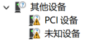
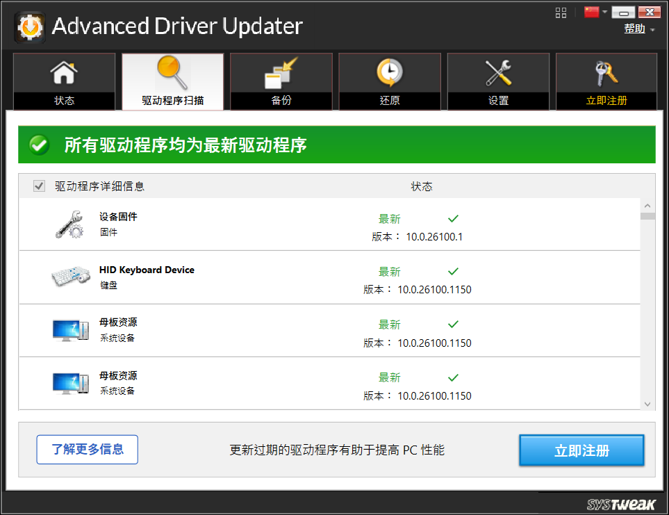
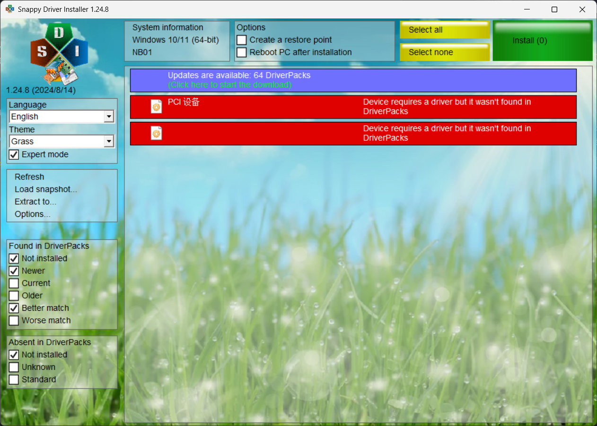
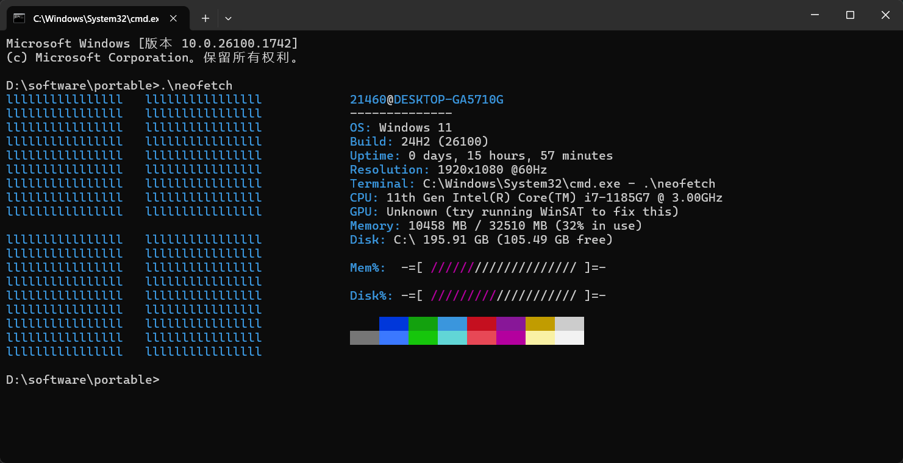

# Windows重装&蓝屏&驱动&neofetch

不算太客套的客套话就写这一句吧，这是我这个寒假的仅有的收获吧。

~~~bash
# 制作启动盘的坑
# 安装系统的坑
# Windows更新的坑
# 驱动问题
# 闲笔：在Windows上使用neofetch
~~~

# Windows启动盘制作
这是老生常谈的啦。

你需要下载一个iso文件，然后准备一个较大的、没怎么用的U盘，然后制作启动盘。

不同的烧录软件做出来的效果不一样，比如Linux自带的就不咋地，用ventoy也不太行。那么，互联网上有一个叫anyburn的软件，一看名字就很自大，不过它也确实厉害！

# 安装系统的坑

然后就是biso启动安装之类的啦，循规蹈矩就来了。分区的时候注意一点！

Windows11安装不好的一点就是需要联网，只能使用在线账户，难受！

怎么分区可以问AI，无非把电脑配置给他，说出自己的需求，比如“我是干什么的”之类的，它会给你一个分区方案，还有：1GB=1024MB。

# Windows更新

如果你成功进入了系统，先别急下载软件，把系统调一下，广告关一关，如果你安装了360，记得配置一下组策略（后面再说，怎么弄，互联网上有）。最重要的是，如果你不慎点开了Windows更新，成功更新好了就不说了，如果频繁蓝屏的话，请暂停它，你的驱动可能存在问题。

# 驱动

右击Windows开始，打开设备管理器，检查设备是否存在那种黄色感叹号：

这里推荐两个软件，可以检测电脑的驱动然后更新或者安装它们。

- Advanced Driver Updater
    
- Snappy Driver Installer
    

这里我是用第一个解决问题的，第二个不如第一个厉害（数据库）。但是呢，第一个没会员只能一个个点，第二个可以批量升级。

解决驱动问题后，Windows应该可以正常升级了。

# neofetch

neofetch是Linux上用来展示系统信息的一个包

在Linux上可以直接使用：
~~~bash
sudo apt update
sudo apt install neofetch
neofetch
~~~
然后终端会输出系统logo和系统信息，对，系统logo！ #!// 激动

但是Windows呢？

用scoop又不太行，需要magic。

[Windows上优雅的使用neofetch](https://www.cnblogs.com/yejiuluo/articles/18271907)

那就在GitHub上找一个！

[nepnep39/neofetch-win](https://github.com/nepnep39/neofetch-win)

下载它的软件然后cd到目录，再.\neofetch就OK啦！

