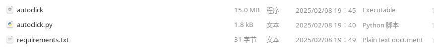
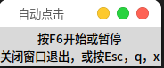
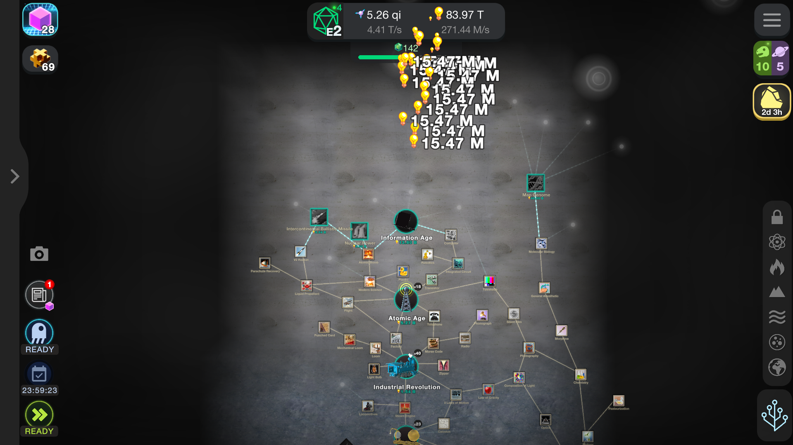

基于python编写的鼠标左键自动点击程序

需要安装：
~~~
PyAutoGUI==0.9.54
pynput==1.7.7
~~~
code
~~~Python
# -*- coding: UTF-8 -*-
"""
@Project ：Python_projects 
@File    ：autoclick
@IDE     ：PyCharm 
@Author  ：pfolg
@Date    ：2/7/25 12:44 PM 
"""
import sys
import time
import pyautogui
import threading
from pynput import keyboard
import tkinter as tk

class AutoClick:
    def __init__(self,mid):
        self.mid=mid
        self.isClick=False
        self.root=tk.Tk()
        self.set_root()
        self.start_listeners()
        self.root.mainloop()

    def set_root(self):
        self.root.title("自动点击")
        tk.Label(self.root,text="按F6开始或暂停\n关闭窗口退出，或按Esc，q，x").pack()

    def on_key_press(self, key):
        """处理键盘按下事件"""
        try:
            # 处理普通按键
            key_name = key.char
        except AttributeError:
            # 处理特殊按键
            key_name = key.name.replace('_', ' ').title()

        if key_name=="F6":
            if not self.isClick:
                self.isClick = True
                print("start")
            else:
                print("pause")
                self.isClick = False

            threading.Thread(target=self.click, daemon=True).start()
        elif key_name in ["Esc","q","x"]:
            print("end")
            self.isClick=False
            self.keyboard_listener.stop()
            self.root.destroy()
            sys.exit()

    def start_listeners(self):
        """启动监听线程"""
        # 键盘监听
        self.keyboard_listener = keyboard.Listener(
            on_press=self.on_key_press,
            # on_release=self.on_key_release
        )

        # 启动线程
        self.keyboard_listener.start()

    def click(self):
        while self.isClick:
            pyautogui.click()
            time.sleep(self.mid)

if __name__ == '__main__':
    # 禁用安全模式
    pyautogui.FAILSAFE = False
    # 点击间隔 s
    AutoClick(.01)
~~~
打包出来：

运行窗口

效果也不错，非常适合打点击游戏

